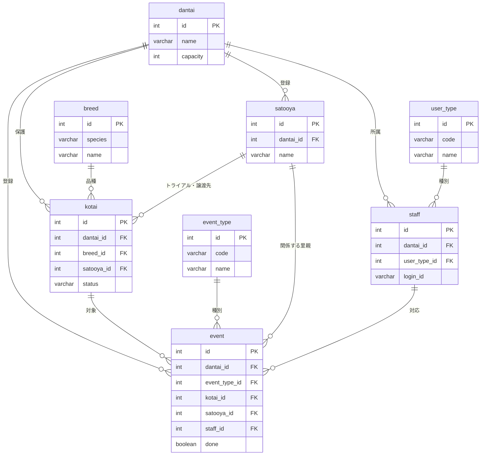

# 基本設計(ホゴタロウ)

<br>

1. [画面一覧・画面遷移図](#chapter1)
2. [ワイヤーフレーム](#chapter2)
3. [DB設計](#chapter3)
4. [URL設計(ルーティング)](#chapter4)
5. [システム構成図](#chapter5)
6. [データフロー](#chapter6)
7. [フォルダ構成](#chapter7)
8. [共通仕様](#chapter8)

<br>
<a id="chapter1"></a>

## 1.画面一覧・画面遷移図

### 権限の記号

| 記号 | 権限 | できること |
|:---:|:---:|:---:|
| A | 管理ユーザー | 全部。スタッフの新規登録（アカウント発行）はこの権限だけ |
| S | 常勤スタッフ | 個体・里親・イベント・スタッフの閲覧・登録・編集・削除 |
| V | ボランティア | 全画面の閲覧だけ。登録・編集・削除のボタンは表示されず、URL を直接開いても 403 |

どの権限でも、見えるのは自分の団体のデータだけ。

### 画面一覧
|No|画面名|閲覧できる権限|概要|
|:---:|:---:|:---:|:---:|
|1|ログインページ|なし|IDとパスワードを入力するフォーム、ログインボタンを表示|
|2|トップページ|V|現在の個体数と上限数を表示<br>ミニカレンダーを表示<br>個体管理、里親管理へのリンクを表示|
|3|個体一覧ページ|V|ファセット検索システムの表示<br>個体情報(名前、犬猫、性別、品種、年齢)の一覧をカード形式で表示。<br>新規登録リンク、詳細リンク|
|4|個体詳細ページ|V|選択した個体の写真<br>情報(名前、犬猫、性別、品種、年齢、誕生日(推定)、保護日、保護場所、保護方法、去勢or避妊、狂犬病ワクチン、混合ワクチン、マイクロチップ)、健康に関する特記事項、その他、個体に紐づくイベント表示<br>編集ボタン、削除ボタン|
|5|個体編集ページ|S|個体の写真<br>詳細情報(名前、犬猫、性別、品種、年齢、誕生日(推定)、保護日、保護場所、保護方法、去勢or避妊、狂犬病ワクチン、混合ワクチン、マイクロチップ)、健康に関する特記事項、その他及び写真の編集入力フォーム<br>登録ボタン|
|6|個体新規登録ページ|S|詳細(名前、犬猫、性別、品種、年齢、誕生日(推定)、保護日、保護場所、保護方法、去勢or避妊、狂犬病ワクチン、混合ワクチン、マイクロチップ)、健康に関する特記事項、その他及び写真の情報の入力フォーム。登録ボタン|
|7|里親一覧ページ|V|ファセット検索システム（名前または電話番号での検索フォーム）の表示<br>里親情報(名前、電話番号、住所)の一覧表示<br>新規登録リンク、詳細リンク|
|8|里親詳細ページ|V|選択した里親の情報(名前、性別、年齢、住所、電話番号、メールアドレス)、メモ、関連するイベント、譲渡済みの個体、表示<br>編集ボタン、削除ボタン|
|9|里親編集ページ|S|里親の詳細情報(名前、性別、年齢、住所、電話番号、メールアドレス)、メモの編集入力フォーム。<br>登録ボタン|
|10|里親新規登録ページ|S|里親新規登録ページ|詳細情報(名前、性別、年齢、住所、電話番号、メールアドレス)、メモの入力フォーム。登録ボタン|
|11|イベント一覧ページ|V|イベント入力されたカレンダーの表示<br>(未/済が分かるように色で分ける)<br>イベント概要ペインを表示<br>カレンダーのイベント見出しをクリックでそのイベント概要(予定時刻、個体名、イベント種別、場所、費用)、特記事項をイベント概要ペインに表示。<br>新規登録ボタン|
|12|イベント詳細ページ|V|指定したイベントの詳細(日付、予定時刻、個体名、イベント種別、場所、対応スタッフ、里親名(譲渡やトライアルの場合)、費用、未/済の設定)が表示。<br>編集リンク、削除ボタン|
|13|イベント編集ページ|S|指定したイベントの内容(日付、予定時刻、個体名、イベント種別、場所、対応スタッフ、里親名(譲渡やトライアルの場合)、費用、未/済の設定)編集フォーム、特記事項入力フォームが表示される<br>登録ボタン|
|14|イベント新規登録ページ|S|イベント詳細(日付、予定時刻、個体名、イベント種別、場所、対応スタッフ、里親名(譲渡やトライアルの場合)、費用、未/済の設定)新規入力フォーム、特記事項入力フォーム<br>登録ボタン|
|15|スタッフ一覧ページ|V|ファセット検索システムの表示<br>スタッフ情報(名前、性別、年齢、電話番号、ユーザー種別)の一覧表示。<br>新規登録リンク、詳細リンク|
|16|スタッフ詳細ページ|V|選択したスタッフの情報(ID、名前、性別、年齢、生年月日、住所、電話番号、メールアドレス、登録日、ユーザー種別)、特記事項表示<br>編集リンク、削除ボタン|
|17|スタッフ編集ページ|S|スタッフの詳細情報(名前、性別、年齢、生年月日、住所、電話番号、メールアドレス、登録日、ユーザー種別)、特記事項の編集入力フォーム。<br>登録ボタン|
|18|スタッフ新規登録ページ|V|詳細情報(名前、性別、年齢、生年月日、住所、電話番号、メールアドレス、登録日、ユーザー種別)の入力フォーム<br>登録ボタン|
|19|エラー|なし|403（権限なし）・404（データなし）・500（システムエラー）の共通ページ<br>メッセージとトップへのリンク|

### 画面遷移図


<br>
<a id="chapter2"></a>


## 2.ワイヤーフレーム


<br>
<a id="chapter3"></a>

## 3.DB設計(テーブル定義・ER図)

### 共通ルール

- DB 名 `hogotaro`
- 主キーは全テーブル `id INT AUTO_INCREMENT`
- 列名は snake_case の英字。JPA が `phone_number` ↔ `phoneNumber` を自動で対応づけるので、Entity に `@Column(name=...)` を書かなくて済む
- 業務 4 テーブル（staff・kotai・satooya・event）は `dantai_id INT NOT NULL`（FK → dantai.id）を持つ。マスタ（user_type・event_type・breed）と dantai は持たない
- 業務 4 テーブルは `created_at` `updated_at` を持つ。値は MySQL の `DEFAULT CURRENT_TIMESTAMP` / `ON UPDATE CURRENT_TIMESTAMP` が入れる。Java からは触らない（Entity では `insertable=false, updatable=false`）
- 済 / 未（避妊去勢・混合ワクチン・狂犬病ワクチン・完了）は `BOOLEAN`
- 特記事項は `TEXT`。上限はフォーム側で 2000 字
- 年齢は保存しない。生年月日から表示するときに計算する
- 外部キーの `ON DELETE` は下の表。書いていない FK は指定なし（子があれば親を消せない → アプリ側でメッセージ）

| 外部キー | ON DELETE | 意味 |
|---|:---:|---|
| event.kotai_id | CASCADE | 個体を消すとイベントも消える |
| event.staff_id | SET NULL | スタッフを消すとイベントの対応スタッフが空になる |
| kotai.breed_id | SET NULL | 品種を消しても個体は残る |
| kotai.satooya_id、event.satooya_id | 指定なし | 紐づく個体・イベントがある里親は消せない |


### テーブル名(staff)
|カラム名|データ型|制約|説明|
|:---:|:---:|:---:|:---:|
|id|INT|PK, AUTO_INCREMENT|スタッフID|
|dantai_id|INT|NOT NULL, FK→dantai.id|所属団体|
|login_id|VARCHAR(30)|NOT NULL, UNIQUE|ログインID。全団体で一意（ログイン画面に団体の欄が無い）|
|password_hash|VARCHAR(255)|NOT NULL|BCrypt|
|user_type_id|INT|NOT NULL, FK→user_type.id|ユーザー種別|
|name|VARCHAR(30)|NOT NULL|名前|
|furigana|VARCHAR(30)|NOT NULL|ふりがな|
|gender|VARCHAR(20)|NOT NULL|`MALE` / `FEMALE` / `OTHER`|
|birthday|DATE|NOT NULL|生年月日|
|address|VARCHAR(100)||住所|
|phone_number|VARCHAR(20)|NOT NULL|電話番号|
|email|VARCHAR(255)||メールアドレス|
|notes|TEXT||特記事項|
|created_at|TIMESTAMP|NOT NULL, DEFAULT CURRENT_TIMESTAMP|登録日時|
|updated_at|TIMESTAMP|NOT NULL, DEFAULT CURRENT_TIMESTAMP ON UPDATE CURRENT_TIMESTAMP|更新日時|

### テーブル名(kotai)
|カラム名|データ型|制約|説明|
|:---:|:---:|:---:|:---:|
|id|INT|PK, AUTO_INCREMENT|個体ID|
|dantai_id|INT|NOT NULL, FK→dantai.id|登録した団体|
|name|VARCHAR(10)|NOT NULL|名前|
|species|VARCHAR(20)|NOT NULL|`DOG` / `CAT`|
|sex|VARCHAR(20)|NOT NULL|`MALE` / `FEMALE` / `UNKNOWN`|
|breed_id|INT|FK→breed.id|品種。分からなければ NULL|
|birthday|DATE||誕生日|
|is_birthday_estimated|BOOLEAN|NOT NULL, DEFAULT TRUE|誕生日が推定かどうか|
|intake_date|DATE|NOT NULL|保護日|
|intake_type|VARCHAR(30)|NOT NULL|保護場所と方法|
|status|VARCHAR(20)|NOT NULL, DEFAULT 'SHELTERED'|`SHELTERED`（保護中）/ `TRIAL`（トライアル中）/ `ADOPTED`（譲渡済）/ `DECEASED`（死亡）|
|satooya_id|INT|FK→satooya.id|トライアル中・譲渡済のときの里親|
|is_neutered|BOOLEAN|NOT NULL, DEFAULT FALSE|避妊去勢 済/未|
|combo_vaccine|BOOLEAN|NOT NULL, DEFAULT FALSE|混合ワクチン 済/未|
|rabies_vaccine|BOOLEAN|NOT NULL, DEFAULT FALSE|狂犬病ワクチン 済/未|
|microchip_no|VARCHAR(15)||マイクロチップ番号。未装着は NULL|
|health_notes|TEXT||健康に関する特記事項|
|notes|TEXT||その他の特記事項|
|image_path|VARCHAR(255)||写真の URL（`/photos/xxxx.jpg`）。無ければ NULL|
|created_at|TIMESTAMP|NOT NULL, DEFAULT CURRENT_TIMESTAMP|登録日時|
|updated_at|TIMESTAMP|NOT NULL, DEFAULT CURRENT_TIMESTAMP ON UPDATE CURRENT_TIMESTAMP|更新日時|

### テーブル名(satooya)
|カラム名|データ型|制約|説明|
|:---:|:---:|:---:|:---:|
|id|INT|PK, AUTO_INCREMENT|里親ID|
|dantai_id|INT|NOT NULL, FK→dantai.id|登録した団体|
|name|VARCHAR(30)|NOT NULL|名前|
|furigana|VARCHAR(30)|NOT NULL|ふりがな|
|gender|VARCHAR(20)|NOT NULL|`MALE` / `FEMALE` / `OTHER`|
|birthday|DATE||生年月日|
|address|VARCHAR(100)||住所|
|phone_number|VARCHAR(20)|NOT NULL|電話番号|
|email|VARCHAR(255)||メールアドレス|
|notes|TEXT||特記事項（家族構成・住環境・希望する子など）|
|created_at|TIMESTAMP|NOT NULL, DEFAULT CURRENT_TIMESTAMP|登録日時|
|updated_at|TIMESTAMP|NOT NULL, DEFAULT CURRENT_TIMESTAMP ON UPDATE CURRENT_TIMESTAMP|更新日時|

### テーブル名(event)
|カラム名|データ型|制約|説明|
|:---:|:---:|:---:|:---:|
|id|INT|PK, AUTO_INCREMENT|イベントID|
|dantai_id|INT|NOT NULL, FK→dantai.id|登録した団体|
|event_type_id|INT|NOT NULL, FK→event_type.id|種別|
|kotai_id|INT|NOT NULL, FK→kotai.id (CASCADE)|対象の個体|
|satooya_id|INT|FK→satooya.id|トライアル・譲渡のときの里親|
|staff_id|INT|FK→staff.id (SET NULL)|対応スタッフ（完了にした人）|
|event_date|DATE|NOT NULL|日程|
|event_time|TIME||時刻|
|place|VARCHAR(100)||場所|
|done|BOOLEAN|NOT NULL, DEFAULT FALSE|完了 済/未|
|cost|INT||費用（円）|
|notes|TEXT||特記事項|
|created_at|TIMESTAMP|NOT NULL, DEFAULT CURRENT_TIMESTAMP|登録日時|
|updated_at|TIMESTAMP|NOT NULL, DEFAULT CURRENT_TIMESTAMP ON UPDATE CURRENT_TIMESTAMP|更新日時|

### テーブル名(dantai)
|カラム名|データ型|制約|説明|
|:---:|:---:|:---:|:---:|
|id|INT|PK, AUTO_INCREMENT|団体ID|
|name|VARCHAR(50)|NOT NULL|団体名|
|address|VARCHAR(100)|NOT NULL|住所|
|phone_number|VARCHAR(20)||電話番号|
|email|VARCHAR(255)||メールアドレス|
|capacity|INT|NOT NULL|団体の受入上限|
|notes|text||団体の特記事項|


### テーブル名(event_type) イベント種別マスタ（全団体共通）

|カラム名|データ型|制約|説明|
|:---:|:---:|:---:|:---:|
|id|INT|PK, AUTO_INCREMENT|イベント種別ID|
|code|VARCHAR(20)|NOT NULL, UNIQUE|`HOSPITAL` / `COMBO_VACCINE` / `RABIES_VACCINE` / `NEUTERING` / `TRIAL_START` / `ADOPTION` / `OTHER`。完了時に個体を更新する分岐に使う|
|name|VARCHAR(20)|NOT NULL|通院 / 混合ワクチン / 狂犬病ワクチン / 避妊去勢手術 / トライアル開始 / 譲渡 / その他|


### テーブル名(user_type) ユーザー種別マスタ（全団体共通）
|カラム名|データ型|制約|説明|
|:---:|:---:|:---:|:---:|
|id|INT|PK, AUTO_INCREMENT|ユーザー種別ID|
|code|VARCHAR(20)|NOT NULL, UNIQUE|`ADMIN` / `STAFF` / `VOLUNTEER`。Spring Security のロール名になる|
|name|VARCHAR(20)|NOT NULL|管理ユーザー / 常勤スタッフ / ボランティア|

### テーブル名(breed) 品種マスタ（全団体共通）

|カラム名|データ型|制約|説明|
|:---:|:---:|:---:|:---:|
|id|INT|PK, AUTO_INCREMENT|品種ID|
|species|VARCHAR(20)|NOT NULL|`DOG` / `CAT`|
|name|VARCHAR(50)|NOT NULL|品種名。(species, name) で UNIQUE。初期値は data.sql|

<br>

### ER図




<br>
<a id="chapter4"></a>

権限列は「その URL を実行できる最低の権限」（A ⊃ S ⊃ V）。**GET は V、POST は S、`/staff/new` だけ A**。未ログインは `/login` 以外の全 URL が `/login` へリダイレクトされる。No.3 と No.4 は Controller を書かない（Spring Security が処理する）。

## 4.URL設計(ルーティング)
|No|URL|メソッド|権限|処理内容|
|:---:|:---:|:---:|:---:|:---:|
|1|/|GET|ボランティア|トップページを表示|
|2|/login|GET|なし|ログイン画面を表示|
|3|/login|POST|なし|ID・パスワードで認証し、成功時は/へリダイレクト 失敗時は/loginへリダイレクト|
|4|/logout|POST|ボランティア|セッションを破棄し、/loginへリダイレクト|
|5|/kotai|GET|ボランティア|ファセット検索<br>個体一覧を表示(カード形式)|
|6|/kotai/new|GET|常勤スタッフ|個体新規登録フォームを表示|
|7|/kotai/new|POST|常勤スタッフ|個体を新規登録し、/kotai/{id}へリダイレクト|
|8|/kotai/{id}|GET|ボランティア|個体詳細と紐づくイベントを表示|
|9|/kotai/{id}/edit|GET|常勤スタッフ|個体編集フォームを表示|
|10|/kotai/{id}/edit|POST|常勤スタッフ|個体情報を更新し、/kotai/{id}へリダイレクト|
|11|/kotai/{id}/delete|POST|常勤スタッフ|個体を削除し、/kotaiへリダイレクト|
|12|/satooya|GET|ボランティア|ファセット検索<br>里親一覧を表示|
|13|/satooya/new|GET|常勤スタッフ|里親新規登録フォームを表示|
|14|/satooya/new|POST|常勤スタッフ|里親を新規登録し、/satooya/{id}へリダイレクト|
|15|/satooya/{id}|GET|ボランティア|里親詳細と紐づく個体(トライアル中、譲渡済み)イベントを表示|
|16|/satooya/{id}/edit|GET|常勤スタッフ|里親編集フォームを表示|
|17|/satooya/{id}/edit|POST|常勤スタッフ|里親情報を更新し、/satooya/{id}へリダイレクト|
|18|/satooya/{id}/delete|POST|常勤スタッフ|里親を削除し、/satooyaへリダイレクト|
|19|/event|GET|ボランティア|ファセット検索<br>イベントカレンダーと概要ペインを表示|
|20|/event/new|GET|常勤スタッフ|イベント新規登録フォームを表示|
|21|/event/new|POST|常勤スタッフ|イベントを新規登録し、/event/へリダイレクト| 
|22|/event/{id}|GET|ボランティア|イベント詳細を表示|
|23|/event/{id}/edit|GET|常勤スタッフ|イベント編集フォームを表示|
|24|/event/{id}/edit|POST|常勤スタッフ|イベント情報を更新し、/event/{id}へリダイレクト|
|25|/event/{id}/complete|POST|常勤スタッフ|イベント状況を完了に変更し、/eventへリダイレクト(関連する個体や里親のupdate文も走ると嬉しい)|
|26|/event/{id}/delete|POST|常勤スタッフ|イベントを削除し、/eventへリダイレクト|
|27|/staff|GET|ボランティア|ファセット検索<br>スタッフ一覧を表示|
|28|/staff/new|GET|管理ユーザー|スタッフ新規登録フォームを表示|
|29|/staff/new|POST|管理スタッフ|スタッフを新規登録(パスワードはハッシュ化)し、/staff/{id}へリダイレクト|
|30|/staff/{id}|GET|ボランティア|スタッフ詳細と紐づくイベントを表示|
|31|/staff/{id}/edit|GET|常勤スタッフ|スタッフ編集フォームを表示|
|32|/staff/{id}/edit|POST|常勤スタッフ|スタッフ情報を更新し、/staff/{id}へリダイレクト|
|33|/staff/{id}/delete|POST|常勤スタッフ|スタッフを削除し、/staffへリダイレクト|

<br>
<a id="chapter5"></a>

## 5.システム構成図


<br>
<a id="chapter6"></a>


## 6.データフロー

### ログインする場合
1. ログインIDとパスワードを入力し、「ログイン」をクリック。
2. ブラウザがPOST通信で/loginへリクエストを送信。
3. Spring Securityのフィルタがリクエストを受け取り、UserDetailsServiceを通じてMySQLのstaffテーブルからログインIDでスタッフを検索する。
    - 成功　→　次のステップへ
    - 失敗　→　/loginへリダイレクトし、エラーメッセージを表示
4. スタッフのユーザー種別からロール（ADMIN / STAFF / VOLUNTEER）を、団体IDと合わせて認証情報（UserDetails）に設定し、セッションに保存する。
5. Spring Securityがトップページへリダイレクトを返す。
6. ブラウザがGET通信で/へリクエストを送信。
7. Springがセッションの団体IDで情報を取得し、トップページを表示する。


### イベントを完了にする場合
1. 常勤スタッフ以上がイベント概要またはイベント詳細で「完了」をクリック。
2. ブラウザがPOST通信で/event/{id}/completeへリクエストを送信。
3. Springがイベントを取得する。（イベントID＋ログインスタッフの団体IDで検索）
    - 該当なし → 404エラーページを表示。
    - 該当あり → 次のステップへ。
4. トランザクションを開始し、eventテーブルの完了状況を「済」、スタッフIDをログインスタッフに更新する。
5. イベント種別のcodeに応じて、紐づく個体をUPDATEする。
6. フラッシュメッセージ「イベントを完了にしました」を設定し、/eventへリダイレクト。
7. ブラウザがGET通信で/event/{id}へリクエストを送信。
8. Springがイベント詳細画面をフラッシュメッセージ付きで表示する。


<a id="chapter7"></a>

## 7.フォルダ構成
```
hogotaro/
├─ pom.xml
├─ uploads/photos/                      個体の写真
├─ sql/
│   ├─ schema.sql                       CREATE DATABASE + 全テーブル
│   └─ data.sql                         user_type 3 行、event_type 7 行、品種、デモ団体 2 つとスタッフ（BCrypt 済み）
├─ src/main/resources/
│   ├─ application.properties           
│   └─ static/
│       ├─ css/style.css
│       ├─ js/confirm.js                
│       └─ img/placeholder-dog.png  placeholder-cat.png   写真が無いとき用
├─ src/main/webapp/WEB-INF/views/
│   ├─ common/header.jspf               共通部品（ヘッダにナビとログアウト、フラッシュメッセージの表示もここ）
│   ├─ login.jsp  top.jsp  error.jsp
│   ├─ kotai/list.jsp  detail.jsp  form.jsp     form は新規と編集で共用
│   ├─ satooya/list.jsp  detail.jsp  form.jsp
│   ├─ event/calendar.jsp  detail.jsp  form.jsp
│   └─ staff/list.jsp  detail.jsp  form.jsp
└─ src/main/java/com/example/hogotaro/
    ├─ HogotaroApplication.java         起動クラス（生成されたまま）
    ├─ security/
    │   ├─ SecurityConfig.java          URL ごとの権限、ログイン画面の場所、BCrypt の Bean
    │   ├─ LoginUserDetailsService.java loginId で staff を探して LoginUser を返す
    │   └─ LoginUser.java               ログイン中の人（id・団体id・ロール・名前）
    ├─ controller/
    │   ├─ TopController.java           /（トップ）と GET /login（login.jsp を返すだけ）
    │   ├─ KotaiController.java
    │   ├─ SatooyaController.java
    │   ├─ EventController.java
    │   └─ StaffController.java
    ├─ service/                         Controller と同じ 5 つ。クラスに @Transactional
    ├─ repository/                      Entity と同じ 8 つ。interface だけ
    ├─ entity/
    │   ├─ Dantai  UserType  Staff  Breed  Kotai  Satooya  EventType  Event   テーブル 1 つに 1 クラス
    │   └─ Species  Sex  Gender  Status                                      enum（日本語ラベル付き）
    └─ form/
        └─ KotaiForm  SatooyaForm  EventForm  StaffForm   入力を受ける + Bean Validation
```

<br>
<a id="chapter8"></a>

## 8.共通仕様

### フラッシュメッセージ
|タイミング|メッセージ|
|:---:|:---:|
|ログイン失敗|「ログインに失敗しました」|
|ログアウト時|「ログアウトしました」|
|新規登録成功|「〇〇新規登録が完了しました」|
|新規登録失敗|「既に登録済みのログインIDです」|
|編集|「〇〇を編集しました」|
|削除|「〇〇を削除しました」|

### エラー処理
- 存在しないIDへのアクセス、および他団体のデータへのアクセスがされた場合は404エラーページを返す。
- 権限が不足しているURLへのアクセスは403エラーページを返す。

### PRGパターン
二重送信を防ぐため、POST(ログイン、ログアウト、新規登録、編集、削除)の処理後はGETへリダイレクトする。

### 命名規則

| 対象 | 規則 | 例 |
|---|---|---|
| パッケージ | `com.example.hogotaro.` + 役割 | `controller` `service` `repository` `entity` `form` `security` |
| Controller | `XxxController`。メソッド名は全機能で `list` `newForm` `create` `detail` `editForm` `update` `delete` に揃える。処理は Service に書き、Controller は受け取り・Service 呼び出し・JSP 返却だけ | `KotaiController` |
| Service / Repository / Entity / Form | `XxxService` `XxxRepository` `Xxx` `XxxForm` | `KotaiService` |
| JSP | `views/xxx/list.jsp` `detail.jsp` `form.jsp`（新規と編集で共用） | `kotai/form.jsp` |
| テーブル | ローマ字・単数・小文字 | `kotai` `satooya` `event_type` |
| DB の列 | snake_case。FK は `xxx_id` | `login_id` `dantai_id` `event_type_id` |
| Entity ↔ テーブル | テーブル名をパスカルケースに。列名は snake_case → キャメルケース（JPA が自動で対応づける） | `event_type` → `EventType`、`phone_number` → `phoneNumber` |
| Entity の FK | `@ManyToOne` で相手の Entity を持つ | `Breed breed`（`Integer breedId` にしない。JSP で `${k.breed.name}` と書けるように） |
| enum | 定数は英大文字、日本語は `label` フィールド。DB には定数名を保存（`@Enumerated(EnumType.STRING)`） | `Status.SHELTERED("保護中")`、JSP は `${k.status.label}` |
| Java の変数 | キャメルケース。Entity 1 件はクラス名の小文字、複数は `xxxList` | `Kotai kotai`、`List<Kotai> kotaiList` |
| Model に入れる名前 | 1 件は `xxx`、一覧は `xxxList`、フォームは `xxxForm`、プルダウンの選択肢は `xxxList` | `kotai` `kotaiList` `kotaiForm` `breedList` |
| JSP のループ変数 | 頭文字 1 文字 | `<c:forEach var="k" items="${kotaiList}">` |
| URL パラメータ・フォームの name | Form のフィールド名と同じ（キャメルケース） | `intakeDate` `breedId` |
| 写真のファイル名 | UUID + 拡張子。`uploads/photos/` に置き、DB には `/photos/xxxx.jpg` を保存 | |