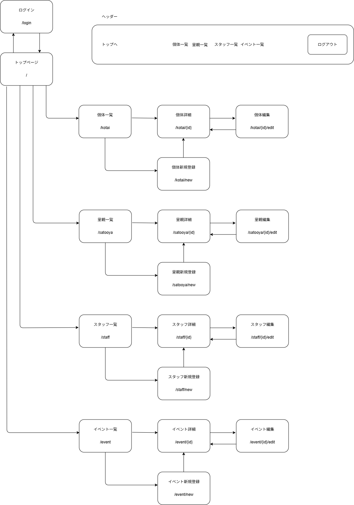
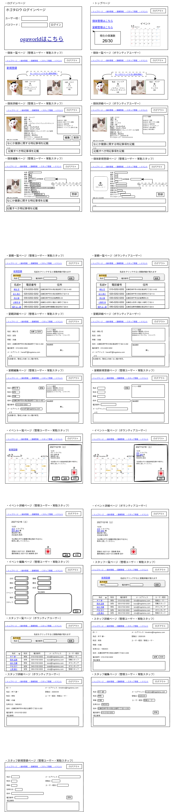
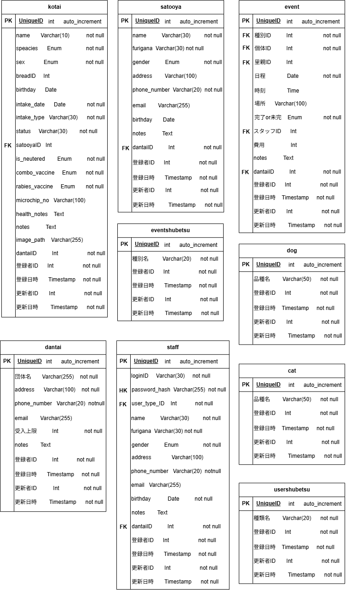
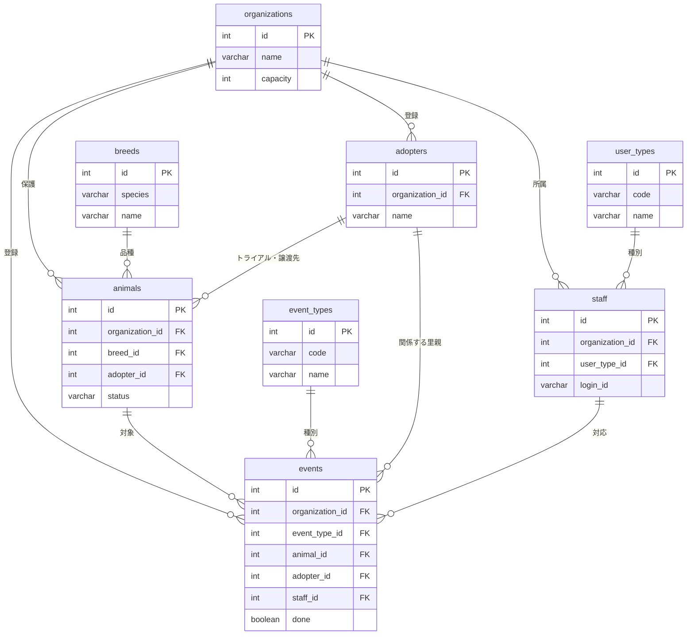
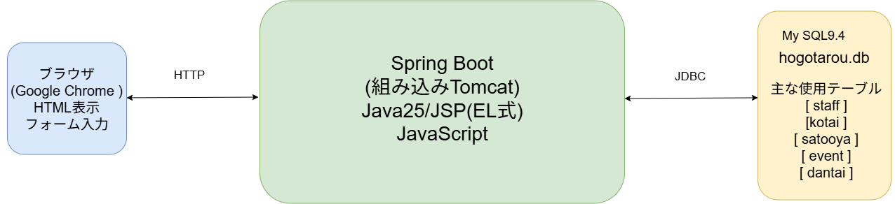

# 基本設計(ホゴタロウ)

<br>

1. [画面一覧・画面遷移図](#chapter1)
2. [ワイヤーフレーム](#chapter2)
3. [URL設計(ルーティング)](#chapter3)
4. [DB設計](#chapter4)
5. [システム構成図](#chapter5)
6. [データフロー](#chapter6)
7. [フォルダ構成](#chapter7)
8. [共通仕様](#chapter8)

<br>
<a id="chapter1"></a>

## 1.画面一覧・画面遷移図

### 権限の記号

|記号|権限|できること|
|:---:|:---:|:---:|
|V|ボランティア|個体・イベント・里親・スタッフの閲覧だけ<br>登録・編集・削除のボタンは表示されず、URLを直接開いても403|
|S|常勤スタッフ|Vにできることに加えて、個体・イベント・里親の登録・編集<br>スタッフの編集|
|A|管理ユーザー|Sにできることに加えて、個体・イベント・里親・スタッフの削除、スタッフの新規登録（アカウント発行）|

どの権限でも、見えるのは自分の団体のデータだけ。

### 画面一覧
|No|画面名|閲覧できる権限|概要|
|:---:|:---:|:---:|:---:|
|S-01|ログインページ|なし|IDとパスワードを入力するフォーム、ログインボタンを表示|
|S-02|トップページ|V|現在の保護頭数（保護中(譲渡可)・保護中(譲渡不可)・入院中・トライアル中の合計）と受入上限を表示<br>ミニカレンダーを表示<br>個体管理、里親管理、スタッフ管理へのリンクを表示|
|S-03|個体一覧ページ|V|絞り込み（犬猫・保護状況のチェックボックス。保護状況の初期値はトップの保護頭数と同じ 4 つ）<br>個体情報(名前、犬猫、性別、品種、年齢、保護状況)の一覧をカード形式で表示。<br>新規登録リンク、詳細リンク|
|S-04|個体詳細ページ|V|選択した個体の写真<br>情報(名前、犬猫、性別、品種、年齢、誕生日(推定)、保護日、保護場所、保護方法、保護状況、里親、去勢or避妊、狂犬病ワクチン、混合ワクチン、マイクロチップ)、健康に関する特記事項、その他、個体に紐づくイベント表示<br>編集ボタン、削除ボタン|
|S-05|個体新規登録ページ|S|S-4の項目（年齢を除く）の入力フォーム + 写真のファイル選択、登録ボタン|
|S-06|個体編集ページ|S|個体の写真<br>S-5と同じフォームに現在値が入った状態、登録ボタン<br>写真は選ばなければ変更しない|
|S-07|イベント一覧ページ|V|イベント入力されたカレンダーの表示<br>(未/済が分かるように色で分ける)<br>イベント概要ペインを表示<br>カレンダーのイベント見出しをクリックでそのイベント概要(日付、個体名、イベント種別、場所、費用)、特記事項、完了ボタンをイベント概要ペインに表示。<br>新規登録ボタン|
|S-08|イベント詳細ページ|V|指定したイベントの詳細(日付・時刻・個体名・種別・場所・対応スタッフ・里親（トライアル・譲渡のとき）・費用・未 / 済・特記事項)が表示<br>完了ボタン、編集リンク、削除ボタン|
|S-09|イベント新規登録ページ|S|S-8の項目（未 / 済と対応スタッフを除く）の入力フォーム（個体・種別・里親はプルダウン）<br>登録ボタン|
|S-10|イベント編集ページ|S|S-9と同じフォームに現在値<br>登録ボタン|
|S-11|里親一覧ページ|V|ファセット検索システム（名前または電話番号での検索フォーム）の表示<br>里親情報(名前、電話番号、住所)の一覧表示<br>新規登録リンク、詳細リンク|
|S-12|里親詳細ページ|V|選択した里親の情報(名前、性別、年齢、生年月日、住所、電話番号、メールアドレス)、メモ、関連するイベント、トライアル中・譲渡済みの個体、表示<br>編集ボタン、削除ボタン|
|S-13|里親新規登録ページ|S|S-12の項目（年齢を除く）の入力フォーム<br>登録ボタン|
|S-14|里親編集ページ|S|S-13と同じフォームに現在値。<br>登録ボタン|
|S-15|スタッフ一覧ページ|V|ファセット検索システムの表示<br>スタッフ情報(名前、性別、年齢、電話番号、ユーザー種別)の一覧表示。<br>新規登録リンク、詳細リンク|
|S-16|スタッフ詳細ページ|V|選択したスタッフの情報(ID、名前、ログインID、性別、年齢、生年月日、住所、電話番号、メールアドレス、登録日、ユーザー種別)、特記事項表示<br>編集リンク、削除ボタン|
|S-17|スタッフ新規登録ページ|A|詳細情報(名前、ログインID、パスワード、性別、生年月日、住所、電話番号、メールアドレス、登録日、ユーザー種別)の入力フォーム、特記事項の入力フォーム<br>登録ボタン|
|S-18|スタッフ編集ページ|S|S-17と同じ（パスワードは「変更する場合だけ入力」、ユーザー種別の変更はAだけ可能）<br>登録ボタン|
|S-19|エラー|なし|403（権限なし）・404（データなし）・500（システムエラー）の共通ページ<br>メッセージとトップへのリンク|

### 画面遷移図


<br>
<a id="chapter2"></a>


## 2.ワイヤーフレーム


<br>
<a id="chapter3"></a>

## 3.URL設計(ルーティング)

権限列は「その URL を実行できる最低の権限」（A ⊃ S ⊃ V）。**GET は V、POST は S、`/staff/new` と`/*/*/delete`は A**。未ログインは `/login` 以外の全 URL が `/login` へリダイレクトされる。F-3 と F-4 は Controller を書かない（Spring Security が処理する）。

|No|URL|メソッド|権限|処理内容|
|:---:|:---:|:---:|:---:|:---:|
|F-01|/|GET|V|トップページを表示|
|F-02|/login|GET|なし|ログイン画面を表示|
|F-03|/login|POST|なし|ID・パスワードで認証し、成功時は/へリダイレクト 失敗時は/loginへリダイレクト|
|F-04|/logout|POST|V|セッションを破棄し、/loginへリダイレクト|
|F-05|/animal|GET|V|ファセット検索<br>個体一覧を表示(カード形式)|
|F-06|/animal/{id}|GET|V|個体詳細と紐づくイベントを表示|
|F-07|/animal/new|GET|S|個体新規登録フォームを表示|
|F-08|/animal/new|POST|S|個体を新規登録し、/animal/{id}へリダイレクト|
|F-09|/animal/{id}/edit|GET|S|個体編集フォームを表示|
|F-10|/animal/{id}/edit|POST|S|個体情報を更新し、/animal/{id}へリダイレクト|
|F-11|/animal/{id}/delete|POST|A|個体を削除し、/animalへリダイレクト|
|F-12|/event|GET|V|ファセット検索<br>イベントカレンダーと概要ペインを表示|
|F-13|/event/{id}|GET|V|イベント詳細を表示|
|F-14|/event/new|GET|S|イベント新規登録フォームを表示|
|F-15|/event/new|POST|S|イベントを新規登録し、/eventへリダイレクト| 
|F-16|/event/{id}/edit|GET|S|イベント編集フォームを表示|
|F-17|/event/{id}/edit|POST|S|イベント情報を更新し、/event/{id}へリダイレクト|
|F-18|/event/{id}/complete|POST|S|イベント状況を完了に変更し、/eventへリダイレクト(種別に応じて紐づく個体を更新する)|
|F-19|/event/{id}/delete|POST|A|イベントを削除し、/eventへリダイレクト|
|F-20|/adopter|GET|V|ファセット検索<br>里親一覧を表示|
|F-21|/adopter/{id}|GET|V|里親詳細と紐づく個体(トライアル中・譲渡済み)イベントを表示|
|F-22|/adopter/new|GET|S|里親新規登録フォームを表示|
|F-23|/adopter/new|POST|S|里親を新規登録し、/adopter/{id}へリダイレクト|
|F-24|/adopter/{id}/edit|GET|S|里親編集フォームを表示|
|F-25|/adopter/{id}/edit|POST|S|里親情報を更新し、/adopter/{id}へリダイレクト|
|F-26|/adopter/{id}/delete|POST|A|里親を削除し、/adopterへリダイレクト|
|F-27|/staff|GET|V|ファセット検索<br>スタッフ一覧を表示|
|F-28|/staff/{id}|GET|V|スタッフ詳細と紐づくイベントを表示|
|F-29|/staff/new|GET|A|スタッフ新規登録フォームを表示|
|F-30|/staff/new|POST|A|スタッフを新規登録(パスワードはハッシュ化)し、/staff/{id}へリダイレクト|
|F-31|/staff/{id}/edit|GET|S|スタッフ編集フォームを表示|
|F-32|/staff/{id}/edit|POST|S|スタッフ情報を更新し、/staff/{id}へリダイレクト|
|F-33|/staff/{id}/delete|POST|A|スタッフを削除し、/staffへリダイレクト|

<br>
<a id="chapter4"></a>

## 4.DB設計(テーブル定義・ER図)

### 共通ルール

- DB名 `hogotaro`、文字コード utf8mb4
- 主キーは全テーブル `id INT AUTO_INCREMENT`
- 列名は snake_case の英字。JPA が `phone_number` ↔ `phoneNumber` を自動で対応づけるので、Entity に `@Column(name=...)` を書かなくて済む
- 業務4テーブル（animals・events・adopters・staff）は `organization_id INT NOT NULL`（FK → organizations.id）を持つ。マスタ（user_types・event_types・breeds）と organizations は持たない
- 業務 4 テーブルは `created_at` `updated_at` を持つ。値は MySQL の `DEFAULT CURRENT_TIMESTAMP` / `ON UPDATE CURRENT_TIMESTAMP` が入れる。Javaからは触らない（Entityでは `insertable=false, updatable=false`）
- 区分値（犬猫・性別・保護状況）は `VARCHAR(20)`。値はJavaのenumの定数名（`DOG` `MALE` `ADOPTABLE`）。日本語はenumが持つ（8章 命名規則）
- 済 / 未（避妊去勢・混合ワクチン・狂犬病ワクチン・完了）は `BOOLEAN`
- 特記事項は `TEXT`。上限はフォーム側で2000字
- 年齢は保存しない。生年月日から表示するときに計算する。
- 外部キーの `ON DELETE` は下の表。書いていない FK は指定なし（子があれば親を消せない → アプリ側でメッセージ）

|外部キー|ON DELETE|意味|
|:---:|:---:|:---:|
|events.animal_id|CASCADE|個体を消すとイベントも消える|
|events.staff_id|SET NULL|スタッフを消すとイベントの対応スタッフが空になる|
|animals.breed_id|SET NULL|品種を消しても個体は残る|
|animals.adopter_id、events.adopter_id|指定なし|紐づく個体・イベントがある里親は消せない|

### テーブル名(organizations)
|カラム名|データ型|制約|説明|
|:---:|:---:|:---:|:---:|
|id|INT|PK, AUTO_INCREMENT|団体ID|
|name|VARCHAR(50)|NOT NULL|団体名|
|address|VARCHAR(100)|NOT NULL|住所|
|phone_number|VARCHAR(20)||電話番号|
|email|VARCHAR(255)||メールアドレス|
|capacity|INT|NOT NULL|団体の受入上限|
|notes|TEXT||団体の特記事項|

### テーブル名(staff)
|カラム名|データ型|制約|説明|
|:---:|:---:|:---:|:---:|
|id|INT|PK, AUTO_INCREMENT|スタッフID|
|organization_id|INT|NOT NULL, FK→organizations.id|所属団体|
|login_id|VARCHAR(30)|NOT NULL, UNIQUE|ログインID。全団体で一意（ログイン画面に団体の欄が無い）|
|password_hash|VARCHAR(255)|NOT NULL|BCrypt|
|user_type_id|INT|NOT NULL, FK→user_types.id|ユーザー種別|
|name|VARCHAR(30)|NOT NULL|名前|
|gender|VARCHAR(20)|NOT NULL|`MALE` / `FEMALE` / `OTHER`|
|birthday|DATE|NOT NULL|生年月日|
|joined_date|DATE||登録日。団体にスタッフとして登録した日（DBの登録日時created_atとは別。画面から入力する）|
|address|VARCHAR(100)||住所|
|phone_number|VARCHAR(20)|NOT NULL|電話番号|
|email|VARCHAR(255)||メールアドレス|
|notes|TEXT||特記事項|
|created_at|TIMESTAMP|NOT NULL, DEFAULT CURRENT_TIMESTAMP|登録日時|
|updated_at|TIMESTAMP|NOT NULL, DEFAULT CURRENT_TIMESTAMP ON UPDATE CURRENT_TIMESTAMP|更新日時|

### テーブル名(animals)
|カラム名|データ型|制約|説明|
|:---:|:---:|:---:|:---:|
|id|INT|PK, AUTO_INCREMENT|個体ID|
|organization_id|INT|NOT NULL, FK→organizations.id|登録した団体|
|name|VARCHAR(10)|NOT NULL|名前|
|species|VARCHAR(20)|NOT NULL|`DOG` / `CAT`|
|sex|VARCHAR(20)|NOT NULL|`MALE` / `FEMALE` / `UNKNOWN`|
|breed_id|INT|FK→breeds.id|品種。分からなければNULL|
|birthday|DATE||誕生日|
|is_birthday_estimated|BOOLEAN|NOT NULL, DEFAULT TRUE|誕生日が推定かどうか|
|intake_date|DATE|NOT NULL|保護日|
|intake_method|VARCHAR(30)|NOT NULL|保護方法（例: 保健所から引き取り、飼い主放棄、迷子）|
|intake_place|VARCHAR(50)|NOT NULL|保護場所（例: ○○公園、△△保健所）|
|status|VARCHAR(20)|NOT NULL, DEFAULT 'NOT_ADOPTABLE'|`ADOPTABLE`（保護中(譲渡可)）/ `NOT_ADOPTABLE`（保護中(譲渡不可)）/ `HOSPITALIZED`（入院中）/ `TRIAL`（トライアル中）/ `ADOPTED`（譲渡済）/ `RETURNED`（返還）/ `TRANSFERRED`（移管）/ `DECEASED`（死亡）|
|adopter_id|INT|FK→adopters.id|トライアル中・譲渡済のときの里親|
|is_neutered|BOOLEAN|NOT NULL, DEFAULT FALSE|避妊去勢 済/未|
|combo_vaccine|BOOLEAN|NOT NULL, DEFAULT FALSE|混合ワクチン 済/未|
|rabies_vaccine|BOOLEAN|NOT NULL, DEFAULT FALSE|狂犬病ワクチン 済/未|
|microchip_no|VARCHAR(15)||マイクロチップ番号。未装着は NULL|
|health_notes|TEXT||健康に関する特記事項|
|notes|TEXT||その他の特記事項|
|image_path|VARCHAR(255)||写真の URL（`/photos/xxxx.jpg`）。無ければ NULL|
|created_at|TIMESTAMP|NOT NULL, DEFAULT CURRENT_TIMESTAMP|登録日時|
|updated_at|TIMESTAMP|NOT NULL, DEFAULT CURRENT_TIMESTAMP ON UPDATE CURRENT_TIMESTAMP|更新日時|

### テーブル名(events)
|カラム名|データ型|制約|説明|
|:---:|:---:|:---:|:---:|
|id|INT|PK, AUTO_INCREMENT|イベントID|
|organization_id|INT|NOT NULL, FK→organizations.id|登録した団体|
|event_type_id|INT|NOT NULL, FK→event_types.id|種別|
|animal_id|INT|NOT NULL, FK→animals.id (CASCADE)|対象の個体|
|adopter_id|INT|FK→adopters.id|トライアル・譲渡のときの里親|
|staff_id|INT|FK→staff.id (SET NULL)|対応スタッフ（完了にした人）|
|event_date|DATE|NOT NULL|日程|
|event_time|TIME||時刻|
|place|VARCHAR(100)||場所|
|done|BOOLEAN|NOT NULL, DEFAULT FALSE|完了 済/未|
|cost|INT||費用（円）|
|notes|TEXT||特記事項|
|created_at|TIMESTAMP|NOT NULL, DEFAULT CURRENT_TIMESTAMP|登録日時|
|updated_at|TIMESTAMP|NOT NULL, DEFAULT CURRENT_TIMESTAMP ON UPDATE CURRENT_TIMESTAMP|更新日時|

### テーブル名(adopters)
|カラム名|データ型|制約|説明|
|:---:|:---:|:---:|:---:|
|id|INT|PK, AUTO_INCREMENT|里親ID|
|organization_id|INT|NOT NULL, FK→organizations.id|登録した団体|
|name|VARCHAR(30)|NOT NULL|名前|
|gender|VARCHAR(20)|NOT NULL|`MALE` / `FEMALE` / `OTHER`|
|birthday|DATE||生年月日|
|address|VARCHAR(100)||住所|
|phone_number|VARCHAR(20)|NOT NULL|電話番号|
|email|VARCHAR(255)||メールアドレス|
|notes|TEXT||特記事項（家族構成・住環境・希望する子など）|
|created_at|TIMESTAMP|NOT NULL, DEFAULT CURRENT_TIMESTAMP|登録日時|
|updated_at|TIMESTAMP|NOT NULL, DEFAULT CURRENT_TIMESTAMP ON UPDATE CURRENT_TIMESTAMP|更新日時|


### テーブル名(event_types) イベント種別マスタ（全団体共通）

|カラム名|データ型|制約|説明|
|:---:|:---:|:---:|:---:|
|id|INT|PK, AUTO_INCREMENT|イベント種別ID|
|code|VARCHAR(20)|NOT NULL, UNIQUE|`HOSPITAL` / `COMBO_VACCINE` / `RABIES_VACCINE` / `NEUTERING` / `TRIAL_START` / `ADOPTION` / `OTHER`。完了時に個体を更新する分岐に使う|
|name|VARCHAR(20)|NOT NULL|通院 / 混合ワクチン / 狂犬病ワクチン / 避妊去勢手術 / トライアル開始 / 譲渡 / その他|

### テーブル名(user_types) ユーザー種別マスタ（全団体共通）
|カラム名|データ型|制約|説明|
|:---:|:---:|:---:|:---:|
|id|INT|PK, AUTO_INCREMENT|ユーザー種別ID|
|code|VARCHAR(20)|NOT NULL, UNIQUE|`ADMIN` / `STAFF` / `VOLUNTEER`。Spring Security のロール名になる|
|name|VARCHAR(20)|NOT NULL|管理ユーザー / 常勤スタッフ / ボランティア|

### テーブル名(breeds) 品種マスタ（全団体共通）

|カラム名|データ型|制約|説明|
|:---:|:---:|:---:|:---:|
|id|INT|PK, AUTO_INCREMENT|品種ID|
|species|VARCHAR(20)|NOT NULL|`DOG` / `CAT`|
|name|VARCHAR(50)|NOT NULL|品種名。(species, name) で UNIQUE。初期値は data.sql|

<br>

### ER図





<br>
<a id="chapter5"></a>

## 5.システム構成図


### application.properties の要点

|行|意味|
|:---|:---|
|`spring.mvc.view.prefix=/WEB-INF/jsp/`<br>`spring.mvc.view.suffix=.jsp`|Controllerが返す `"animal/list"`を`/WEB-INF/jsp/animal/list.jsp`に解決する|
|`server.error.whitelabel.enabled=false`|Spring Boot標準のエラーページを止め、403 / 404 / 500 のときに`jsp/error.jsp`を表示する|
|`spring.web.resources.static-locations=classpath:/static/,file:uploads/`|プロジェクト直下の`uploads/`を静的ファイルとして公開する。`uploads/photos/a.jpg`が`/photos/a.jpg`で見える（写真配信のControllerが要らない）|
|`spring.servlet.multipart.max-file-size=5MB`|写真の上限。超えるとSpringが413を返し、error.jspに出る|
|`spring.jpa.hibernate.ddl-auto=none`|テーブルは`sql/schema.sql`で作る。Hibernateに作らせない|

<br>
<a id="chapter6"></a>


## 6.データフロー

### ログインする場合
1. ログインIDとパスワードを入力し、「ログイン」をクリック。
2. ブラウザがPOST通信で/loginへリクエストを送信。
3. Spring Securityのフィルタがリクエストを受け取り、UserDetailsServiceを通じてMySQLのstaffテーブルからログインIDでスタッフを検索する。
    - 成功　→　次のステップへ
    - 失敗　→　/loginへリダイレクトし、エラーメッセージを表示
4. スタッフのユーザー種別からロール（ADMIN / STAFF / VOLUNTEER）を、団体IDと合わせて認証情報（Spring Security 標準の User）に設定し、セッションに保存する。団体IDはセッションには入れず、必要なときに LoginUser がログインIDで staff を引いて返す。
5. Spring Securityがトップページへリダイレクトを返す。
6. ブラウザがGET通信で/へリクエストを送信。
7. Springがセッションの団体IDで情報を取得し、トップページを表示する。


### イベントを完了にする場合
1. 常勤スタッフ以上がイベント概要またはイベント詳細で「完了」をクリック。
2. ブラウザがPOST通信で/event/{id}/completeへリクエストを送信。
3. Springがイベントを取得する。（イベントID＋ログインスタッフの団体IDで検索）
    - 該当なし → 404エラーページを表示。
    - 該当あり → 次のステップへ。
4. トランザクションを開始し、eventsテーブルの完了状況を「済」、スタッフIDをログインスタッフに更新する。
5. イベント種別のcodeに応じて、紐づく個体をUPDATEする。
6. フラッシュメッセージ「イベントを完了にしました」を設定し、/eventへリダイレクト。
7. ブラウザがGET通信で/eventへリクエストを送信。
8. Springがイベント一覧をフラッシュメッセージ付きで表示する。


<a id="chapter7"></a>

## 7.フォルダ構成
```
hogotaro/
├─ pom.xml
├─ uploads/photos/                      個体の写真
├─ sql/
│   ├─ schema.sql                       CREATE DATABASE + 全テーブル
│   └─ data.sql                         user_types 3 行、event_types 7 行、品種、デモ団体 2 つとスタッフ（BCrypt 済み）
├─ src/main/resources/
│   ├─ application.properties           
│   └─ static/
│       ├─ css/style.css
│       ├─ js/confirm.js                
│       └─ img/placeholder-dog.png  placeholder-cat.png   写真が無いとき用
├─ src/main/webapp/WEB-INF/jsp/
│   ├─ common/header.jspf               共通部品（ヘッダにナビとログアウト、フラッシュメッセージの表示もここ）
│   ├─ login.jsp  top.jsp  error.jsp
│   ├─ animal/list.jsp  detail.jsp  form.jsp     form は新規と編集で共用
│   ├─ event/calendar.jsp  detail.jsp  form.jsp
│   ├─ adopter/list.jsp  detail.jsp  form.jsp
│   └─ staff/list.jsp  detail.jsp  form.jsp
└─ src/main/java/com/example/hogotaro/
    ├─ HogotaroApplication.java         起動クラス（生成されたまま）
    ├─ security/
    │   ├─ SecurityConfig.java          URL ごとの権限、ログイン画面の場所、BCrypt の Bean
    │   ├─ LoginUserDetailsService.java loginId で staff を探して LoginUser を返す
    │   └─ LoginUser.java               今ログインしている人の団体id・スタッフid・名前・ロールを返す窓口（Controllerに注入して使う）
    ├─ controller/
    │   ├─ TopController.java           /（トップ）と GET /login（login.jsp を返すだけ）
    │   ├─ AnimalController.java
    │   ├─ EventController.java
    │   ├─ AdopterController.java
    │   └─ StaffController.java
    ├─ service/                         Controller と同じ 5 つ。クラスに @Transactional
    ├─ repository/                      Entity と同じ 8 つ。interface だけ
    ├─ entity/
    │   ├─ Organization  UserType  Staff  Breed  Animal  EventType  Adopter  Event   テーブル 1 つに 1 クラス
    │   └─ Species  Sex  Gender  Status                                      enum（日本語ラベル付き）
    └─ form/
        └─ AnimalForm  EventForm AdopterForm    StaffForm   入力を受ける + Bean Validation
```

<br>
<a id="chapter8"></a>

## 8.共通仕様

### フラッシュメッセージ
|タイミング|メッセージ|
|:---:|:---:|
|ログイン失敗|「ログインに失敗しました」|
|ログアウト時|「ログアウトしました」|
|新規登録成功|「〇〇新規登録が完了しました」|
|新規登録失敗|「既に登録済みのログインIDです」|
|編集|「〇〇を編集しました」|
|削除|「〇〇を削除しました」|
|イベント完了|「イベントを完了にしました」|
|削除拒否（里親）|「個体またはイベントに紐づいているため削除できません」|

### エラー処理
Java のエラー処理クラスは書かない。`jsp/error.jsp` 1 枚に `${status}` で文言を分けて書く。

|エラー|発生条件|HTTP|誰が処理するか|error.jsp の文言|
|:---:|:---|:---:|:---|:---|
|未ログイン|認証なしで保護 URL を開く|302|Spring Security が /login へリダイレクト|（ログイン画面）|
|権限なし|V が POST、S が削除、CSRF 不一致|403|Spring Security → Spring Boot が error.jsp|この操作を行う権限がありません|
|データなし|存在しない ID、他団体の ID|404|Service が `ResponseStatusException(HttpStatus.NOT_FOUND)` を投げる → Spring Boot が error.jsp|指定されたデータは存在しません|
|ファイルサイズ超過|写真が 5MB 超|413|Spring → Spring Boot が error.jsp|ファイルは 5MB 以下にしてください|
|入力エラー|Bean Validation|200|Controller が同じフォームを再表示|（項目の横にメッセージ）|
|システムエラー|DB 接続失敗など|500|Spring Boot が error.jsp|システムエラーが発生しました|

### PRGパターン
二重送信を防ぐため、POST(ログイン、ログアウト、新規登録、編集、削除)の処理後はGETへリダイレクトする。

### 団体の絞り込み
受け入れ基準「他団体のデータが見えない」はこの 3 つで実現する。

- 業務 4 テーブルの Repository メソッドは**必ず名前に `OrganizationId` を含める**（`findByOrganizationId...`、`findByIdAndOrganizationId`）。`findById` `findAll` は業務テーブルでは使わない
- 1 件取得は `findByIdAndOrganizationId(id, loginUser.getOrganizationId())`。取れなければ 404。他団体の ID を URL に入れても「存在しない」扱いになる
- 登録・更新するときの `organizationId` はフォームからではなく `loginUser.getOrganizationId()` から入れる。プルダウンで選んだ里親・個体・スタッフの ID も、保存前に `findByIdAndOrganizationId` で引き直す（他団体の ID を送られても弾く）

確認方法: 団体 B でログインして団体 A の個体 URL を開き、404 になることを各担当が自分で確かめる。

### 命名規則

|対象|規則|例|
|:---:|:---:|:---:|
|パッケージ|`com.example.hogotaro.` + 役割 | `controller` `service` `repository` `entity` `form` `security`|
|Controller|`XxxController`。メソッド名は全機能で `list` `newForm` `create` `detail` `editForm` `update` `delete` に揃える。処理は Service に書き、Controller は受け取り・Service 呼び出し・JSP 返却だけ | `AnimalController`|
|Service / Repository / Entity / Form| `XxxService` `XxxRepository` `Xxx` `XxxForm` | `AnimalService` |
|JSP|`jsp/xxx/list.jsp` `detail.jsp` `form.jsp`（新規と編集で共用）|`animal/form.jsp`|
|テーブル|英語・**複数形**・小文字。staff だけ複数形も staff|`animals` `adopters` `event_types` `staff`|
|DBの列|snake_case。FK は `xxx_id`|`login_id` `organization_id` `event_type_id`|
|主キーの型|DB が INT なので Java は `Integer`。`Long` にしない（ネットのサンプルは `Long` が多いので注意）|Entity の `Integer id`、`JpaRepository<Animal, Integer>`、`@PathVariable Integer id`|
|Entity ↔ テーブル|テーブル名の**単数形**をPascalCaseにし、`@Table(name = "animals")`を書く。列名はsnake_case → camelCase（JPAが自動で対応づける）|`event_types`→ `EventType`、`phone_number` → `phoneNumber`|
|EntityのFK|`@ManyToOne`で相手のEntityを持つ|`Breed breed`（`Integer breedId`にしない。JSPで`${a.breed.name}`と書けるように）|
|enum|定数は英大文字、日本語は`label`フィールド。DBには定数名を保存（`@Enumerated(EnumType.STRING)`）。保護頭数に数える4つは `Status.inCare()` が返す。トップの頭数と個体一覧の初期値は必ずここから取り、リストを直接書かない| `Status.ADOPTABLE("保護中(譲渡可)")`、JSPは`${a.status.label}`|
|Javaの変数| camelCase。Entity1件はクラス名の小文字、複数は`xxxList`|`Animal animal`、`List<Animal> animalList`|
|Modelに入れる名前|1件は`xxx`、一覧は`xxxList`、フォームは`xxxForm`、プルダウンの選択肢は`xxxList`|`animal` `animalList` `animalForm` `breedList`|
|JSPのループ変数|頭文字1文字。`a`（個体）`a`（里親）`e`（イベント）`s`（スタッフ）|`<c:forEach var="a" items="${animalList}">`|
|URLパラメータ・フォームのname|Formのフィールド名と同じ（camelCase）|`intakeDate` `breedId`|
|写真のファイル名|UUID + 拡張子。`uploads/photos/`に置き、DBには`/photos/xxxx.jpg`を保存||
