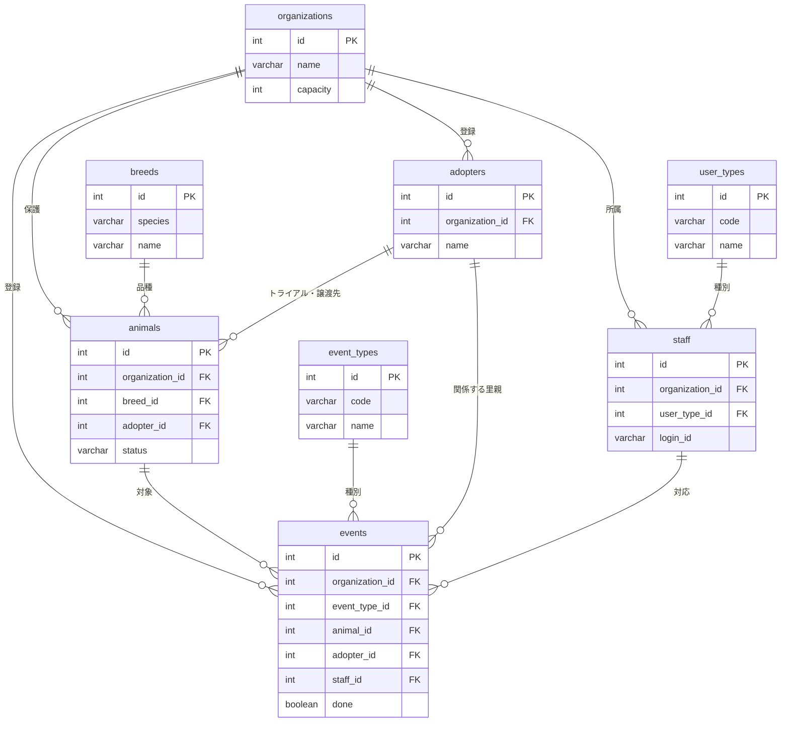

# 基本設計(ホゴタロウ)

<br>

1. [画面一覧・画面遷移図](#chapter1)
2. [ワイヤーフレーム](#chapter2)
3. [URL設計(ルーティング)](#chapter3)
4. [DB設計](#chapter4)
5. [システム構成図](#chapter5)
6. [データフロー](#chapter6)
7. [フォルダ構成](#chapter7)
8. [共通仕様](#chapter8)

<br>
<a id="chapter1"></a>

## 1.画面一覧・画面遷移図

### 権限の記号

|記号|権限|できること|
|:---:|:---:|:---:|
|V|ボランティア|個体・イベント・里親・スタッフの閲覧だけ<br>登録・編集・削除のボタンは表示されず、URLを直接開いても403|
|S|常勤スタッフ|Vにできることに加えて、個体・イベント・里親の登録・編集<br>イベントを対応済にする・未対応に戻す|
|A|管理ユーザー|Sにできることに加えて、個体・イベント・里親・スタッフの削除、スタッフの新規登録（アカウント発行）・編集<br>ただし自分自身の削除と、自分自身のユーザー種別の変更はできない|

どの権限でも、見えるのは自分の団体のデータだけ。

### 画面一覧
|No|画面名|閲覧できる権限|概要|
|:---:|:---:|:---:|:---:|
|S-01|ログインページ|なし|IDとパスワードを入力するフォーム、ログインボタンを表示<br>ログイン失敗時は「ログインに失敗しました」、ログアウト後は「ログアウトしました」を表示|
|S-02|トップページ|V|受け入れ状況（空きが0頭以下なら満員、使用率80%以上なら残りわずか、それ以外は受け入れOK）と空き頭数を表示<br>保護頭数（保護中(譲渡可)・保護中(譲渡不可)・入院中・トライアル中の合計）/ 受入上限（定員）と使用状況のバーを表示<br>今月のミニカレンダーを表示（イベントは未 / 済を色で分ける。クリックでS-07へ移動し、そのイベントの概要を表示）<br>個体管理、イベント管理、里親管理、スタッフ管理へのリンクを表示|
|S-03|個体一覧ページ|V|絞り込み（犬猫・保護状況のチェックボックスと名前の部分一致。保護状況の初期値はトップの保護頭数と同じ 4 つ）<br>個体情報(写真、名前、犬猫、性別、品種、年齢)の一覧をカード形式で表示。<br>新規登録リンク、詳細リンク|
|S-04|個体詳細ページ|V|選択した個体の写真<br>情報(名前、犬猫、性別、品種、年齢、誕生日(推定)、保護日、保護場所、保護方法、保護状況、里親（トライアル中・譲渡済のとき）、避妊去勢（済・未・不明）、狂犬病ワクチン（犬のとき）、混合ワクチン、マイクロチップ)、健康に関する特記事項、その他、個体に紐づくイベント（日付・イベント種別・内容）表示<br>編集ボタン、削除ボタン、一覧へ戻るボタン|
|S-05|個体新規登録ページ|S|S-4の項目（年齢を除く）の入力フォーム + 写真のファイル選択（選んだ写真は正方形に切り抜く）、新しい品種の入力欄、登録ボタン|
|S-06|個体編集ページ|S|個体の写真<br>S-5と同じフォームに現在値が入った状態、更新ボタン<br>写真は選ばなければ変更しない|
|S-07|イベント一覧ページ|V|イベント入力されたカレンダーの表示<br>(未/済が分かるように色で分ける)<br>前月・次月・今月への切り替え<br>イベント概要ペインを表示<br>カレンダーのイベント見出しをクリックでそのイベント概要(日付、時刻、個体名、イベント種別、場所、費用、里親)、特記事項、スタンプ欄（対応済にする・未対応に戻す。ボランティアには対応状況を文字で表示）、詳細を見るボタンをイベント概要ペインに表示。<br>新規登録ボタン|
|S-08|イベント詳細ページ|V|指定したイベントの詳細(日付・時刻・個体名・種別・場所・里親（紐づいているとき）・対応スタッフ・費用・未 / 済・特記事項)が表示<br>スタンプ欄（対応済にする・未対応に戻す）、編集リンク、削除ボタン、一覧へ戻るボタン|
|S-09|イベント新規登録ページ|S|S-8の項目（未 / 済と対応スタッフを除く）の入力フォーム（個体・種別・里親はプルダウン。個体は保護頭数に数える 4 つの保護状況の個体だけ）<br>登録ボタン|
|S-10|イベント編集ページ|S|S-9と同じフォームに現在値<br>更新ボタン|
|S-11|里親一覧ページ|V|検索フォーム（名前・電話番号の部分一致。電話番号はハイフンを無視）の表示<br>検索結果の件数、里親情報(名前、電話番号、住所)の一覧表示<br>新規登録リンク、詳細リンク|
|S-12|里親詳細ページ|V|選択した里親の情報(名前、性別、年齢、生年月日、住所、電話番号、メールアドレス)、メモ、関連するイベント、トライアル中・譲渡済みの個体、表示<br>編集ボタン、削除ボタン（個体・イベントに紐づいている里親は削除できない）|
|S-13|里親新規登録ページ|S|S-12の項目（年齢を除く）の入力フォーム<br>登録ボタン|
|S-14|里親編集ページ|S|S-13と同じフォームに現在値。<br>更新ボタン|
|S-15|スタッフ一覧ページ|V|検索フォーム（名前・電話番号の部分一致。電話番号はハイフンを無視）の表示<br>検索結果の件数、スタッフ情報(名前、性別、電話番号、メールアドレス、ユーザー種別)の一覧表示。<br>新規登録リンク、詳細リンク|
|S-16|スタッフ詳細ページ|V|選択したスタッフの情報(ID、名前、ログインID、性別、年齢、生年月日、住所、電話番号、メールアドレス、登録日、ユーザー種別)、特記事項、対応したイベント表示<br>編集リンク、削除ボタン（どちらもAだけ。削除は自分自身の詳細には出さない）|
|S-17|スタッフ新規登録ページ|A|詳細情報(名前、ログインID、パスワード、性別、生年月日、住所、電話番号、メールアドレス、登録日、ユーザー種別)の入力フォーム、特記事項の入力フォーム<br>登録ボタン|
|S-18|スタッフ編集ページ|A|S-17と同じ（ログインIDは表示だけで変更できない。パスワードは「変更する場合だけ入力」。自分自身のユーザー種別は変更できない）<br>更新ボタン|
|S-19|エラー|なし|400（送信内容の誤り）・403（権限なし）・404（データなし）・413（ファイルサイズ超過）・500（システムエラー）の共通ページ<br>メッセージとトップへのリンク（ヘッダーはログインしているときだけ表示）|

### 画面遷移図


<br>
<a id="chapter2"></a>


## 2.ワイヤーフレーム


<br>
<a id="chapter3"></a>

## 3.URL設計(ルーティング)

権限列は「その URL を実行できる最低の権限」（A ⊃ S ⊃ V）。**GET は V、POST は S。ただし登録・編集フォームの GET（`/*/new` `/*/*/edit`）は S。`/staff/new` と `/staff/{id}/edit`（GET・POST とも）と`/*/*/delete`は A**。未ログインは `/login` と CSS・画像以外の全 URL が `/login` へリダイレクトされる。F-3 と F-4 は Controller を書かない（Spring Security が処理する）。F-34 は実装のときに追加した機能（番号は追加した順）。

|No|URL|メソッド|権限|処理内容|
|:---:|:---:|:---:|:---:|:---:|
|F-01|/|GET|V|トップページを表示|
|F-02|/login|GET|なし|ログイン画面を表示（ログイン済みなら/へリダイレクト）|
|F-03|/login|POST|なし|ID・パスワードで認証し、成功時は/へリダイレクト 失敗時は/login?errorへリダイレクト|
|F-04|/logout|POST|V|セッションを破棄し、/login?logoutへリダイレクト|
|F-05|/animal|GET|V|ファセット検索（犬猫・保護状況・名前）<br>個体一覧を表示(カード形式)|
|F-06|/animal/{id}|GET|V|個体詳細と紐づくイベントを表示|
|F-07|/animal/new|GET|S|個体新規登録フォームを表示|
|F-08|/animal/new|POST|S|個体を新規登録し、/animal/{id}へリダイレクト|
|F-09|/animal/{id}/edit|GET|S|個体編集フォームを表示|
|F-10|/animal/{id}/edit|POST|S|個体情報を更新し、/animal/{id}へリダイレクト|
|F-11|/animal/{id}/delete|POST|A|個体を削除し、/animalへリダイレクト|
|F-12|/event|GET|V|イベントカレンダーと概要ペインを表示（year・month で表示する月を指定。無ければ今月）|
|F-13|/event/{id}|GET|V|イベント詳細を表示|
|F-14|/event/new|GET|S|イベント新規登録フォームを表示|
|F-15|/event/new|POST|S|イベントを新規登録し、/event?year=&month=（登録したイベントの月）へリダイレクト|
|F-16|/event/{id}/edit|GET|S|イベント編集フォームを表示|
|F-17|/event/{id}/edit|POST|S|イベント情報を更新し、/event/{id}へリダイレクト|
|F-18|/event/{id}/complete|POST|S|イベントを対応済に変更し、対応スタッフにログイン中のスタッフを記録する(個体は更新しない)<br>カレンダーから押したときは/event?year=&month=&selectedEventId=へ、詳細から押したときは/event/{id}へリダイレクト|
|F-34|/event/{id}/uncomplete|POST|S|イベントを未対応に戻し、対応スタッフを空にする(個体は更新しない)<br>リダイレクト先はF-18と同じ|
|F-19|/event/{id}/delete|POST|A|イベントを削除し、/event?year=&month=（削除したイベントの月）へリダイレクト|
|F-20|/adopter|GET|V|名前・電話番号で検索<br>里親一覧を表示|
|F-21|/adopter/{id}|GET|V|里親詳細と紐づく個体(トライアル中・譲渡済み)イベントを表示|
|F-22|/adopter/new|GET|S|里親新規登録フォームを表示|
|F-23|/adopter/new|POST|S|里親を新規登録し、/adopter/{id}へリダイレクト|
|F-24|/adopter/{id}/edit|GET|S|里親編集フォームを表示|
|F-25|/adopter/{id}/edit|POST|S|里親情報を更新し、/adopter/{id}へリダイレクト|
|F-26|/adopter/{id}/delete|POST|A|里親を削除し、/adopterへリダイレクト<br>個体・イベントに紐づいていれば削除せず、/adopter/{id}へリダイレクト|
|F-27|/staff|GET|V|名前・電話番号で検索<br>スタッフ一覧を表示|
|F-28|/staff/{id}|GET|V|スタッフ詳細と、そのスタッフが対応したイベントを表示|
|F-29|/staff/new|GET|A|スタッフ新規登録フォームを表示|
|F-30|/staff/new|POST|A|スタッフを新規登録(パスワードはハッシュ化)し、/staff/{id}へリダイレクト|
|F-31|/staff/{id}/edit|GET|A|スタッフ編集フォームを表示|
|F-32|/staff/{id}/edit|POST|A|スタッフ情報を更新し、/staff/{id}へリダイレクト（パスワードは入力されたときだけハッシュ化して更新）|
|F-33|/staff/{id}/delete|POST|A|スタッフを削除し、/staffへリダイレクト<br>自分自身は削除せず、/staff/{id}へリダイレクト|

<br>
<a id="chapter4"></a>

## 4.DB設計(テーブル定義・ER図)

### 共通ルール

- DB名 `hogotaro`、文字コード utf8mb4
- 主キーは全テーブル `id INT AUTO_INCREMENT`
- 列名は snake_case の英字。JPA が `phone_number` ↔ `phoneNumber` を自動で対応づけるので、Entity に `@Column(name=...)` を書かなくて済む
- 業務4テーブル（animals・events・adopters・staff）は `organization_id INT NOT NULL`（FK → organizations.id）を持つ。マスタ（user_types・event_types・breeds）と organizations は持たない
- 業務 4 テーブルは `created_at` `updated_at` を持つ。値は MySQL の `DEFAULT CURRENT_TIMESTAMP` / `ON UPDATE CURRENT_TIMESTAMP` が入れる。Javaからは触らない（Entityでは `insertable=false, updatable=false`）
- 区分値（犬猫・性別・保護状況・避妊去勢）は `VARCHAR(20)`。値はJavaのenumの定数名（`DOG` `MALE` `ADOPTABLE` `DONE`）。日本語はenumが持つ（8章 命名規則）
- 済 / 未（混合ワクチン・狂犬病ワクチン・対応状況）は `BOOLEAN`。避妊去勢は「不明」もあるので区分値にする
- 特記事項は `TEXT`。上限はフォーム側で2000字
- 年齢は保存しない。生年月日から表示するときに計算する。
- 外部キーの `ON DELETE` は下の表。書いていない FK は指定なし（子があれば親を消せない → アプリ側でメッセージ）

|外部キー|ON DELETE|意味|
|:---:|:---:|:---:|
|events.animal_id|CASCADE|個体を消すとイベントも消える|
|events.staff_id|SET NULL|スタッフを消すとイベントの対応スタッフが空になる|
|animals.breed_id|SET NULL|品種を消しても個体は残る|
|animals.adopter_id、events.adopter_id|指定なし|紐づく個体・イベントがある里親は消せない|

### テーブル名(organizations)
|カラム名|データ型|制約|説明|
|:---:|:---:|:---:|:---:|
|id|INT|PK, AUTO_INCREMENT|団体ID|
|name|VARCHAR(50)|NOT NULL|団体名|
|address|VARCHAR(100)|NOT NULL|住所|
|phone_number|VARCHAR(20)||電話番号|
|email|VARCHAR(255)||メールアドレス|
|capacity|INT|NOT NULL|団体の受入上限|
|notes|TEXT||団体の特記事項|

### テーブル名(staff)
|カラム名|データ型|制約|説明|
|:---:|:---:|:---:|:---:|
|id|INT|PK, AUTO_INCREMENT|スタッフID|
|organization_id|INT|NOT NULL, FK→organizations.id|所属団体|
|login_id|VARCHAR(30)|NOT NULL, UNIQUE|ログインID。全団体で一意（ログイン画面に団体の欄が無い）|
|password_hash|VARCHAR(255)|NOT NULL|BCrypt|
|user_type_id|INT|NOT NULL, FK→user_types.id|ユーザー種別|
|name|VARCHAR(30)|NOT NULL|名前|
|gender|VARCHAR(20)|NOT NULL|`MALE` / `FEMALE` / `OTHER`|
|birthday|DATE|NOT NULL|生年月日|
|joined_date|DATE||登録日。団体にスタッフとして登録した日（DBの登録日時created_atとは別。画面から入力する）|
|address|VARCHAR(100)||住所|
|phone_number|VARCHAR(20)|NOT NULL|電話番号|
|email|VARCHAR(255)||メールアドレス|
|notes|TEXT||特記事項|
|created_at|TIMESTAMP|NOT NULL, DEFAULT CURRENT_TIMESTAMP|登録日時|
|updated_at|TIMESTAMP|NOT NULL, DEFAULT CURRENT_TIMESTAMP ON UPDATE CURRENT_TIMESTAMP|更新日時|

### テーブル名(animals)
|カラム名|データ型|制約|説明|
|:---:|:---:|:---:|:---:|
|id|INT|PK, AUTO_INCREMENT|個体ID|
|organization_id|INT|NOT NULL, FK→organizations.id|登録した団体|
|name|VARCHAR(10)|NOT NULL|名前|
|species|VARCHAR(20)|NOT NULL|`DOG` / `CAT`|
|sex|VARCHAR(20)|NOT NULL|`MALE` / `FEMALE` / `UNKNOWN`|
|breed_id|INT|FK→breeds.id|品種。分からなければNULL|
|birthday|DATE||誕生日|
|is_birthday_estimated|BOOLEAN|NOT NULL, DEFAULT TRUE|誕生日が推定かどうか|
|intake_date|DATE|NOT NULL|保護日|
|intake_method|VARCHAR(30)|NOT NULL|保護方法（例: 保健所から引き取り、飼い主放棄、迷子）|
|intake_place|VARCHAR(50)|NOT NULL|保護場所（例: ○○公園、△△保健所）|
|status|VARCHAR(20)|NOT NULL, DEFAULT 'NOT_ADOPTABLE'|`ADOPTABLE`（保護中(譲渡可)）/ `NOT_ADOPTABLE`（保護中(譲渡不可)）/ `HOSPITALIZED`（入院中）/ `TRIAL`（トライアル中）/ `ADOPTED`（譲渡済）/ `RETURNED`（返還）/ `TRANSFERRED`（移管）/ `DECEASED`（死亡）|
|adopter_id|INT|FK→adopters.id|トライアル中・譲渡済のときの里親|
|neutered|VARCHAR(20)|NOT NULL, DEFAULT 'UNKNOWN'|避妊去勢 `DONE`（済）/ `NOT_DONE`（未）/ `UNKNOWN`（不明）|
|combo_vaccine|BOOLEAN|NOT NULL, DEFAULT FALSE|混合ワクチン 済/未|
|rabies_vaccine|BOOLEAN|NOT NULL, DEFAULT FALSE|狂犬病ワクチン 済/未。猫は常に FALSE|
|microchip_no|VARCHAR(15)||マイクロチップ番号。未装着は NULL|
|health_notes|TEXT||健康に関する特記事項|
|notes|TEXT||その他の特記事項|
|image_path|VARCHAR(255)||写真の URL（`/photos/xxxx.jpg`）。無ければ NULL|
|created_at|TIMESTAMP|NOT NULL, DEFAULT CURRENT_TIMESTAMP|登録日時|
|updated_at|TIMESTAMP|NOT NULL, DEFAULT CURRENT_TIMESTAMP ON UPDATE CURRENT_TIMESTAMP|更新日時|

### テーブル名(events)
|カラム名|データ型|制約|説明|
|:---:|:---:|:---:|:---:|
|id|INT|PK, AUTO_INCREMENT|イベントID|
|organization_id|INT|NOT NULL, FK→organizations.id|登録した団体|
|event_type_id|INT|NOT NULL, FK→event_types.id|種別|
|animal_id|INT|NOT NULL, FK→animals.id (CASCADE)|対象の個体|
|adopter_id|INT|FK→adopters.id|トライアル・譲渡のときの里親|
|staff_id|INT|FK→staff.id (SET NULL)|対応スタッフ（対応済にした人）。未対応のあいだは NULL|
|event_date|DATE|NOT NULL|日程|
|event_time|TIME||時刻|
|place|VARCHAR(100)||場所|
|done|BOOLEAN|NOT NULL, DEFAULT FALSE|対応状況 対応済（TRUE）/ 未対応（FALSE）|
|cost|INT||費用（円）|
|notes|TEXT||特記事項|
|created_at|TIMESTAMP|NOT NULL, DEFAULT CURRENT_TIMESTAMP|登録日時|
|updated_at|TIMESTAMP|NOT NULL, DEFAULT CURRENT_TIMESTAMP ON UPDATE CURRENT_TIMESTAMP|更新日時|

### テーブル名(adopters)
|カラム名|データ型|制約|説明|
|:---:|:---:|:---:|:---:|
|id|INT|PK, AUTO_INCREMENT|里親ID|
|organization_id|INT|NOT NULL, FK→organizations.id|登録した団体|
|name|VARCHAR(30)|NOT NULL|名前|
|gender|VARCHAR(20)|NOT NULL|`MALE` / `FEMALE` / `OTHER`|
|birthday|DATE||生年月日|
|address|VARCHAR(100)||住所|
|phone_number|VARCHAR(20)|NOT NULL|電話番号|
|email|VARCHAR(255)||メールアドレス|
|notes|TEXT||特記事項（家族構成・住環境・希望する子など）|
|created_at|TIMESTAMP|NOT NULL, DEFAULT CURRENT_TIMESTAMP|登録日時|
|updated_at|TIMESTAMP|NOT NULL, DEFAULT CURRENT_TIMESTAMP ON UPDATE CURRENT_TIMESTAMP|更新日時|


### テーブル名(event_types) イベント種別マスタ（全団体共通）

|カラム名|データ型|制約|説明|
|:---:|:---:|:---:|:---:|
|id|INT|PK, AUTO_INCREMENT|イベント種別ID|
|code|VARCHAR(20)|NOT NULL, UNIQUE|`HOSPITAL_VISIT` / `HOSPITAL_ADMISSION` / `HOSPITAL_DISCHARGE` / `NEUTERING` / `COMBO_VACCINE` / `RABIES_VACCINE` / `MICROCHIP` / `TRIAL_START` / `TRIAL_RETURN` / `ADOPTION` / `OTHER`（11種類）。入力チェック（猫には狂犬病ワクチンを登録できない、トライアル開始・譲渡は里親が必須）に使う|
|name|VARCHAR(20)|NOT NULL|通院 / 入院 / 退院 / 避妊去勢手術 / 混合ワクチン / 狂犬病ワクチン / マイクロチップ装着 / トライアル開始 / トライアル返却 / 譲渡 / その他。初期値は schema.sql|

### テーブル名(user_types) ユーザー種別マスタ（全団体共通）
|カラム名|データ型|制約|説明|
|:---:|:---:|:---:|:---:|
|id|INT|PK, AUTO_INCREMENT|ユーザー種別ID|
|code|VARCHAR(20)|NOT NULL, UNIQUE|`ADMIN` / `STAFF` / `VOLUNTEER`。Spring Security のロール名になる|
|name|VARCHAR(20)|NOT NULL|管理ユーザー / 常勤スタッフ / ボランティア。初期値は schema.sql|

### テーブル名(breeds) 品種マスタ（全団体共通）

|カラム名|データ型|制約|説明|
|:---:|:---:|:---:|:---:|
|id|INT|PK, AUTO_INCREMENT|品種ID|
|species|VARCHAR(20)|NOT NULL|`DOG` / `CAT`|
|name|VARCHAR(50)|NOT NULL|品種名。(species, name) で UNIQUE。初期値は data.sql|

<br>

### ER図





<br>
<a id="chapter5"></a>

## 5.システム構成図


### application.properties の要点

|行|意味|
|:---|:---|
|`spring.mvc.view.prefix=/WEB-INF/jsp/`<br>`spring.mvc.view.suffix=.jsp`|Controllerが返す `"animal/list"`を`/WEB-INF/jsp/animal/list.jsp`に解決する|
|`spring.web.error.whitelabel.enabled=false`|Spring Boot標準のエラーページを止め、400 / 403 / 404 / 413 / 500 のときに`jsp/error.jsp`を表示する（Spring Boot 4 で名前が変わった。3 系の `server.error.whitelabel.enabled` は効かない）|
|`spring.web.resources.static-locations=classpath:/static/,file:uploads/`|プロジェクト直下の`uploads/`を静的ファイルとして公開する。`uploads/photos/a.jpg`が`/photos/a.jpg`で見える（写真配信のControllerが要らない）|
|`spring.servlet.multipart.max-file-size=5MB`<br>`spring.servlet.multipart.max-request-size=6MB`|写真の上限（リクエスト全体は6MB）。超えるとerror.jspに「写真の上限。超えるとSpringが413を返し、error.jspに出る|
|`spring.jpa.hibernate.ddl-auto=none`|テーブルは`sql/schema.sql`で作る。Hibernateに作らせない|

<br>
<a id="chapter6"></a>


## 6.データフロー

### ログインする場合
1. ログインIDとパスワードを入力し、「ログイン」をクリック。
2. ブラウザがPOST通信で/loginへリクエストを送信。
3. Spring Securityのフィルタがリクエストを受け取り、UserDetailsServiceを通じてMySQLのstaffテーブルからログインIDでスタッフを検索し、パスワードをBCryptで照合する。
    - 成功　→　次のステップへ
    - 失敗　→　/login?errorへリダイレクトし、「ログインに失敗しました」を表示
4. ログインIDと、スタッフのユーザー種別から決めたロール（ADMIN / STAFF / VOLUNTEER）を認証情報（Spring Security 標準の User）に設定し、セッションに保存する。団体IDはセッションには入れず、必要なときに LoginUser がログインIDで staff を引いて返す。
5. Spring Securityがトップページへリダイレクトを返す。
6. ブラウザがGET通信で/へリクエストを送信。
7. LoginUser がセッションのログインIDから団体IDを引き、その団体の保護頭数・受入上限・今月のイベントを取得して、トップページを表示する。


### イベントを完了にする場合
1. 常勤スタッフ以上がイベント概要ペインまたはイベント詳細のスタンプ欄をクリックし、確認のポップアップで「OK」を押す。
2. ブラウザがPOST通信で/event/{id}/completeへリクエストを送信。（概要ペインから押したときは reopenPane=true も送る）
3. Springがイベントを取得する。（イベントID＋ログインスタッフの団体IDで検索）
    - 該当なし → 404エラーページを表示。
    - 該当あり → 次のステップへ。
4. トランザクションを開始し、eventsテーブルの対応状況を「対応済」、スタッフIDをログインスタッフに更新する。（すでに対応済なら何もしない）
5. 個体は更新しない。（保護状況などはスタッフが個体編集で変える）
6. 概要ペインから押したときは/event?year=&month=&selectedEventId=へ、詳細から押したときは/event/{id}へリダイレクト。（フラッシュメッセージは出さない）
7. ブラウザがGET通信でリダイレクト先へリクエストを送信。
8. 概要ペインから押したときは、そのイベントの月のカレンダーを、そのイベントの概要ペインを開いた状態で表示する。詳細から押したときは、イベント詳細を表示する。どちらもスタンプの見た目が「済」に変わる。


<a id="chapter7"></a>

## 7.フォルダ構成
```
hogotaro/
├─ pom.xml
├─ uploads/
│   ├─ photos/                          個体の写真（登録すると UUID のファイル名で増える）
│   └─ NoPhotos/NoPhotos.png            写真が無いとき用（犬猫共通）
├─ sql/
│   ├─ schema.sql                       CREATE DATABASE + 全テーブル + マスタ（user_types 3 行、event_types 11 行）
│   └─ data.sql                         品種、デモ団体 2 つとスタッフ（BCrypt 済み）・里親・個体・イベント
├─ src/main/resources/
│   ├─ application.properties           
│   └─ static/
│       ├─ css/hogotarou.css            共通スタイル（配色、カード、ボタン、表など）
│       └─ images/                      ロゴ、favicon.ico、apple-touch-icon.png など
├─ src/main/webapp/WEB-INF/jsp/
│   ├─ common/head.jspf                 共通部品（<head> の中身。Bootstrap・フォント・hogotarou.css の読み込み）
│   ├─ common/header.jspf               共通部品（ヘッダにロゴ・ナビ・団体名と名前・ログアウト）
│   ├─ common/message.jspf              フラッシュメッセージの表示部品（今は _template だけが使う。各画面は自分で表示する）
│   ├─ _template/list.jsp  detail.jsp  form.jsp   画面を作るときにコピーして使う見本（表示はしない）
│   ├─ login.jsp  top.jsp  error.jsp
│   ├─ animal/list.jsp  detail.jsp  form.jsp     form は新規と編集で共用
│   ├─ event/calendar.jsp  detail.jsp  form.jsp
│   ├─ adopter/list.jsp  detail.jsp  form.jsp
│   └─ staff/list.jsp  detail.jsp  form.jsp
└─ src/main/java/com/example/hogotaro/
    ├─ HogotaroApplication.java         起動クラス（生成されたまま）
    ├─ security/
    │   ├─ SecurityConfig.java          URL ごとの権限、ログイン画面の場所、BCrypt の Bean
    │   ├─ LoginUserDetailsService.java loginId で staff を探して Spring Security 標準の User（ログインIDとロール）を返す
    │   └─ LoginUser.java               今ログインしている人の団体id・スタッフid・名前・ロールを返す窓口（Controllerに注入して使う）
    ├─ controller/
    │   ├─ TopController.java           /（トップ）と GET /login（login.jsp を返すだけ）
    │   ├─ AnimalController.java
    │   ├─ EventController.java
    │   ├─ AdopterController.java
    │   ├─ StaffController.java
    │   └─ LoginUserModelAdvice.java    全画面の JSP に loginUser を渡す（ヘッダーの団体名・名前の表示に使う）
    ├─ service/                         Controller と同じ 5 つ（TopService は保護頭数と団体の取得）。TopService 以外はクラスに @Transactional
    ├─ repository/                      Entity と同じ 8 つ。interface だけ
    ├─ entity/
    │   ├─ Organization  UserType  Staff  Breed  Animal  EventType  Adopter  Event   テーブル 1 つに 1 クラス
    │   └─ Species  Sex  Gender  Status  NeuterStatus                        enum（日本語ラベル付き）
    ├─ dto/
    │   └─ EventCalendar  CalendarDay   カレンダーの1か月分・1マス分（画面に渡す入れ物。テーブルとは対応しない）
    └─ form/
        ├─ AnimalForm  EventForm AdopterForm    StaffForm   入力を受ける + Bean Validation
        └─ AnimalSearchForm  AdopterSearchForm  StaffSearchForm   一覧の検索条件を受ける
```

<br>
<a id="chapter8"></a>

## 8.共通仕様

### フラッシュメッセージ
|タイミング|メッセージ|
|:---:|:---:|
|ログイン失敗|「ログインに失敗しました」|
|ログアウト時|「ログアウトしました」|
|新規登録成功|「〇〇新規登録が完了しました」|
|編集|「〇〇を編集しました」|
|削除|「〇〇を削除しました」|
|削除拒否（里親）|「個体またはイベントに紐づいているため削除できません」|
|削除拒否（スタッフ）|「自分自身は削除できません」|

- ログイン失敗・ログアウト時はフラッシュではなく、ログイン画面が URL の `?error` `?logout` を見て表示する
- イベントを対応済にする・未対応に戻すときはメッセージを出さない（スタンプの見た目が変わるので分かる）
- 「既に登録済みのログインIDです」はフラッシュではなく、入力エラーとしてログインIDの欄の下に出す

### エラー処理
Java のエラー処理クラスは書かない。`jsp/error.jsp` 1 枚に `${status}` で文言を分けて書く。

|エラー|発生条件|HTTP|誰が処理するか|error.jsp の文言|
|:---:|:---|:---:|:---|:---|
|未ログイン|認証なしで保護 URL を開く|302|Spring Security が /login へリダイレクト|（ログイン画面）|
|送信内容の誤り|数字でない ID を URL に入れたときなど|400|Spring → Spring Boot が error.jsp|送信された内容に誤りがあります。画面を開き直してから、もう一度操作してください|
|権限なし|V が POST や登録・編集フォームを開く、S が削除やスタッフの登録・編集をする、CSRF 不一致|403|Spring Security → Spring Boot が error.jsp|この操作を行う権限がありません|
|データなし|存在しない ID、他団体の ID|404|Service が `ResponseStatusException(HttpStatus.NOT_FOUND)` を投げる → Spring Boot が error.jsp|指定されたデータは存在しません|
|ファイルサイズ超過|写真が 5MB 超|413|Spring → Spring Boot が error.jsp|ファイルは 5MB 以下にしてください|
|入力エラー|Bean Validation、Service のチェック|200|Controller が同じフォームを再表示|（項目の下にメッセージ）|
|システムエラー|DB 接続失敗など|500|Spring Boot が error.jsp|システムエラーが発生しました。時間を置いて再度お試しください|

### PRGパターン
二重送信を防ぐため、POST(ログイン、ログアウト、新規登録、編集、削除)の処理後はGETへリダイレクトする。

### 団体の絞り込み
受け入れ基準「他団体のデータが見えない」はこの 3 つで実現する。

- 業務 4 テーブルの Repository メソッドは**必ず名前に `OrganizationId` を含める**（`findByOrganizationId...`、`findByIdAndOrganizationId`）。`findById` `findAll` は業務テーブルでは使わない
- 1 件取得は `findByIdAndOrganizationId(id, loginUser.getOrganizationId())`。取れなければ 404。他団体の ID を URL に入れても「存在しない」扱いになる
- 登録・更新するときの `organizationId` はフォームからではなく `loginUser.getOrganizationId()` から入れる。プルダウンで選んだ里親・個体・スタッフの ID も、保存前に `findByIdAndOrganizationId` で引き直す（他団体の ID を送られても弾く）

確認方法: 団体 B でログインして団体 A の個体 URL を開き、404 になることを各担当が自分で確かめる。

### 命名規則

|対象|規則|例|
|:---:|:---:|:---:|
|パッケージ|`com.example.hogotaro.` + 役割 | `controller` `service` `repository` `entity` `form` `security`|
|Controller|`XxxController`。メソッド名は全機能で `list` `newForm` `create` `detail` `editForm` `update` `delete` に揃える（イベントは `complete` `uncomplete` も。トップは `top` `login`）。処理は Service に書き、Controller は受け取り・Service 呼び出し・JSP 返却だけ | `AnimalController`|
|Service / Repository / Entity / Form| `XxxService` `XxxRepository` `Xxx` `XxxForm` | `AnimalService` |
|JSP|`jsp/xxx/list.jsp` `detail.jsp` `form.jsp`（新規と編集で共用。イベントの一覧は `calendar.jsp`）|`animal/form.jsp`|
|テーブル|英語・**複数形**・小文字。staff だけ複数形も staff|`animals` `adopters` `event_types` `staff`|
|DBの列|snake_case。FK は `xxx_id`|`login_id` `organization_id` `event_type_id`|
|主キーの型|DB が INT なので Java は `Integer`。`Long` にしない（ネットのサンプルは `Long` が多いので注意）|Entity の `Integer id`、`JpaRepository<Animal, Integer>`、`@PathVariable Integer id`|
|Entity ↔ テーブル|テーブル名の**単数形**をPascalCaseにし、`@Table(name = "animals")`を書く。列名はsnake_case → camelCase（JPAが自動で対応づける）|`event_types`→ `EventType`、`phone_number` → `phoneNumber`|
|EntityのFK|`@ManyToOne`で相手のEntityを持つ|`Breed breed`（`Integer breedId`にしない。JSPで`${a.breed.name}`と書けるように）|
|enum|定数は英大文字、日本語は`label`フィールド。DBには定数名を保存（`@Enumerated(EnumType.STRING)`）。保護頭数に数える4つは `Status.inCare()` が返す。トップの頭数と個体一覧の初期値は必ずここから取り、リストを直接書かない| `Status.ADOPTABLE("保護中(譲渡可)")`、JSPは`${a.status.label}`|
|Javaの変数| camelCase。Entity1件はクラス名の小文字、複数は`xxxList`|`Animal animal`、`List<Animal> animalList`|
|Modelに入れる名前|1件は`xxx`、一覧は`xxxList`、フォームは`xxxForm`、プルダウンの選択肢は`xxxList`|`animal` `animalList` `animalForm` `breedList`|
|JSPのループ変数|頭文字1文字。`a`（個体）`a`（里親）`e`（イベント）`s`（スタッフ）|`<c:forEach var="a" items="${animalList}">`|
|URLパラメータ・フォームのname|Formのフィールド名と同じ（camelCase）|`intakeDate` `breedId`|
|写真のファイル名|UUID + 拡張子（PNG なら `.png`、それ以外は `.jpg`）。`uploads/photos/`に置き、DBには`/photos/xxxx.jpg`を保存||
