# 詳細設計(ホゴタロウ)

技術: Java / Spring Boot / Spring Security / Spring Data JPA / JSP + JSTL / MySQL。

<br>

1. [共通仕様](#chapter1)
2. [トップページ](#chapter2)
3. [個体管理](#chapter3)
4. [イベント管理](#chapter4)
5. [里親管理](#chapter5)
6. [スタッフ管理](#chapter6)
7. [エラー](#chapter7)
8. [付録（DDL、初期データ、状態遷移図）](#chapter8)

<br>
<a id="chapter1"></a>

## 1. 共通仕様

### 1.1 この文書の読み方

- 画面は `S-xx`（基本設計1章「画面一覧」の No）。例: S-03 個体一覧
- 機能は `F-xx`（基本設計3章「URL設計」の No）。例: F-05 GET /animal。F-34（未対応に戻す）は詳細設計で追加した機能で、基本設計3章にはまだ載っていない
- 各章は「画面 → 機能」の順。画面はカンプの画像と表で説明。新規登録と編集は同じ JSP を共用するので、カンプは新規登録の1枚だけ載せる（編集は同じレイアウトに現在値が入る）
- フォームの表の「name」は Form クラスのフィールド名（= `<form:input path>` の値）。「タグ・型」の `text, maxlength=10` は `<input type="text" maxlength="10">` の意味

### 1.2 ログインと権限

- ログインは Spring Security に任せる（`POST /login` と `POST /logout` の Controller は書かない）
- ログインしたらセッションに入るのは Spring Security 標準の `User`（ログインIDとロール）だけ。`User` は `LoginUserDetailsService` が作り、ロールは `User.withUsername(...).roles(user_types.code)` で付ける（`roles()` が `ROLE_` を付けるので、自分で `ROLE_` を付けない。付けると `ROLE_ROLE_ADMIN` になって全員 403）
- `LoginUser` は `@Component` の窓口クラス。Controller に `private final LoginUser loginUser;` で注入して使う。呼ばれるたびに、ログインIDで staff を引き直して返す。`@AuthenticationPrincipal` は使わない。`loginUser.getId()` は無い（スタッフIDは `getStaffId()`）
  - `getOrganizationId()`（団体ID）・`getStaffId()`（スタッフID）・`getOrganizationName()`（団体名）・`getName()`（名前）・`getRole()`（`ADMIN` など）・`getUserTypeName()`（管理ユーザー など）・`isLoggedIn()`
  - 団体IDは常に `loginUser.getOrganizationId()`。ログインしていないときに呼ぶと例外になる
- 権限は基本設計3章のとおり。GETはV、POSTはS。ただし新規登録・編集のフォーム（`/xxx/new` `/xxx/{id}/edit`）はGETもS（ボランティアがURLを直接開いたら403）。削除・`/staff/new`・`/staff/{id}/edit`（GET・POST）はA
- `SecurityConfig` に必ず書く設定（書かないとログイン画面が出ない・ログインできない）
  - `.formLogin(...)` に `.loginPage("/login")` と `.usernameParameter("loginId")`。ログインIDの name が Spring Security の既定（`username`）ではなく `loginId` のため。パスワードは既定の `password` のまま
  - `.dispatcherTypeMatchers(DispatcherType.FORWARD, DispatcherType.ERROR).permitAll()`。JSP への転送と error.jsp の表示を通す（無いと、未ログインで `/login` を開いたときにリダイレクトが繰り返される）
  - `/login` `/css/**` `/js/**` `/img/**` は `permitAll()`（ログイン前でも画面とスタイルを出す）。写真の `/photos/**` はログイン必須のまま
  - `requestMatchers` は先に書いたものが優先されるので、範囲の狭いものから順に書く: `permitAll()` のもの → A（`/*/*/delete`、`/staff/new`、`/staff/*/edit`）→ S（`/*/new`、`/*/*/edit`、POST すべて）→ 残りはログイン必須。「GETはV」を先に書くと、ボランティアが登録・編集フォームを開けてしまう
  - 土台を動かしたら、未ログインでログイン画面が表示されること、正しいIDとパスワードでトップページへ進めること、ボランティアでログインしたときに編集・削除のボタンとスタンプ欄が出ず、代わりに対応状況が「未対応」「対応済」の文字で出ることを確かめる
- 画面のボタンは `<sec:authorize access="...">` で囲む。新規登録・編集・完了・未対応に戻すは `hasAnyRole('ADMIN','STAFF')`、削除とスタッフの新規登録・編集は `hasRole('ADMIN')`。ボランティアにはスタンプ欄の代わりに対応状況を文字で出す（`!hasAnyRole('ADMIN','STAFF')` で囲む。S-07・S-08）。`sec` のタグを使うには、pom.xml に `spring-security-taglibs` を足す

### 1.3 団体の絞り込み

基本設計8章のとおり。1件取得は必ず `findByIdAndOrganizationId(id, loginUser.getOrganizationId())`、空なら 404。登録するときの団体IDは `loginUser` から。

### 1.4 フラッシュメッセージとエラー

基本設計8章のとおり。

### 1.5 入力チェックの書き方

- Form に `@NotBlank` `@Size` `@NotNull` `@Email` `@Pattern` `@Past` `@PastOrPresent`などを付け、メッセージはアノテーションに直接書く
- 各章の表の `@Pattern("...")` は略記。実際は `@Pattern(regexp = "...", message = "...")` と書く。表の中の `\|` は Markdown の表を崩さないための書き方で、Java では `|` と書く
- Controller は `@Validated XxxForm xxxForm, BindingResult result` で受け、`result.hasErrors()` なら同じフォームを再表示（プルダウンの選択肢を Model に入れ直す）
- アノテーションで書けないチェック（ログインID重複、新規登録時のパスワード必須、里親の必須条件、プルダウンで選んだID（品種・個体・イベント種別・里親・ユーザー種別）の存在確認、写真の種類、犬の狂犬病ワクチン、猫の狂犬病ワクチンイベント、自分自身のユーザー種別の変更など）は Service で判定し `result.rejectValue()` で乗せる。エラーがあれば保存せずに戻る（戻り値があるメソッドは null を返す）。Controller は Service を呼んだあとでもう一度 `result.hasErrors()` を見て、エラーなら同じフォームを再表示する
- 日付は `<input type="date">` + `LocalDate` + `@DateTimeFormat(iso = ISO.DATE)`
- 時刻は `<input type="time">` + `LocalTime` + `@DateTimeFormat(pattern = "HH:mm")`
- 数値や日付に変換できない値が送られたとき（typeMismatch）に英語のメッセージが出ないよう、`messages.properties` に `typeMismatch=入力形式が正しくありません` を書く
- プルダウン・ラジオは enum の定数名を送り、表示は `label`
- 任意の文字列項目が空文字なら Service で `null` にして保存

### 1.6 標準画面遷移（個体・里親・イベント・スタッフ共通）

ヘッダー: ログイン後の全画面で表示。トップ / 個体一覧 / 里親一覧 / イベント / スタッフ一覧  <br>右端にログイン中の団体名と名前 / ログアウト（POST フォーム）

|遷移元|操作|遷移先|
|:---:|:---:|:---:|
|一覧|「新規登録」| 新規登録画面（GET /xxx/new）|
|一覧| 行・カードをクリック | 詳細（GET /xxx/{id}）|
|詳細|「編集」|編集画面（GET /xxx/{id}/edit）|
|詳細|「削除」|確認 → POST /xxx/{id}/delete → 一覧へ。フラッシュ「〇〇を削除しました」|
|新規登録|「登録」|POST /xxx/new → 詳細へ。フラッシュ「〇〇新規登録が完了しました」|
|編集|「更新」|POST /xxx/{id}/edit → 詳細へ。フラッシュ「〇〇を編集しました」|
|新規登録・編集| 入力エラー | 同じフォームを再表示 |
|新規登録・編集| 「キャンセル」 | 新規 → 一覧、編集 → 詳細 |


各機能の章では、この表と**違うところだけ**書く。


### 1.7 命名

基本設計8章のとおり。追加分: Service のメソッドは `search` `findById` `findXxxList` `getEditForm` `create` `update` `delete`（イベントだけ `complete` `uncomplete`）。`getEditForm` は編集画面用に、取得した Entity の値を Form に詰めて返す。検索条件は `XxxSearchForm`、Model 名は `searchForm`（Controller の引数に `@ModelAttribute("searchForm")` を付ける）。BOOLEAN のフィールドは `is_` を付けない（`birthdayEstimated`。列名は `@Column(name = "is_birthday_estimated")`）。避妊去勢は enum `NeuterStatus`（`DONE` 済 / `NOT_DONE` 未 / `UNKNOWN` 不明）で、列名・フィールド名とも `neutered`。

### 1.8 共通部品

- `jsp/common/header.jspf`: taglib 宣言（`c` `fn` `form` `sec`）、ナビ、ログイン中の団体名と名前（`LoginUserModelAdvice`（`@ControllerAdvice`）が全画面に `loginUser` を渡しているので、`${loginUser.organizationName}` `${loginUser.name}` で読む）、ログアウトの `<form:form action="/logout" method="post">`、フラッシュの表示。ナビ・団体名と名前・ログアウトは `<sec:authorize access="isAuthenticated()">` で囲む（login.jsp と error.jsp は未ログインでも表示されるため。囲まないと団体名の取得で例外になる）
- `static/js/confirm.js`: `confirmSubmit(msg)`。削除・完了・未対応に戻すの form に `onsubmit="return confirmSubmit('...')"` と書く（`return` が無いと、キャンセルしても送信される）
- `static/js/calendar.js`: イベント一覧の概要ペインの表示（S-07）
- `static/img/placeholder-dog.png` `placeholder-cat.png`: 写真が無い個体に犬猫で出し分け
- 年齢は Entity の `@Transient getAge()` で誕生日から計算。無ければ「不明」

<br>
<a id="chapter2"></a>

## 2. トップページ

### 2.1 画面（S-01 〜 S-02）

#### S-01 ログインページ（login.jsp）

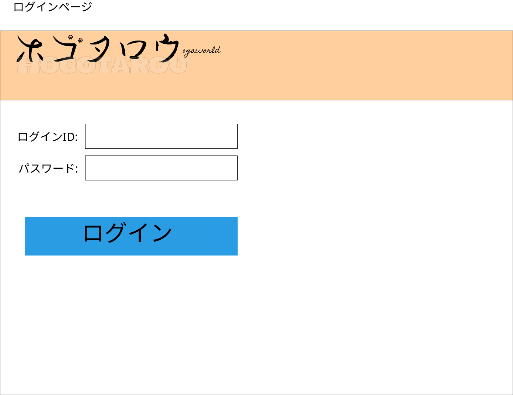

|項目|name|タグ・型|必須|備考|
|:---:|:---:|:---:|:---:|:---:|
|ログインID|loginId|text|○|`SecurityConfig` で `.usernameParameter("loginId")` を指定する（1.2）|
|パスワード|password|password|○||
|メッセージ|—|—||`?error` で「ログインに失敗しました」、`?logout` で「ログアウトしました」。フラッシュではなく、JSP で `${param.error != null}` `${param.logout != null}` を見て表示する|

`<form:form action="/login" method="post">` で書く（生の `<form>` は 403 になる）。

#### S-02 トップページ（top.jsp）

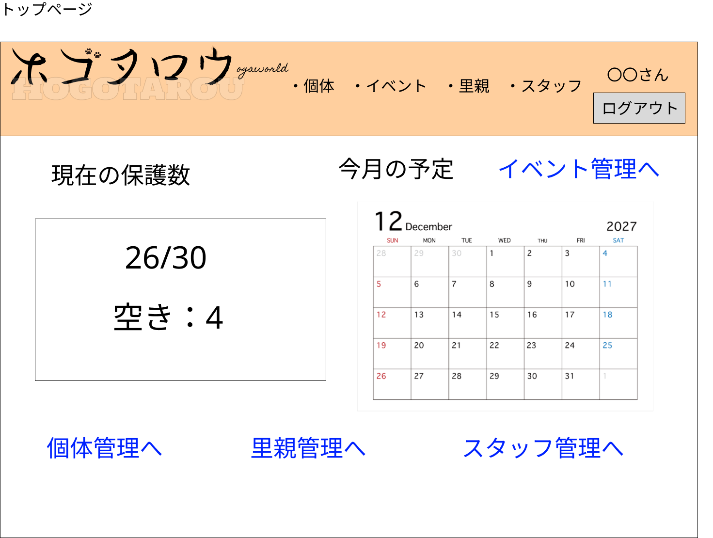

|表示項目|内容|備考|
|:---:|:---:|:---:|
|保護頭数/受入上限|`${animalCount}`/`${capacity}`|`Status.inCare()` の4つ（保護中(譲渡可)・保護中(譲渡不可)・トライアル中・入院中）の合計。上限以上なら赤|
|ミニカレンダー|日付のマスにイベントの見出しを表示|マスをクリックで `/event?year=&month=`|
|個体管理へ/イベント管理へ/里親管理へ/スタッフ管理へ|リンク|S-03/S-07/S-11/S-15へ|

### 2.2 機能（F-01 〜 F-04）

#### F-01 GET /（TopController#top）
1. 保護頭数 = `animalRepository.countByOrganizationIdAndStatusIn(団体ID, Status.inCare())`
2. 受入上限 = 団体の `capacity`（`organizationRepository.findById(団体ID)` で取る）
3. `eventService.search(organizationId, null, null)` で `EventCalendar` を作る（F-12 と同じ）
4. Model: `animalCount`、`capacity`、`calendar` → top.jsp

#### F-02 GET /login（TopController#login）
1. ログイン済みなら `redirect:/`。それ以外はlogin.jspを返す。

#### F-03 POST /login、F-04 POST /logout（Controller 無し）
Controller 無し。Spring Securityに任せる

<br>
<a id="chapter3"></a>

## 3. 個体管理

### 3.1 画面（S-03 〜 S-06）

#### S-03 個体一覧（animal/list.jsp）

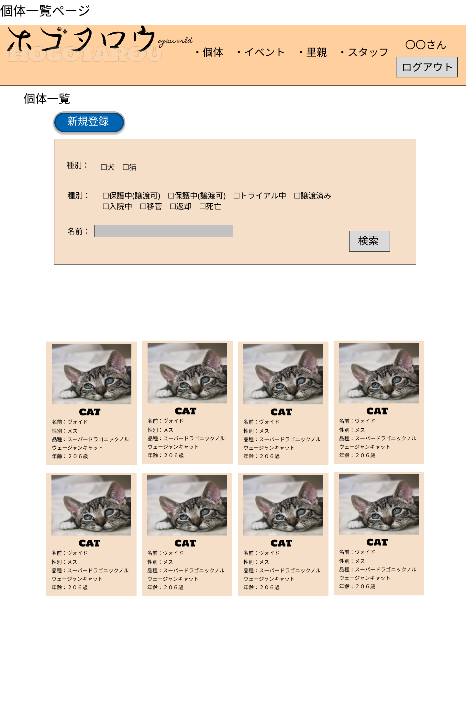

カード形式で個体の一覧を表示する。カードにマウスを乗せたとき（ホバー）は、枠や影を変えてクリックできることが分かるようにする。

- 絞り込み：犬猫・保護状況（どちらもチェックボックスで複数選択）。保護状況の初期値は `Status.inCare()` の4つ

各カードの表示項目は以下の通り

|表示項目|内容|備考|
|---|---|---|
|写真|``、無ければプレースホルダ||
|名前|`${a.name}`| カード全体を `<a href="/animal/${a.id}">`|
|犬猫|`${a.species.label}`||
|性別|`${a.sex.label}`||
|年齢|`${a.age}`||
|品種|`${a.breed.name}`|品種が無ければ空欄|
|保護状況|`${a.status.label}`||

|操作|権限|遷移先|
|---|:---:|---|
|新規登録リンク|S|S-05|
|カードクリック|V|S-04|
|検索ボタン|V|S-03（条件つき）|

#### S-04 個体詳細（animal/detail.jsp）

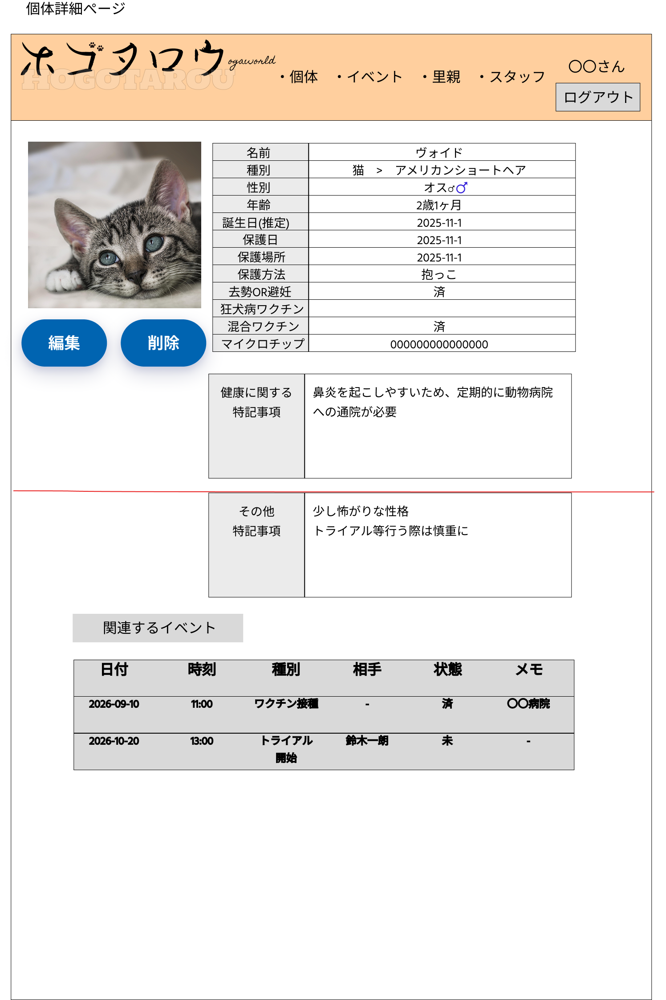

|表示項目|内容|
|---|---|
|写真|大きめに1枚|
|基本|名前・犬猫・性別・品種・年齢・誕生日（誕生日があり、推定のときは後ろに「（推定）」を付ける）・保護日・保護方法・保護場所・保護状況|
|里親|保護状況がトライアル中・譲渡済のとき `${animal.adopter.name}` を `/adopter/{id}` へのリンクで。それ以外は表示しない|
|医療|避妊去勢（済/未/不明）・混合ワクチン（済/未）・狂犬病ワクチン（済/未。猫のときは項目ごと表示しない）・マイクロチップ番号|
|特記事項|健康に関する特記事項・その他の特記事項。表示は `<c:out>` + `white-space: pre-wrap`|
|イベント一覧|この個体に関連するイベントを日付の降順で（日付・時刻・種別・場所・済/未）。行は `/event/{id}` へのリンク。0件なら「イベントはありません」|

|操作|権限|遷移先|
|---|:---:|---|
|編集リンク|S|S-06|
|削除ボタン|A|確認「紐づくイベントと写真も削除されます。本当に削除しますか？」→ F-11 |
|一覧へ戻る|V|S-03|

#### S-05 個体新規登録・S-06 個体編集（animal/form.jsp 共用）

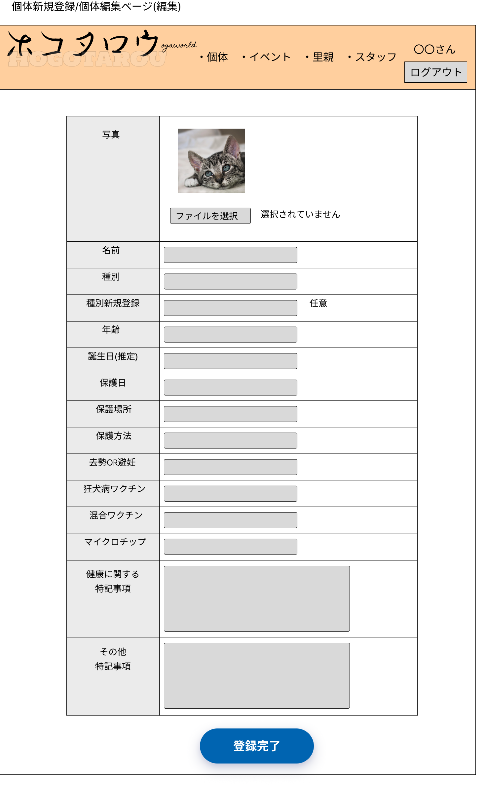

`<form:form modelAttribute="animalForm" method="post" enctype="multipart/form-data">`、`${mode}` が `new` / `edit`。

|項目|name|タグ・型|必須|チェック|エラーメッセージ|
|---|---|---|:---:|---|---|
|名前|name | text, maxlength=10 | ○ | `@NotBlank @Size(max=10)` | 名前を入力してください / 名前は10文字以内で入力してください |
|犬猫|species | radio（犬 / 猫） | ○ | `@NotNull` | 犬猫を選択してください |
|性別|sex | radio（オス / メス / 不明） | ○ | `@NotNull` | 性別を選択してください |
|品種|breedId | select（`breedList`。先頭に「未選択」（value=""）。犬猫で絞り、犬猫が選ばれるまでは選べない。下の注記） | | 任意。Service で `breedRepository.findById` が空、または品種の犬猫が個体の犬猫と違えば rejectValue | 品種の指定が不正です |
|新しい品種|newBreedName|text, maxlength=50||`@Size(max=50)`。入力されていれば `breedId` より優先（Service）|品種は50文字以内で入力してください|
|誕生日|birthday | date | | `@PastOrPresent` | 未来の日付は指定できません |
|誕生日は推定|birthdayEstimated | checkbox（誕生日の入力欄のすぐ下に置く。`<form:checkbox path="birthdayEstimated" label="推定"/>`） | | — | — |
|保護日|intakeDate | date | ○ | `@NotNull @PastOrPresent` | 保護日を入力してください / 未来の日付は指定できません |
|保護方法|intakeMethod | text, maxlength=30 | ○ | `@NotBlank @Size(max=30)` | 保護方法を入力してください / 保護方法は30文字以内で入力してください |
|保護場所|intakePlace | text, maxlength=50 | ○ | `@NotBlank @Size(max=50)` | 保護場所を入力してください / 保護場所は50文字以内で入力してください |
|保護状況|status | select（保護中(譲渡可)、保護中(譲渡不可)、トライアル中、入院中、譲渡済、返還、移管、死亡） | ○ | `@NotNull` | 保護状況を選択してください |
|里親|adopterId | select（`adopterList`。先頭に「なし」） | | 保護状況がトライアル中・譲渡済なら必須（Service）。トライアル中・譲渡済で指定時は `findByIdAndOrganizationId` で引き直し。それ以外の保護状況では、選んでいても保存時に空にする（F-08・F-10） | トライアル中・譲渡済の場合は里親を選択してください / 里親の指定が不正です |
|避妊去勢|neutered | radio（済 / 未 / 不明。`neuterStatusList`） | ○ | `@NotNull` | 避妊去勢を選択してください |
|混合ワクチン|comboVaccine | radio（済 / 未） | ○ | `@NotNull` | 混合ワクチンを選択してください |
|狂犬病ワクチン|rabiesVaccine | radio（済 / 未）。犬のときだけ表示（犬猫のラジオに合わせて JS で切り替え） | 犬は○ | Service: 犬で空なら rejectValue。猫なら `false` で保存 | 狂犬病ワクチンを選択してください |
|マイクロチップ番号|microchipNo | text, maxlength=15 | | `@Pattern("^[0-9]{15}$\|^$")` | マイクロチップ番号は15桁の数字で入力してください |
|健康に関する特記事項|healthNotes | textarea | | `@Size(max=2000)` | 2000文字以内で入力してください |
|その他の特記事項|notes | textarea | | `@Size(max=2000)` | 2000文字以内で入力してください |
|写真|photo | file, accept="image/jpeg,image/png" | | Service: 空なら変更なし。種類（`getContentType()`）が `image/jpeg` `image/png` 以外なら rejectValue。5MB 超はエラー処理（7章） | 写真は JPEG または PNG を選択してください / ファイルは 5MB 以下にしてください|

- 編集では現在の写真を表示し、「変更しない / 差し替える」はファイルを選んだかどうかで判定する。
- 年齢は入力欄に入れない（誕生日から計算して表示する）。
- 保護状況の初期値は保護中(譲渡不可)、避妊去勢の初期値は不明、「誕生日は推定」の初期値はチェックあり（DB の初期値と同じ。F-07）。
- 「誕生日は推定」は `<form:checkbox>` で書く。チェックを外して送るとブラウザは値を送らないが、`<form:checkbox>` が自動で入れる隠し項目（`_birthdayEstimated`）のおかげで `false` が入る。Form のフィールドは `boolean`。誕生日が空でもチェックはそのまま保存する（年齢は「不明」と表示されるので影響しない）。
- 品種のプルダウンは、犬猫がまだ選ばれていないときは `disabled`（選べない）にする。犬猫のラジオを選ぶと JS で有効にし、選んだ犬猫の品種だけを出す。各 option は `<c:forEach>` + `<form:option value="${b.id}" data-species="${b.species}">` で書く（`<form:options>` では `data-species` を付けられない）。JS は画面を開いたときに全部の option を配列に覚えておき、犬猫を選ぶたびに「未選択」以外を外して、その犬猫のものだけを入れ直す（option を `hidden` や `display:none` で隠す方法は、iPhone の Safari では効かないため使わない）。犬猫を切り替えたら、品種の選択を「未選択」に戻す。入力エラーの再表示や編集のときに犬猫が選ばれていれば、最初から絞った状態で表示する。`disabled` の間は値が送られないが、品種は任意なのでエラーにはならない。
- 品種が選択肢に無いときは「新しい品種」に入力する。同じ犬猫・同じ名前の品種がすでにあればそれを使い、無ければ `breeds` に登録してから個体に設定する。品種マスタは全団体共通なので、登録した品種は他の団体の選択肢にも出る。

| 操作 | 遷移先 |
|---|---|
| 登録（new）| F-08 → S-04 |
| 更新（edit）| F-10 → S-04 |
| キャンセル | new → S-03、edit → S-04 |

### 3.2 機能（F-05 〜 F-11）

#### F-05 GET /animal（AnimalController#list）
1. `AnimalSearchForm`（`speciesList` `List<Species>`、`statusList` `List<Status>`。どちらも任意）を受ける
   - `@ModelAttribute("searchForm") AnimalSearchForm form, @RequestParam(required = false) String search`
   - チェックボックスは `<form:checkboxes>` で書き、検索ボタンには `name="search" value="1"` を付ける。`search` が null のとき（一覧を初めて開いたとき）だけ、`statusList` に `Status.inCare()` を入れる。チェックを全部外して検索したときは `search` があるので、初期値は入れない（全部が表示される）
2. `animalService.search(loginUser.getOrganizationId(), form)`
   - → null または空のリストは「全部」に置き換える（`speciesList` が空なら `Species.values()` の全部）
   - → `animalRepository.findByOrganizationIdAndSpeciesInAndStatusInOrderByIdDesc(organizationId, speciesList, statusList)`
3. Model: `animalList`、`searchForm`、`speciesList`、`statusList` → animal/list.jsp
   - Model の `speciesList` `statusList` はチェックボックスの選択肢（`Species.values()` `Status.values()`）。`searchForm` の中の同じ名前のフィールド（チェックされた値）とは別物

#### F-06 GET /animal/{id}（AnimalController#detail）
1. `animalService.findById(id, loginUser.getOrganizationId())` → `animalRepository.findByIdAndOrganizationId(id, organizationId)`、空なら 404
2. `animalService.findEventList(id, organizationId)` → `eventRepository.findByOrganizationIdAndAnimalIdOrderByEventDateDescEventTimeDesc(organizationId, id)`
3. Model: `animal`、`eventList` → animal/detail.jsp

#### F-07 GET /animal/new（AnimalController#newForm）
1. 空の入力フォームを用意する。
   - `new AnimalForm()`
   - 初期値を入れる: `status` = `Status.NOT_ADOPTABLE`、`neutered` = `NeuterStatus.UNKNOWN`、`birthdayEstimated` = `true`（DB の初期値と同じ）
2. ラジオボタンとプルダウンの選択肢を用意する。
   - `Species.values()`（犬 / 猫。表示は `label`）
   - `Sex.values()`（オス / メス / 不明。表示は `label`）
   - `NeuterStatus.values()`（済 / 未 / 不明）
   - `Status.values()`（保護状況8種類）
   - `animalService.findBreedList()` → `breedRepository.findAll()`（品種。全団体共通）
   - `animalService.findAdopterList(organizationId)` → `adopterRepository.findByOrganizationIdOrderByIdDesc(organizationId)`（里親。自団体だけ）
   - ワクチンは済/未の2択なので、選択肢の一覧は作らず JSP に直接書く
3. 新規登録モードで画面を表示する。
   - Model: `animalForm`、`speciesList`、`sexList`、`statusList`、`neuterStatusList`、`breedList`、`adopterList`、`mode`="new" → animal/form.jsp
- 権限は `SecurityConfig` で制御（ボランティアがURLを直接開いたら403）

#### F-08 POST /animal/new（AnimalController#create）
1. 入力値を`AnimalForm`で受け取り、入力チェックを行う。
   - `@Validated AnimalForm animalForm, BindingResult result`
2. 入力エラーがあれば、同じフォームを再表示する。（リダイレクトしない）
   - Model: `animalForm`、`speciesList`、`sexList`、`statusList`、`neuterStatusList`、`breedList`、`adopterList`、`mode`="new" → animal/form.jsp
3. アノテーションで書けないチェックをしてから、個体を登録する。団体はフォームからではなくログイン情報から設定する。
   - `animalService.create(animalForm, result, loginUser.getOrganizationId())`
   - → `newBreedName`（前後の空白を除く）が入力されているときは、`breedId` のチェックをしない（新しい品種を優先するため）。それ以外で `breedId` 指定時は `breedRepository.findById`。空、または品種の `species` が個体の `species` と違えば `result.rejectValue("breedId", ...)`
   - → 保護状況がトライアル中・譲渡済のとき: `adopterId` が空なら `result.rejectValue("adopterId", ...)`。指定時は `adopterRepository.findByIdAndOrganizationId` で引き直し、空なら rejectValue
   - → 保護状況がそれ以外のとき: `adopterId` は見ない（チェックもしない）。保存時に里親を null にする
   - → `species` が `DOG` で `rabiesVaccine` が null なら `result.rejectValue("rabiesVaccine", ...)`
   - → 写真の種類（`getContentType()`）が `image/jpeg` `image/png` 以外なら `result.rejectValue("photo", ...)`
   - → エラーがあれば保存せずに戻る（Controller が 2. と同じく再表示）
   - → `newBreedName` が入力されていれば `breedRepository.findBySpeciesAndName(species, newBreedName)` で探し、無ければ `breedRepository.save(new Breed(species, newBreedName))` で登録して、個体の品種にする
   - → Formの値を`Animal`に詰め替え、`microchipNo` `healthNotes` `notes` が空文字なら null に変換。`species` が `CAT` なら `rabiesVaccine` を false にする。保護状況がトライアル中・譲渡済以外なら `adopter` を null にする
   - → `organization` = `organizationRepository.getReferenceById(organizationId)`
   - → 写真が選ばれていれば、UUID + 拡張子のファイル名で `uploads/photos/` に保存し、`imagePath` に `/photos/xxxx.jpg` を入れる。拡張子は判定した種類から `.jpg` / `.png` を付ける（元のファイル名の拡張子は使わない）
   - → `animalRepository.save(animal)`、登録された `id` を返す。
4. フラッシュメッセージを設定し、登録した個体の詳細へリダイレクトする。
   - フラッシュ「個体新規登録が完了しました」→ `redirect:/animal/{id}`（F-06）

#### F-09 GET /animal/{id}/edit（AnimalController#editForm）
1. パス変数 `id`（Integer）を受ける。
2. 編集する個体を取得する。他団体のデータを編集させないよう団体IDも条件に含める。
   - `animalService.getEditForm(id, loginUser.getOrganizationId())` → `animalRepository.findByIdAndOrganizationId(id, organizationId)`。空なら `ResponseStatusException(HttpStatus.NOT_FOUND)`
3. 取得した`Animal`の値を`AnimalForm`に詰めて返す。（null の項目は空欄表示）
4. 編集モードで画面を表示する。
   - 現在の写真を表示するため、Controller は `animalService.findById(id, organizationId)` で `Animal` を取り、その `imagePath` を Model に入れる
   - Model: `animalForm`、`animalId`、`imagePath`、`speciesList`、`sexList`、`statusList`、`neuterStatusList`、`breedList`、`adopterList`、`mode`="edit" → animal/form.jsp
- 権限は `SecurityConfig` で制御（ボランティアは403）

#### F-10 POST /animal/{id}/edit（AnimalController#update）
1. パス変数 `id`（Integer）と入力値`AnimalForm`を受け取り、入力チェックを行う。
   - `@PathVariable Integer id, @Validated AnimalForm animalForm, BindingResult result`
2. 入力エラーがあれば、同じフォームを再表示する。（リダイレクトしない）
   - Model: `animalForm`、`animalId`、`imagePath`、`speciesList`、`sexList`、`statusList`、`neuterStatusList`、`breedList`、`adopterList`、`mode`="edit" → animal/form.jsp
   - `imagePath` は F-09 と同じく `animalService.findById` で取る
3. アノテーションで書けないチェックをしてから、個体を更新する。更新前に団体ID付きで取り直す。
   - `animalService.update(id, animalForm, result, loginUser.getOrganizationId())`
   - → `animalRepository.findByIdAndOrganizationId(id, organizationId)`。空なら `ResponseStatusException(HttpStatus.NOT_FOUND)`
   - → F-08 の 3. と同じチェック。エラーがあれば保存せずに戻る（Controller が 2. と同じく再表示）
   - → `newBreedName` が入力されていれば、F-08 と同じ手順で品種を設定する
   - → 取得した`Animal` に Form の値を上書き。`microchipNo` `healthNotes` `notes` が空文字なら null に変換。`species` が `CAT` なら `rabiesVaccine` を false にする。保護状況がトライアル中・譲渡済以外なら `adopter` を null にする（トライアル中・譲渡済から戻したとき、里親の紐づきが残らないようにするため。残ると、里親詳細（S-12）に出ないのに里親を削除できなくなる）
   - → `organization` `createdAt` は変更しない
   - → 写真が選ばれていれば F-08 と同じく保存して `imagePath` を差し替え、古い写真ファイルは `Files.deleteIfExists` で削除する。
   - → `animalRepository.save(animal)`
4. フラッシュメッセージを設定し、個体詳細へリダイレクトする。
   - フラッシュ「個体を編集しました」→ `redirect:/animal/{id}`（F-06）

#### F-11 POST /animal/{id}/delete（AnimalController#delete）
1. パス変数 `id`（Integer）を受ける。
2. 削除する個体を取得する。他団体のデータを削除させないよう団体IDも条件に含める。
   - `animalService.delete(id, loginUser.getOrganizationId())` → `animalRepository.findByIdAndOrganizationId(id, organizationId)`。空なら `ResponseStatusException(HttpStatus.NOT_FOUND)`
3. 削除する。紐づくイベントは DB の CASCADE で一緒に消えるので、紐づきの確認は不要。
   - `animalRepository.delete(animal)`
   - → `imagePath` が null でなければ、`uploads/photos/` の写真ファイルも削除する（`Files.deleteIfExists`）
4. フラッシュメッセージを設定し、個体一覧へリダイレクトする。
   - フラッシュ「個体を削除しました」→ `redirect:/animal`（F-05）
- 権限は `SecurityConfig` で制御（管理ユーザー以外は403）
- 削除ボタン押下時は `confirm.js` で「紐づくイベントと写真も削除されます。本当に削除しますか？」を表示（S-04）

<br>

<a id="chapter4"></a>

## 4. イベント管理

### 4.1 画面（S-07 〜 S-10）

#### S-07 イベント一覧（event/calendar.jsp）

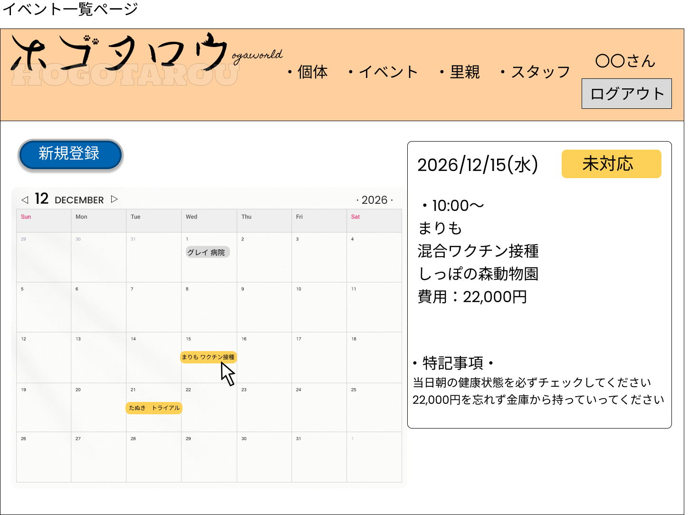

画面の動き
- 月間カレンダーでその月のイベントを表示する。初期表示は今月。
- ◁▷で前月・次月に切り替える（`/event?year=&month=`）
- 同じ日に複数のイベントがあれば縦に並べる
- イベントバーは未対応と対応済で色を分ける。
- バーをクリックすると、概要ペインにそのイベントを表示する。
- 対応済のスタンプを押すと、確認のうえ、未対応に戻す。
- スタンプ欄は、概要ペインに `<form:form method="post">` を1つ置き、バーをクリックしたときに JS で `action` を `/event/{id}/complete`（未対応のとき）か `/event/{id}/uncomplete`（対応済のとき）に差し替える。JS で `<form>` を新しく作ると CSRF トークンが入らず、403 になる。確認メッセージも `action` と一緒に差し替える（form に `data-msg` を持たせ、`onsubmit="return confirmSubmit(this.dataset.msg)"` と書く）。
- ボランティアにはスタンプ欄（ボタン）ごと出さず、代わりに対応状況を文字（未対応／対応済）で出す。スタンプ欄の form を `<sec:authorize access="hasAnyRole('ADMIN','STAFF')">`、文字の要素を `<sec:authorize access="!hasAnyRole('ADMIN','STAFF')">` で囲む。JS はバーをクリックしたとき、スタンプ欄の form があれば `action` と確認メッセージを差し替え、無ければ（ボランティア）文字の要素に「未対応」か「対応済」を入れる。

カレンダー表示項目

|表示項目|内容|備考|
|---|---|---|
|年月|年`${calendar.year}`、月`${calendar.month}`|現在表示中の年月|
|日付|`${d.day}`|月間カレンダー形式|
|イベントバー|個体名`${e.animal.name}`、`${e.eventType.name}`|dが持つイベント一覧をループ（e）|


概要ペイン表示項目

ペインの値はすべてバーのdata属性からJSで表示する。文字はすべて `fn:escapeXml` でエスケープする。JS は `innerHTML` ではなく `textContent` でペインに入れる（`innerHTML` だとエスケープが無効になる）。

|表示項目|内容|備考|
|---|---|---|
|基本|日付、時刻、個体名、種別、場所、費用|時刻・場所・費用は任意。無ければ表示しない|
|里親|`${e.adopter.name}`|里親が紐づいているときだけ表示|
|特記事項|`${e.notes}`（改行を保って表示）|`white-space: pre-wrap`|
|対応状況|未/済|未対応なら空のスタンプ欄、対応済なら済スタンプ。ボランティアにはスタンプ欄を出さず、文字で「未対応」「対応済」と出す|

|操作|権限|遷移先|
|---|:---:|---|
|新規登録ボタン|S|S-09|
|イベントバークリック|V|概要ペインに表示（画面遷移なし）|
|◁▷|V|S-07（前月・次月の年月つき）|
|スタンプ欄のクリック（未対応のとき）|S|確認「イベントを完了にしますか？個体の情報は自動では変わりません」→ F-18|
|スタンプ欄のクリック（対応済のとき）|S|確認「未対応に戻しますか？」→ F-34|
|詳細リンク|V|S-08|
|編集リンク|S|S-10|

#### S-08 イベント詳細（event/detail.jsp）

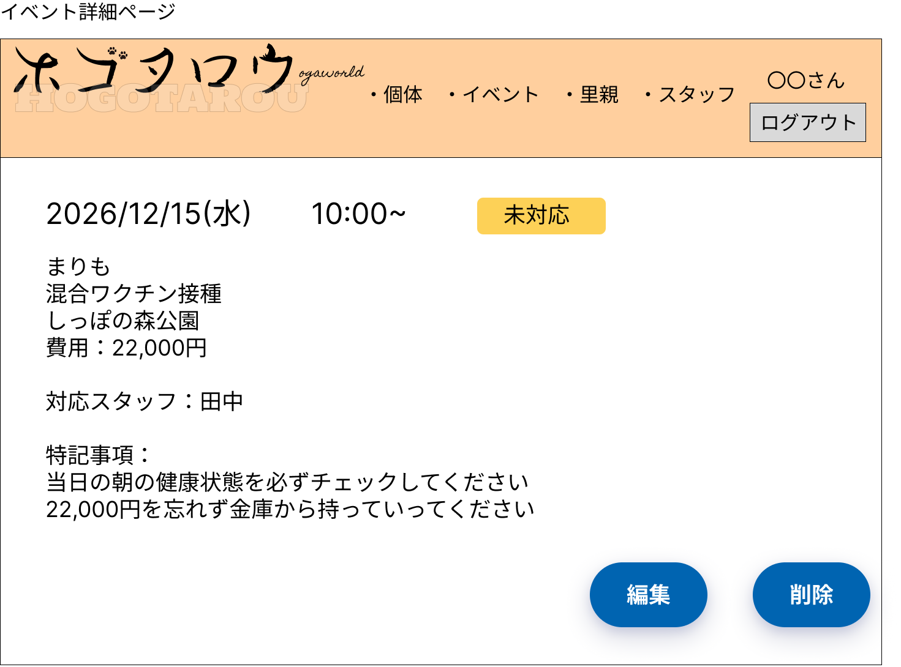

選択したイベントの詳細を表示する。

|表示項目|内容|
|---|---|
|基本|日付・時刻・種別・場所・費用。時刻・場所・費用は任意のため、無ければ表示しない|
|個体|`${event.animal.name}` を `/animal/{id}` へのリンクで|
|里親|`${event.adopter.name}` を `/adopter/{id}` へのリンクで。里親が紐づいているときだけ表示|
|対応スタッフ|`${event.staff.name}` を `/staff/{id}` へのリンクで。対応済のときだけ表示（スタッフが削除されていれば表示しない）|
|対応状況|未対応なら空のスタンプ欄、対応済なら済スタンプ。ボランティアにはスタンプ欄を出さず、文字で「未対応」「対応済」と出す（S-07 と同じ。`<sec:authorize>` で出し分ける）|
|特記事項|`<c:out value="${event.notes}"/>` + `white-space: pre-wrap`|

|操作|権限|遷移先|
|---|:---:|---|
|スタンプ欄のクリック（未対応のとき）|S|確認「イベントを完了にしますか？個体の情報は自動では変わりません」→ F-18 → S-07（このイベントの年月）|
|スタンプ欄のクリック（対応済のとき）|S|確認「未対応に戻しますか？」→ F-34 → S-07（このイベントの年月）|
|個体名リンク|V|S-04|
|里親名リンク|V|S-12|
|対応スタッフ名リンク|V|S-16|
|編集リンク|S|S-10|
|削除ボタン|A|確認「本当に削除しますか？」→ F-19|
|一覧へ戻る|V|S-07（このイベントの年月。`/event?year=&month=`）|

#### S-09 イベント新規登録・S-10 イベント編集（event/form.jsp 共用）

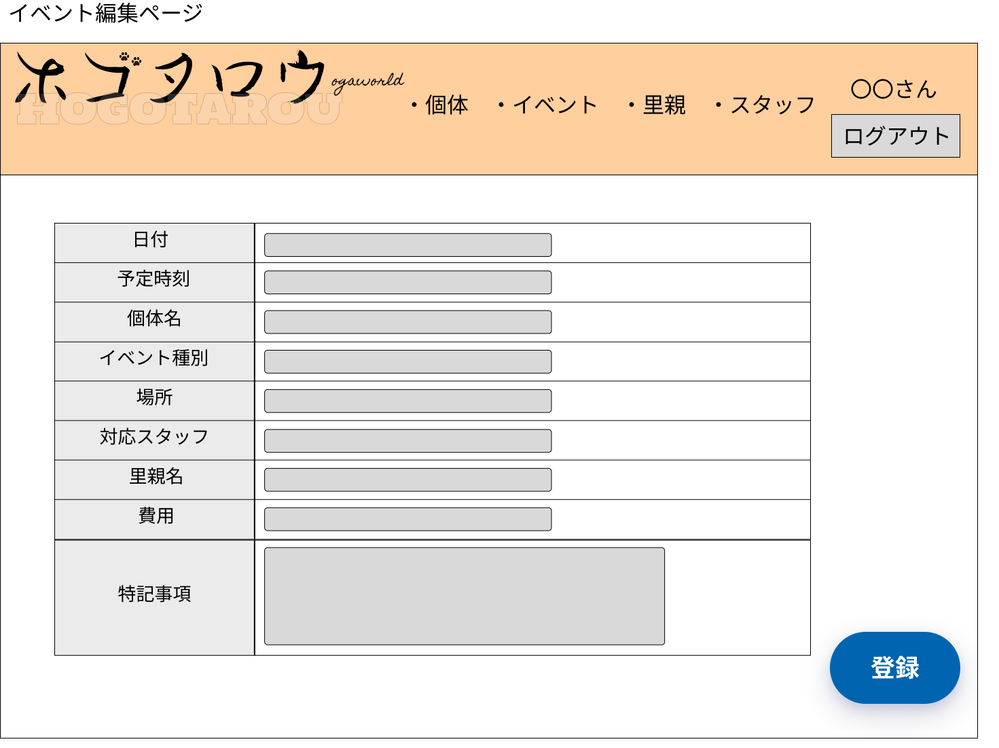

`<form:form modelAttribute="eventForm" method="post">`、`${mode}` が `new` / `edit`。

|項目|name|タグ・型|必須|チェック|エラーメッセージ|
|---|---|---|:---:|---|---|
|日付|eventDate|date|○|`@NotNull`|日付を入力してください|
|時刻|eventTime|time||任意。`LocalTime` + `@DateTimeFormat(pattern = "HH:mm")`（1.5）|—|
|個体名|animalId|select（`animalList`）|○|`@NotNull`。Service で `animalRepository.findByIdAndOrganizationId` が空なら rejectValue|個体を選択してください / 個体の指定が不正です|
|イベント種別|eventTypeId|select（`eventTypeList`）|○|`@NotNull`。Service で `eventTypeRepository.findById` が空なら rejectValue。個体が猫で種別が狂犬病ワクチンなら rejectValue|種別を選択してください / 種別の指定が不正です / 猫には狂犬病ワクチンを登録できません|
|場所|place|text, maxlength=100||`@Size(max=100)`|場所は100文字以内で入力してください|
|里親名|adopterId|select（`adopterList`。先頭に「なし」）||種別がトライアル開始・譲渡なら必須（Service）。指定時は `adopterRepository.findByIdAndOrganizationId` で引き直し|トライアル開始・譲渡の場合は里親を選択してください / 里親の指定が不正です|
|費用|cost|number, min=0||`@PositiveOrZero`|費用は0以上で入力してください|
|特記事項|notes|textarea||`@Size(max=2000)`|2000文字以内で入力してください|

- 団体ID・対応スタッフ・対応状況は画面から受け取らない。団体IDは `loginUser` から設定し、対応スタッフと対応状況は完了（F-18）と未対応に戻す（F-34）のときだけ変わる。
- `place` `notes` が空文字のときは、Service で `null` に変換して保存する。
- 個体の選択肢は、保護状況が `Status.inCare()`（`ADOPTABLE` 保護中(譲渡可)・`NOT_ADOPTABLE` 保護中(譲渡不可)・`TRIAL` トライアル中・`HOSPITALIZED` 入院中）の個体だけ。ただし編集のときは、現在の個体がこの4つに入っていなくても選択肢に含める。
- イベントを登録・編集・完了・未対応に戻す・削除しても、個体の情報は変わらない。個体の情報を変えるのは個体の編集（F-10）だけ。
- イベント種別は11種類（通院・入院・退院・避妊去勢手術・混合ワクチン・狂犬病ワクチン・マイクロチップ装着・トライアル開始・トライアル返却・譲渡・その他。8.2）。種別の `code` で入力チェックするのは、狂犬病ワクチン（`RABIES_VACCINE`。猫には登録できない）と、トライアル開始・譲渡（`TRIAL_START` `ADOPTION`。里親必須）だけ。ほかの種別に特別なチェックは無い（トライアル返却も里親は任意）。

| 操作 | 遷移先 |
|---|---|
| 登録（new）| F-15 → S-07（登録したイベントの年月） |
| 更新（edit）| F-17 → S-08 |
| キャンセル | new → S-07、edit → S-08 |

### 4.2 機能（F-12 〜 F-19、F-34）

#### F-12 GET /event（EventController#list）
1. 表示する年月 `year` `month`（Integer。どちらも任意）を受ける。
   - `@RequestParam(required = false) Integer year, @RequestParam(required = false) Integer month`
   - year か month のどちらかが未指定、または month が 1〜12 以外なら今月を表示する。数字でない値（`year=abc` など）は 400 になり error.jsp が出る（URL を手で書き換えたときだけ起きるので、そのままにする）。
2. カレンダーを組み立てる。
   - `eventService.search(loginUser.getOrganizationId(), year, month)`
   - → 表示期間は「1日を含む週の日曜」〜「末日を含む週の土曜」（前月・次月のはみ出したマスも含む）
   - → `eventRepository.findByOrganizationIdAndEventDateBetweenOrderByEventDateAscEventTimeAsc(organizationId, 開始日, 終了日)`
   - → 取得したイベントを日ごとに振り分け、`EventCalendar` を作って返す。
3. Model: `calendar` → event/calendar.jsp
- 前月・次月は `YearMonth` の `minusMonths(1)` `plusMonths(1)` で求める（12月の次月は翌年1月になる）。
- F-01（トップページ）も同じ `eventService.search(organizationId, null, null)` で今月のカレンダーを作る。

`EventCalendar`（カレンダー1か月分）

|フィールド|型|内容|
|---|---|---|
|year|int|表示中の年|
|month|int|表示中の月|
|prevYear / prevMonth|int|前月の年・月（◁ のリンク用）|
|nextYear / nextMonth|int|次月の年・月（▷ のリンク用）|
|weeks|`List<List<CalendarDay>>`|週のリスト。1週は日曜〜土曜の7日|

`CalendarDay`（カレンダー1マス分）

|フィールド|型|内容|
|---|---|---|
|date|`LocalDate`|日付|
|day|int|日（1〜31）。JSPでは `${d.day}`|
|inMonth|boolean|表示中の月の日なら true。false のマスは薄く表示|
|eventList|`List<Event>`|その日のイベント（時刻順）|

`EventCalendar` と `CalendarDay` は `com.example.hogotaro.dto` パッケージに置く。画面に渡すための入れ物で、テーブルとは対応しない（Entityではない）。

#### F-13 GET /event/{id}（EventController#detail）
1. パス変数 `id`（Integer）を受ける。
2. イベントを取得する。団体IDも条件に含める。
   - `eventService.findById(id, loginUser.getOrganizationId())` → `eventRepository.findByIdAndOrganizationId(id, organizationId)`。空なら `ResponseStatusException(HttpStatus.NOT_FOUND)`
3. Model: `event` → event/detail.jsp
- 「一覧へ戻る」の年月は `${event.eventDate.year}` `${event.eventDate.monthValue}` から作る。

#### F-14 GET /event/new（EventController#newForm）
1. 空の入力フォームを用意する。
   - `new EventForm()`
2. プルダウンの選択肢を用意する。個体・里親は自団体のものだけ。
   - `eventService.findAnimalList(organizationId, null)` → `animalRepository.findByOrganizationIdAndStatusInOrderByIdDesc(organizationId, Status.inCare())`
   - `eventService.findEventTypeList()` → `eventTypeRepository.findAllByOrderByIdAsc()`（id 順 = 通院 → … → その他。`findAll()` は並び順が決まっていない）
   - `eventService.findAdopterList(organizationId)` → `adopterRepository.findByOrganizationIdOrderByIdDesc(organizationId)`
3. 新規登録モードで画面を表示する。
   - Model: `eventForm`、`animalList`、`eventTypeList`、`adopterList`、`mode`="new" → event/form.jsp
- 権限は `SecurityConfig` で制御（ボランティアがURLを直接開いたら403）

#### F-15 POST /event/new（EventController#create）
1. 入力値を`EventForm`で受け取り、入力チェックを行う。
   - `@Validated EventForm eventForm, BindingResult result`
2. 入力エラーがあれば、同じフォームを再表示する。（リダイレクトしない）
   - Model: `eventForm`（入力値とエラー）、`animalList`、`eventTypeList`、`adopterList`、`mode`="new" → event/form.jsp
3. アノテーションで書けないチェックをしてから、イベントを登録する。団体はフォームからではなくログイン情報から設定する。
   - `eventService.create(eventForm, result, loginUser.getOrganizationId())`
   - → `animalRepository.findByIdAndOrganizationId(animalId, organizationId)`。空なら `result.rejectValue("animalId", ...)`
   - → `eventTypeRepository.findById(eventTypeId)`。空なら `result.rejectValue("eventTypeId", ...)`
   - → 個体と種別が両方取れたとき、個体の `species` が `CAT` で種別の `code` が `RABIES_VACCINE` なら `result.rejectValue("eventTypeId", ...)`
   - → 種別が取れていて、その `code` が `TRIAL_START` `ADOPTION` で `adopterId` が空なら `result.rejectValue("adopterId", ...)`
   - → `adopterId` 指定時は `adopterRepository.findByIdAndOrganizationId(adopterId, organizationId)`。空なら `result.rejectValue("adopterId", ...)`
   - → エラーがあれば保存せずに戻る（Controller が 2. と同じく再表示）
   - → Formの値を`Event`に詰め替え、`place` `notes` が空文字なら null に変換。`done` は false、`staff` は null。
   - → `organization` = `organizationRepository.getReferenceById(organizationId)`
   - → `eventRepository.save(event)`、登録したイベントを返す。
4. フラッシュメッセージを設定し、登録したイベントの年月のカレンダーへリダイレクトする。
   - フラッシュ「イベント新規登録が完了しました」→ `redirect:/event?year={年}&month={月}`（F-12）

#### F-16 GET /event/{id}/edit（EventController#editForm）
1. パス変数 `id`（Integer）を受ける。
2. 編集するイベントを取得する。他団体のデータを編集させないよう団体IDも条件に含める。
   - `eventService.getEditForm(id, loginUser.getOrganizationId())` → `eventRepository.findByIdAndOrganizationId(id, organizationId)`。空なら `ResponseStatusException(HttpStatus.NOT_FOUND)`
3. 取得した`Event`の値を`EventForm`に詰めて返す。（null の項目は空欄表示）
   - `animalId` は `event.getAnimal().getId()`、`eventTypeId` は `event.getEventType().getId()`、`adopterId` は里親が無ければ null
4. プルダウンの選択肢を用意する。個体は現在の個体も含める。
   - `eventService.findAnimalList(organizationId, 現在の個体ID)`（現在の個体の保護状況が `Status.inCare()` に入っていなければ、選択肢に追加する）
   - 種別・里親は F-14 と同じ
5. 編集モードで画面を表示する。
   - Model: `eventForm`（現在値入り）、`eventId`、`animalList`、`eventTypeList`、`adopterList`、`mode`="edit" → event/form.jsp
- 権限は `SecurityConfig` で制御（ボランティアは403）

#### F-17 POST /event/{id}/edit（EventController#update）
1. パス変数 `id`（Integer）と入力値`EventForm`を受け取り、入力チェックを行う。
   - `@PathVariable Integer id, @Validated EventForm eventForm, BindingResult result`
2. 入力エラーがあれば、同じフォームを再表示する。（リダイレクトしない）
   - Model: `eventForm`（入力値とエラー）、`eventId`、`animalList`、`eventTypeList`、`adopterList`、`mode`="edit" → event/form.jsp（選択肢は F-16 と同じ。個体の選択肢に渡す「現在の個体ID」は、送信された値ではなく保存済みのイベントの個体。`eventService.findById` で取り直す）
3. アノテーションで書けないチェックをしてから、イベントを更新する。更新前に団体ID付きで取り直す。
   - `eventService.update(id, eventForm, result, loginUser.getOrganizationId())`
   - → `eventRepository.findByIdAndOrganizationId(id, organizationId)`。空なら `ResponseStatusException(HttpStatus.NOT_FOUND)`
   - → F-15 の 3. と同じチェック。エラーがあれば保存せずに戻る（Controller が 2. と同じく再表示）
   - → 取得した`Event` に Form の値を上書き。`place` `notes` が空文字なら null に変換。
   - → `organization` `done` `staff` `createdAt` は変更しない
   - → `eventRepository.save(event)`
4. フラッシュメッセージを設定し、イベント詳細へリダイレクトする。
   - フラッシュ「イベントを編集しました」→ `redirect:/event/{id}`（F-13）

#### F-18 POST /event/{id}/complete（EventController#complete）
1. パス変数 `id`（Integer）を受ける。
2. イベントを完了にする。
   - `eventService.complete(id, loginUser.getOrganizationId(), loginUser.getStaffId())`
   - → `eventRepository.findByIdAndOrganizationId(id, organizationId)`。空なら `ResponseStatusException(HttpStatus.NOT_FOUND)`
   - → すでに対応済なら何もしない（二重クリックや、別の人が先に完了にした場合）
   - → `done` を true、`staff` を `staffRepository.getReferenceById(staffId)`（完了にした人）にする。
   - → `eventRepository.save(event)`、イベントを返す（リダイレクト先の年月に使う）
3. フラッシュメッセージを設定し、イベントの年月のカレンダーへリダイレクトする。
   - フラッシュ「イベントを完了にしました」→ `redirect:/event?year={年}&month={月}`（F-12）
- 権限は `SecurityConfig` で制御（ボランティアは403）
- スタンプ欄押下時は `confirm.js` で「イベントを完了にしますか？個体の情報は自動では変わりません」を表示（S-07・S-08）

#### F-34 POST /event/{id}/uncomplete（EventController#uncomplete）
1. パス変数 `id`（Integer）を受ける。
2. イベントを未対応に戻す。
   - `eventService.uncomplete(id, loginUser.getOrganizationId())`
   - → `eventRepository.findByIdAndOrganizationId(id, organizationId)`。空なら `ResponseStatusException(HttpStatus.NOT_FOUND)`
   - → すでに未対応なら何もしない
   - → `done` を false、`staff` を null にする。個体は更新しない。
   - → `eventRepository.save(event)`、イベントを返す（リダイレクト先の年月に使う）
3. フラッシュメッセージを設定し、イベントの年月のカレンダーへリダイレクトする。
   - フラッシュ「イベントを未対応に戻しました」→ `redirect:/event?year={年}&month={月}`（F-12）
- 権限は `SecurityConfig` で制御（ボランティアは403）
- スタンプ欄押下時は `confirm.js` で「未対応に戻しますか？」を表示（S-07・S-08）

#### F-19 POST /event/{id}/delete（EventController#delete）
1. パス変数 `id`（Integer）を受ける。
2. 削除するイベントを取得する。他団体のデータを削除させないよう団体IDも条件に含める。
   - `eventService.delete(id, loginUser.getOrganizationId())` → `eventRepository.findByIdAndOrganizationId(id, organizationId)`。空なら `ResponseStatusException(HttpStatus.NOT_FOUND)`
3. 削除する。イベントに紐づくデータは無いので、紐づきの確認は不要。
   - `eventRepository.delete(event)`、削除したイベントの日付を返す（リダイレクト先の年月に使う）
   - → 個体は更新しない
4. フラッシュメッセージを設定し、削除したイベントの年月のカレンダーへリダイレクトする。
   - フラッシュ「イベントを削除しました」→ `redirect:/event?year={年}&month={月}`（F-12）
- 権限は `SecurityConfig` で制御（管理ユーザー以外は403）
- 削除ボタン押下時は `confirm.js` で「本当に削除しますか？」を表示（S-08）

<br>
<a id="chapter5"></a>

## 5. 里親管理

### 5.1 画面（S-11 〜 S-14）

#### S-11 里親一覧（adopter/list.jsp）

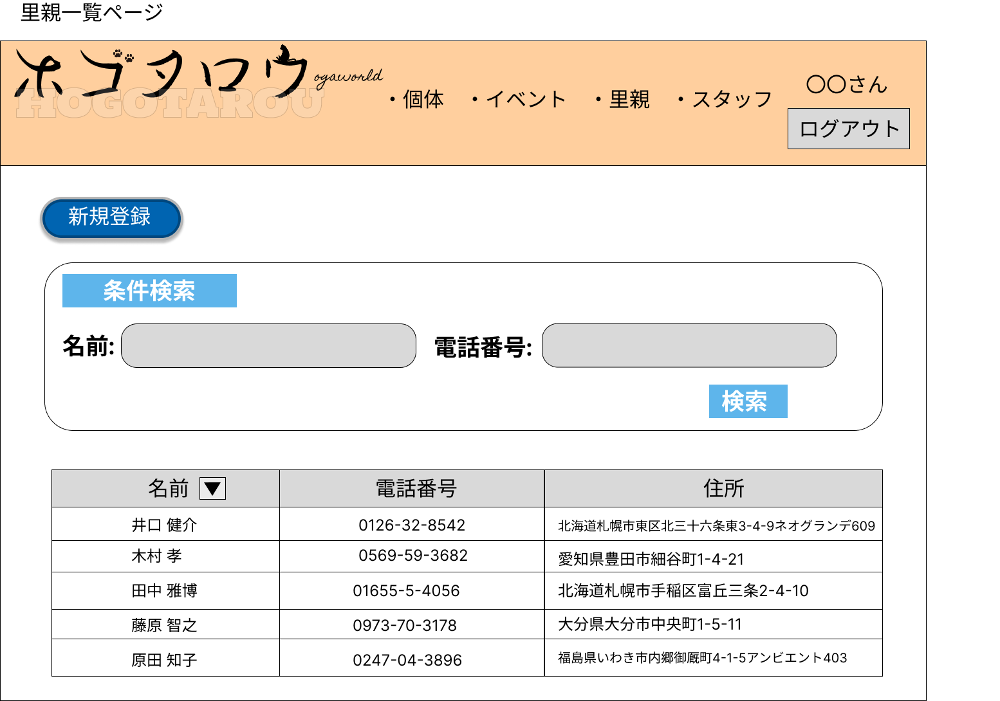

表形式で里親の一覧を表示する。

- 絞り込み：名前、電話番号（入力欄に、自団体の里親の名前・電話番号を候補として出す）

各行の表示項目は以下の通り

|表示項目|内容|備考|
|---|---|---|
|名前|`${a.name}`| 名前を `<a href="/adopter/${a.id}">`|
|電話番号|`${a.phoneNumber}`||
|住所|`${a.address}`||

|操作|権限|遷移先|
|---|:---:|---|
|新規登録リンク|S|S-13|
|名前クリック|V|S-12|
|検索ボタン|V|S-11（条件つき）|

#### S-12 里親詳細（adopter/detail.jsp）

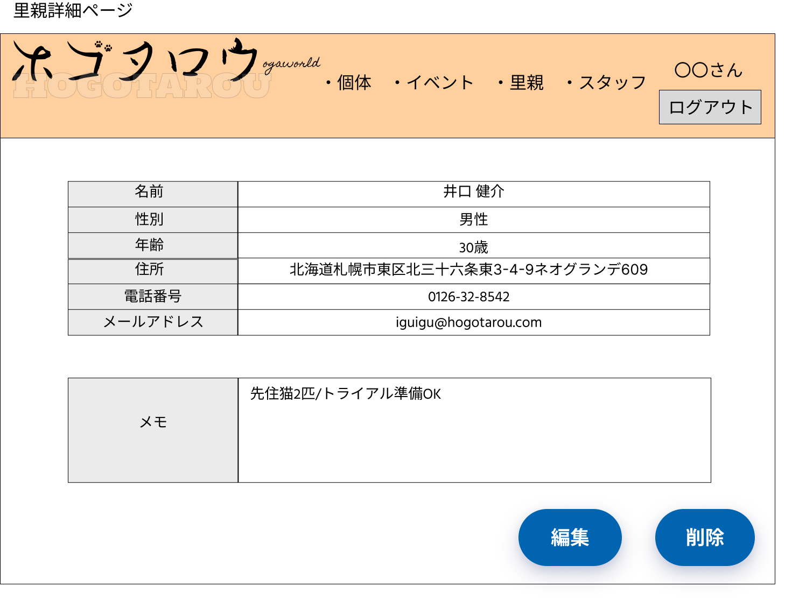

|表示項目|内容|
|---|---|
|基本|名前・性別・年齢・生年月日・住所・電話番号・メールアドレス|
|個体一覧|トライアル中・譲渡済の個体（名前・犬猫・保護状況）。行は `/animal/{id}` へのリンク。0件なら「個体はありません」|
|イベント一覧|この里親に関連するイベントを日付の降順で（日付・種別・個体名・済/未）。行は `/event/{id}` へのリンク。0件なら「イベントはありません」|
|メモ|`<c:out value="${adopter.notes}"/>` + `white-space: pre-wrap`。`notes` のこと（他の画面の「特記事項」にあたる）|

|操作|権限|遷移先|
|---|:---:|---|
|編集リンク|S|S-14|
|削除ボタン|A|確認「本当に削除しますか？」→ F-26 |
|一覧へ戻る|V|S-11|

#### S-13 里親新規登録・S-14 里親編集（adopter/form.jsp 共用）

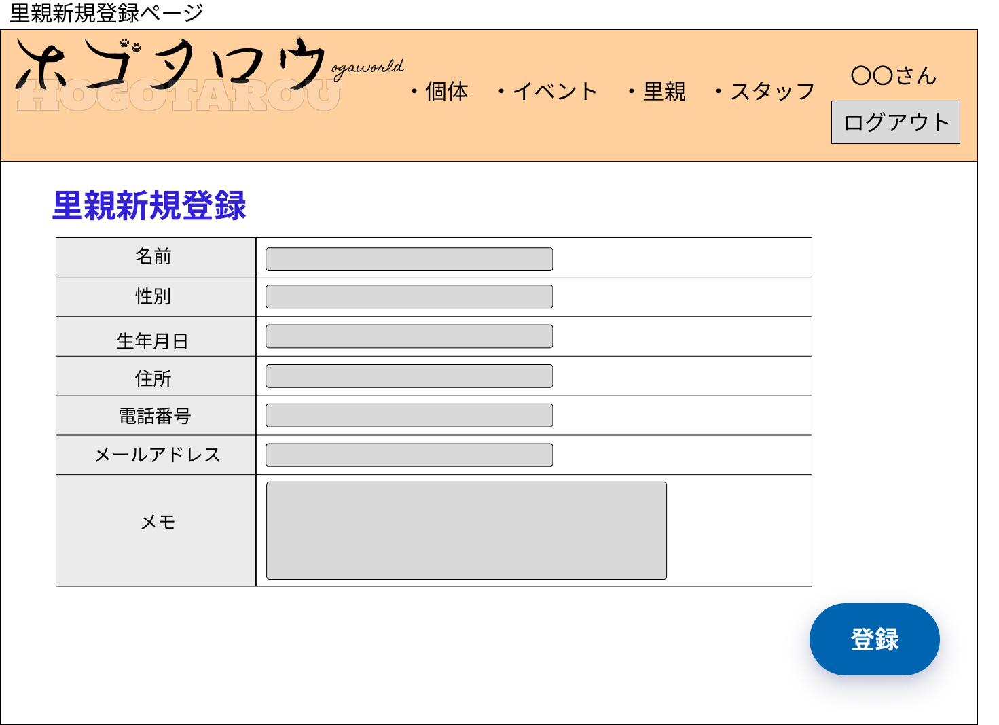

`<form:form modelAttribute="adopterForm" method="post">`、`${mode}` が `new` / `edit`。

|項目|name|タグ・型|必須|チェック|エラーメッセージ|
|---|---|---|:---:|---|---|
|名前|name | text, maxlength=30 | ○ | `@NotBlank @Size(max=30)` | 名前を入力してください / 名前は30文字以内で入力してください |
|性別|gender | radio（男性 / 女性 / その他） | ○ | `@NotNull` | 性別を選択してください |
|生年月日|birthday | date | | `@PastOrPresent` | 未来の日付は指定できません |
|住所|address | text, maxlength=100 |  | `@Size(max=100)` | 住所は100文字以内で入力してください  |
|電話番号|phoneNumber | tel, maxlength=20 | ○ | `@NotBlank @Size(max=20) @Pattern("^$\|^[0-9-]+$")` | 電話番号を入力してください / 電話番号は20文字以内で入力してください / 電話番号は数字とハイフンで入力してください |
|メールアドレス|email | email, maxlength=255 |  | `@Size(max=255) @Email` | メールアドレスは255文字以内で入力してください / メールアドレスの形式が正しくありません |
|メモ|notes | textarea | | `@Size(max=2000)` | メモは2000文字以内で入力してください |

| 操作 | 遷移先 |
|---|---|
| 登録（new）| F-23 → S-12 |
| 更新（edit）| F-25 → S-12 |
| キャンセル | new → S-11、edit → S-12 |

### 5.2 機能（F-20 〜 F-26）

#### F-20 GET /adopter（AdopterController#list）
1. `AdopterSearchForm`（`name` `phoneNumber`。どちらも任意）を受ける。
   - `@ModelAttribute("searchForm") AdopterSearchForm form`（検索したあとも、入力欄に検索した文字が残る）
2. 名前・電話番号とも部分一致で絞り込む。未入力なら、その条件では絞らない（全件に当たる）。電話番号はハイフンを無視して比べる（`080-1111` でも `0801111` でも同じ里親が当たる）。
   - `adopterService.search(loginUser.getOrganizationId(), form)`
   - → `name` が null なら空文字にし、前後の空白を除く
   - → `phoneNumber` が null なら空文字にし、ハイフン（`-`）を取り除いて、前後の空白を除く
   - → `adopterRepository.search(organizationId, name, phone)`。**null は渡さない**（`concat('%', null, '%')` は null になり、どの行にも当たらず0件になる）。空文字なら `like '%%'` で全件に当たる
   - `@Query` には団体の条件を必ず入れる（無くてもエラーにならず、他団体の里親が出てしまう）: `select a from Adopter a where a.organization.id = :organizationId and a.name like concat('%', :name, '%') and replace(a.phoneNumber, '-', '') like concat('%', :phone, '%') order by a.id desc`。メソッドの引数には `@Param("organizationId")` `@Param("name")` `@Param("phone")` を付ける
3. 絞り込みの候補として、自団体の名前一覧・電話番号一覧を取得する。（Repository にまだ無い。一覧と検索が動いてから足す）
   - `adopterService.findNameList(organizationId)` → `adopterRepository.findNameList(organizationId)`（`@Query` で `select distinct a.name from Adopter a where a.organization.id = :organizationId order by a.name`）
   - 電話番号も同じ形で `findPhoneNumberList(organizationId)`
4. Model: `adopterList`（検索結果）、`searchForm`、`nameList`（名前の候補）、`phoneNumberList`（電話番号の候補） → adopter/list.jsp

#### F-21 GET /adopter/{id}（AdopterController#detail）
1. パス変数 `id`（Integer）を受ける。
2. 里親を取得する。団体IDも条件に含める。
   - `adopterService.findById(id, loginUser.getOrganizationId())` → `adopterRepository.findByIdAndOrganizationId(id, organizationId)`。空なら `ResponseStatusException(HttpStatus.NOT_FOUND)`
3. 里親に紐づく個体のうち、トライアル中・譲渡済のものを取得する。
   - `adopterService.findAnimalList(id, organizationId)` → `animalRepository.findByOrganizationIdAndAdopterIdAndStatusInOrderByStatusDesc(organizationId, id, List.of(Status.TRIAL, Status.ADOPTED))`
4. 里親に紐づくイベントを取得する。
   - `adopterService.findEventList(id, organizationId)` → `eventRepository.findByOrganizationIdAndAdopterIdOrderByEventDateDescEventTimeDesc(organizationId, id)`
5. Model: `adopter`、`animalList`、`eventList` → adopter/detail.jsp

#### F-22 GET /adopter/new（AdopterController#newForm）
1. 空の入力フォームを用意する。
   - `new AdopterForm()`
2. 性別のラジオボタンの選択肢を用意する。
   - `Gender.values()`（男性 / 女性 / その他。表示は `label`）
3. 新規登録モードで画面を表示する。
   - Model: `adopterForm`、`genderList`、`mode`="new" → adopter/form.jsp
- DB へのアクセスはないため、団体IDの絞り込みは不要。
- 権限は `SecurityConfig` で制御（ボランティアがURLを直接開いたら403）

#### F-23 POST /adopter/new（AdopterController#create）
1. 入力値を`AdopterForm`で受け取り、入力チェックを行う。
   - `@Validated AdopterForm adopterForm, BindingResult result`
2. 入力エラーがあれば、同じフォームを再表示する。（リダイレクトしない）
   - Model: `adopterForm`（入力値とエラー）、`genderList`、`mode`="new" → adopter/form.jsp
3. エラーがなければ里親を登録する。団体はフォームからではなくログイン情報から設定する。
   - `adopterService.create(adopterForm, loginUser.getOrganizationId())`
   - → Formの値を`Adopter`に詰め替え、`address` `email` `notes`が空文字なら null に変換。
   - → `organization` = `organizationRepository.getReferenceById(organizationId)`
   - → `adopterRepository.save(adopter)`、登録された `id` を返す。
4. フラッシュメッセージを設定し、登録した里親の詳細へリダイレクトする。
   - フラッシュ「里親新規登録が完了しました」→ `redirect:/adopter/{id}`（F-21）

#### F-24 GET /adopter/{id}/edit（AdopterController#editForm）
1. パス変数 `id`（Integer）を受ける。
2. 編集する里親を取得する。他団体のデータを編集させないよう団体IDも条件に含める。
   - `adopterService.getEditForm(id, loginUser.getOrganizationId())` → `adopterRepository.findByIdAndOrganizationId(id, organizationId)`。空なら `ResponseStatusException(HttpStatus.NOT_FOUND)`
3. 取得した`Adopter`の値を`AdopterForm`に詰めて返す。（null の項目は空欄表示）
4. 編集モードで画面を表示する。
   - Model: `adopterForm`（現在値入り）、`adopterId`、`genderList`、`mode`="edit" → adopter/form.jsp
- 権限は `SecurityConfig` で制御（ボランティアは403）

#### F-25 POST /adopter/{id}/edit（AdopterController#update）
1. パス変数 `id`（Integer）と入力値`AdopterForm`を受け取り、入力チェックを行う。
   - `@PathVariable Integer id, @Validated AdopterForm adopterForm, BindingResult result`
2. 入力エラーがあれば、同じフォームを再表示する。（リダイレクトしない）
   - Model: `adopterForm`（入力値とエラー）、`adopterId`、`genderList`、`mode`="edit" → adopter/form.jsp
3. エラーがなければ里親を更新する。更新前に団体ID付きで取り直す。
   - `adopterService.update(id, adopterForm, loginUser.getOrganizationId())`
   - → `adopterRepository.findByIdAndOrganizationId(id, organizationId)`。空なら `ResponseStatusException(HttpStatus.NOT_FOUND)`
   - → 取得した`Adopter` に Form の値を上書き。`address` `email` `notes`が空文字なら null に変換。
   - → `organization` `createdAt` は変更しない
   - → `adopterRepository.save(adopter)`
4. フラッシュメッセージを設定し、里親詳細へリダイレクトする。
   - フラッシュ「里親を編集しました」→ `redirect:/adopter/{id}`（F-21）

#### F-26 POST /adopter/{id}/delete（AdopterController#delete）
1. パス変数 `id`（Integer）を受ける。
2. 削除する里親を取得する。他団体のデータを削除させないよう団体IDも条件に含める。
   - `adopterService.delete(id, loginUser.getOrganizationId())` → `adopterRepository.findByIdAndOrganizationId(id, organizationId)`。空なら `ResponseStatusException(HttpStatus.NOT_FOUND)`
3. 紐づく個体・イベントがあるか確認する（個体は保護状況に関係なくすべて対象）
   - `animalRepository.existsByOrganizationIdAndAdopterId(organizationId, id)`
   - `eventRepository.existsByOrganizationIdAndAdopterId(organizationId, id)`
   - どちらかが true なら false を返す。
   - → フラッシュ「個体またはイベントに紐づいているため削除できません」→ `redirect:/adopter/{id}`（F-21）
4. 紐づきがなければ削除し、true を返す
   - `adopterRepository.delete(adopter)`
   - → フラッシュ「里親を削除しました」→ `redirect:/adopter`（F-20）
- 権限は `SecurityConfig` で制御（管理ユーザー以外は403）
- 削除ボタン押下時は `confirm.js` で「本当に削除しますか？」を表示（S-12）

<br>
<a id="chapter6"></a>

## 6. スタッフ管理

### 6.1 画面（S-15 〜 S-18）

#### S-15 スタッフ一覧（staff/list.jsp）

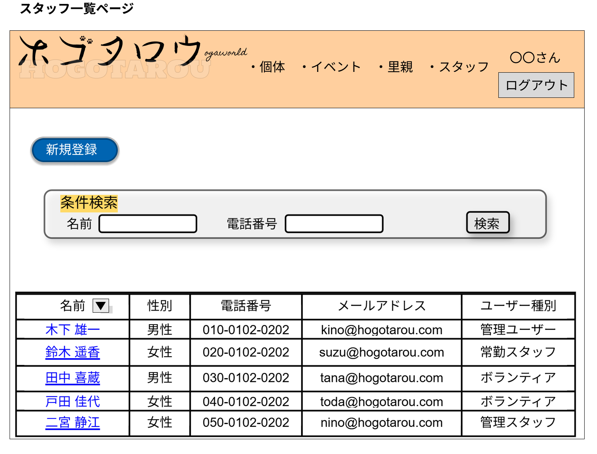

表形式でスタッフの一覧を表示する。

- 絞り込み：名前、電話番号

各行の表示項目は以下の通り

|表示項目|内容|備考|
|---|---|---|
|名前|`${s.name}`| 名前を `<a href="/staff/${s.id}">`|
|性別|`${s.gender.label}`||
|電話番号|`${s.phoneNumber}`||
|メールアドレス|`${s.email}`||
|ユーザー種別|`${s.userType.name}`||

|操作|権限|遷移先|
|---|:---:|---|
|新規登録リンク|A|S-17|
|名前クリック|V|S-16|
|検索ボタン|V|S-15（条件つき）|

#### S-16 スタッフ詳細（staff/detail.jsp）

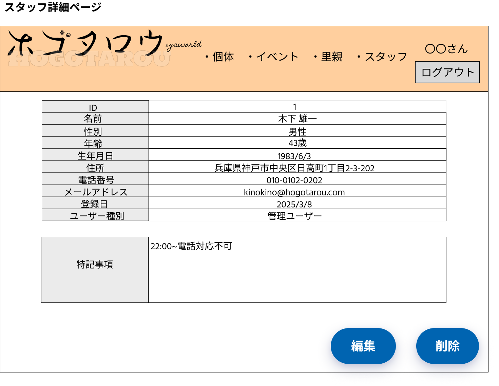

|表示項目|内容|
|---|---|
|基本|スタッフID・ログインID・名前・性別・年齢・生年月日・住所・電話番号・メールアドレス・登録日・ユーザー種別|
|イベント一覧|このスタッフが対応した（完了にした）イベントを日付の降順で（日付・種別・個体名）。行は `/event/{id}` へのリンク。0件なら「イベントはありません」|
|特記事項|`<c:out value="${staff.notes}"/>` + `white-space: pre-wrap`|

|操作|権限|遷移先|
|---|:---:|---|
|編集リンク|A|S-18|
|削除ボタン|A（自分自身の詳細では表示しない）|確認「本当に削除しますか？」→ F-33 |
|一覧へ戻る|V|S-15|

#### S-17 スタッフ新規登録・S-18 スタッフ編集（staff/form.jsp 共用）

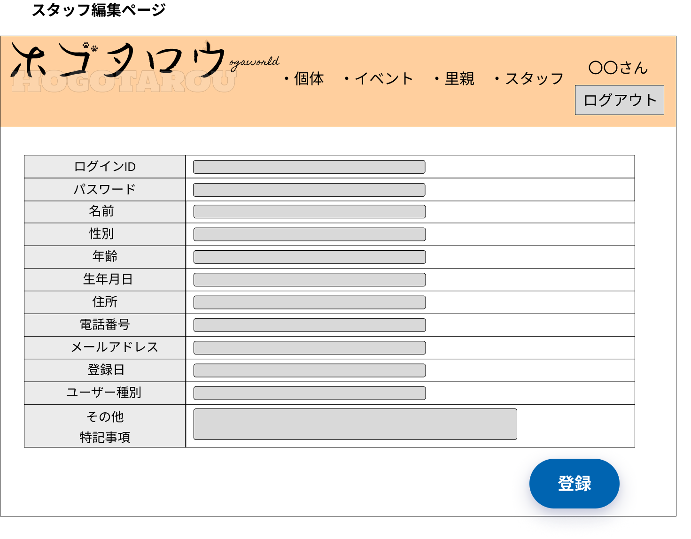

`<form:form modelAttribute="staffForm" method="post">`、`${mode}` が `new` / `edit`。

|項目|name|タグ・型|必須|チェック|エラーメッセージ|
|---|---|---|:---:|---|---|
|ログインID|loginId|new: text, maxlength=30 / edit: 表示のみ（入力欄にしない）|new は○|Form: `@Pattern("^$\|^[a-zA-Z0-9]{4,30}$")`。Service（new）: 空・重複。edit では変更しない|ログインIDを入力してください / ログインIDは半角英数字4〜30文字で入力してください / 既に登録済みのログインIDです|
|パスワード|password|password, maxlength=72|new は○（edit は任意）|Form: `@Pattern("^$\|^[!-~]{8,72}$")`（`!` から `~` まで = 半角の英数字・記号だけ。BCrypt の上限が72バイトなので、全角文字は受け付けない）。Service: new は空不可、edit は空なら変更なし|パスワードを入力してください / パスワードは半角の英数字・記号8〜72文字で入力してください|
|名前|name|text, maxlength=30|○|`@NotBlank @Size(max=30)`|名前を入力してください / 名前は30文字以内で入力してください|
|性別|gender|radio（男性/女性/その他）|○|`@NotNull`|性別を選択してください|
|生年月日|birthday|date|○|`@NotNull @Past`|生年月日を入力してください / 過去の日付を指定してください|
|住所|address|text, maxlength=100||`@Size(max=100)`|住所は100文字以内で入力してください|
|電話番号|phoneNumber|tel, maxlength=20|○|`@NotBlank @Size(max=20) @Pattern("^$\|^[0-9-]+$")`|電話番号を入力してください / 電話番号は20文字以内で入力してください / 電話番号は数字とハイフンで入力してください|
|メールアドレス|email|email, maxlength=255||`@Size(max=255) @Email`|メールアドレスは255文字以内で入力してください / メールアドレスの形式が正しくありません|
|登録日|joinedDate|date||`@PastOrPresent`|未来の日付は指定できません|
|ユーザー種別|userTypeId|select（`userTypeList`）|○|`@NotNull`。Service で `userTypeRepository.findById` が空なら rejectValue。edit で自分自身のユーザー種別を変えていたら rejectValue|ユーザー種別を選択してください / ユーザー種別の指定が不正です / 自分自身のユーザー種別は変更できません|
|特記事項|notes|textarea||`@Size(max=2000)`|特記事項は2000文字以内で入力してください|

- 団体ID・登録日時（`created_at`）・更新日時は画面から受け取らない。団体IDは Service が `loginUser` から設定し、登録日時・更新日時は DB が自動で入れる。登録日（`joinedDate`）は画面から入力する。
- `address` `email` `notes` が空文字のときは、Service で `null` に変換して保存する。
- 編集で自分自身のユーザー種別は変更できない（ログイン中のセッションにロールが入っているため、変更が反映されなくなる）。自分自身の編集でも、ユーザー種別のプルダウンは `disabled` にしない（`disabled` にすると値が送られず、必須エラーになる）。変えて送られたときは Service がエラーにする（F-32）。
- ほかのスタッフのユーザー種別を変えた場合も、そのスタッフが次にログインするまでは前の権限のまま動く。

|操作|遷移先|
|---|---|
|登録（new）|F-30 → S-16|
|更新（edit）|F-32 → S-16|
|キャンセル|new → S-15、edit → S-16|

### 6.2 機能（F-27 〜 F-33）

#### F-27 GET /staff（StaffController#list）
1. `StaffSearchForm`（`name` `phoneNumber`。どちらも任意）を受ける。
   - `@ModelAttribute("searchForm") StaffSearchForm form`（検索したあとも、入力欄に検索した文字が残る）
2. 名前・電話番号とも部分一致で絞り込む。未入力なら、その条件では絞らない（全件に当たる）。電話番号はハイフンを無視して比べる。F-20（里親）と同じ。
   - `staffService.search(loginUser.getOrganizationId(), form)`
   - → `name` が null なら空文字にし、前後の空白を除く
   - → `phoneNumber` が null なら空文字にし、ハイフン（`-`）を取り除いて、前後の空白を除く
   - → `staffRepository.search(organizationId, name, phone)`。**null は渡さない**（`concat('%', null, '%')` は null になり、どの行にも当たらず0件になる）。空文字なら `like '%%'` で全件に当たる
   - `@Query` には団体の条件を必ず入れる（無くてもエラーにならず、他団体のスタッフが出てしまう）: `select s from Staff s where s.organization.id = :organizationId and s.name like concat('%', :name, '%') and replace(s.phoneNumber, '-', '') like concat('%', :phone, '%') order by s.id desc`。メソッドの引数には `@Param("organizationId")` `@Param("name")` `@Param("phone")` を付ける
3. Model: `staffList`、`searchForm` → staff/list.jsp

#### F-28 GET /staff/{id}（StaffController#detail）
1. パス変数 `id`（Integer）を受ける。
2. スタッフを取得する。団体IDも条件に含める。
   - `staffService.findById(id, loginUser.getOrganizationId())` → `staffRepository.findByIdAndOrganizationId(id, organizationId)`。空なら `ResponseStatusException(HttpStatus.NOT_FOUND)`
3. このスタッフが完了にしたイベントを取得する。
   - `staffService.findEventList(id, organizationId)` → `eventRepository.findByOrganizationIdAndStaffIdOrderByEventDateDescEventTimeDesc(organizationId, id)`
4. Model: `staff`、`eventList` → staff/detail.jsp

#### F-29 GET /staff/new（StaffController#newForm）
1. 空の入力フォームを用意する。
   - `new StaffForm()`
2. プルダウンとラジオボタンの選択肢を用意する。
   - `staffService.findUserTypeList()` → `userTypeRepository.findAll()`（ユーザー種別。全団体共通）
   - `Gender.values()`（男性 / 女性 / その他。表示は `label`）
3. 新規登録モードで画面を表示する。
   - Model: `staffForm`、`userTypeList`、`genderList`、`mode`="new" → staff/form.jsp
- 権限は `SecurityConfig` で制御（管理ユーザー以外は403）

#### F-30 POST /staff/new（StaffController#create）
1. 入力値を `StaffForm` で受け取り、入力チェックを行う。
   - `@Validated StaffForm staffForm, BindingResult result`
2. 入力エラーがあれば、同じフォームを再表示する。（リダイレクトしない）
   - Model: `staffForm`（入力値とエラー）、`userTypeList`、`genderList`、`mode`="new" → staff/form.jsp
3. アノテーションで書けないチェックをしてから、スタッフを登録する。団体はフォームからではなくログイン情報から設定する。
   - `staffService.create(staffForm, result, loginUser.getOrganizationId())`
   - → `loginId` が空、または `staffRepository.existsByLoginId(loginId)` が true なら `result.rejectValue("loginId", ...)`（ログインIDは全団体で一意なので、ここだけ団体を条件に入れない。`existsByOrganizationIdAndLoginId` にしない）
   - → `password` が空なら `result.rejectValue("password", ...)`
   - → `userTypeRepository.findById(userTypeId)`。空なら `result.rejectValue("userTypeId", ...)`
   - → エラーがあれば保存せずに戻る（Controller が 2. と同じく再表示）
   - → Form の値を `Staff` に詰め替え、`address` `email` `notes` が空文字なら null に変換。
   - → `passwordHash` に、`password` を BCrypt でハッシュ化した値を入れる。
   - → `organization` = `organizationRepository.getReferenceById(organizationId)`
   - → `staffRepository.save(staff)`、登録された `id` を返す。（`created_at` `updated_at` は DB が自動で入れる）
4. フラッシュメッセージを設定し、登録したスタッフの詳細へリダイレクトする。
   - フラッシュ「スタッフ新規登録が完了しました」→ `redirect:/staff/{id}`（F-28）
- 権限は `SecurityConfig` で制御（管理ユーザー以外は403）

#### F-31 GET /staff/{id}/edit（StaffController#editForm）
1. パス変数 `id`（Integer）を受ける。
2. 編集するスタッフを取得する。他団体のデータを編集させないよう団体IDも条件に含める。
   - `staffService.getEditForm(id, loginUser.getOrganizationId())` → `staffRepository.findByIdAndOrganizationId(id, organizationId)`。空なら `ResponseStatusException(HttpStatus.NOT_FOUND)`
3. 取得した `Staff` の値を `StaffForm` に詰めて返す。（null の項目は空欄表示）
   - `password` は空のまま、`userTypeId` は `staff.getUserType().getId()`。`loginId` は表示用に入れる
4. 編集モードで画面を表示する。
   - プルダウンとラジオボタンの選択肢は F-29 と同じ
   - Model: `staffForm`（現在値入り）、`staffId`、`userTypeList`、`genderList`、`mode`="edit" → staff/form.jsp
- 権限は `SecurityConfig` で制御（管理ユーザー以外は403）

#### F-32 POST /staff/{id}/edit（StaffController#update）
1. パス変数 `id`（Integer）と入力値 `StaffForm` を受け取り、入力チェックを行う。
   - `@PathVariable Integer id, @Validated StaffForm staffForm, BindingResult result`
2. 入力エラーがあれば、同じフォームを再表示する。（リダイレクトしない）
   - Model: `staffForm`（入力値とエラー）、`staffId`、`userTypeList`、`genderList`、`mode`="edit" → staff/form.jsp
   - ログインIDは表示のみで送られてこないので、再表示のときは `staffService.findById` で取り直した `loginId` を `staffForm` に入れる
3. アノテーションで書けないチェックをしてから、スタッフを更新する。更新前に団体ID付きで取り直す。
   - `staffService.update(id, staffForm, result, loginUser.getOrganizationId(), loginUser.getStaffId())`
   - → `staffRepository.findByIdAndOrganizationId(id, organizationId)`。空なら `ResponseStatusException(HttpStatus.NOT_FOUND)`
   - → `userTypeRepository.findById(userTypeId)`。空なら `result.rejectValue("userTypeId", ...)`
   - → `id` がログイン中のスタッフIDと同じ（自分自身の編集）で、かつ `userTypeId` が現在のユーザー種別と違うときだけ `result.rejectValue("userTypeId", ...)`（自分自身のユーザー種別は変更できません）。ユーザー種別を変えなければ、自分の名前や電話番号は編集できる。ID の比較は `==` ではなく `equals` で行う
   - → エラーがあれば保存せずに戻る（Controller が 2. と同じく再表示）。ここまでは、取得した `Staff` に値を入れない（先に入れると、エラーで戻っても更新されてしまう）
   - → 取得した `Staff` に Form の値を上書き（`userType` も反映）。`address` `email` `notes` が空文字なら null に変換。
   - → `password` が空でなければ、ハッシュ化して `passwordHash` を更新する。空なら変更しない。（この URL を開けるのは管理ユーザーだけなので、本人と他人の区別は不要）
   - → `loginId` `organization` `createdAt` は変更しない
   - → `staffRepository.save(staff)`（`updated_at` は DB が自動で更新する）
4. フラッシュメッセージを設定し、スタッフ詳細へリダイレクトする。
   - フラッシュ「スタッフを編集しました」→ `redirect:/staff/{id}`（F-28）
- 権限は `SecurityConfig` で制御（管理ユーザー以外は403）

#### F-33 POST /staff/{id}/delete（StaffController#delete）
1. パス変数 `id`（Integer）を受ける。
2. 削除するスタッフを取得する。他団体のデータを削除させないよう団体IDも条件に含める。
   - `staffService.delete(id, loginUser.getOrganizationId(), loginUser.getStaffId())` → `staffRepository.findByIdAndOrganizationId(id, organizationId)`。空なら `ResponseStatusException(HttpStatus.NOT_FOUND)`
3. 自分自身かどうかを確認する。
   - `id` がログイン中のスタッフIDと同じ（`equals` で比較）なら、削除せずに false を返す。
   - → フラッシュ「自分自身は削除できません」→ `redirect:/staff/{id}`（F-28）
4. 自分自身でなければ削除し、true を返す。このスタッフが完了にしたイベントは、対応スタッフが空になる（`ON DELETE SET NULL`）。
   - `staffRepository.delete(staff)`
   - → フラッシュ「スタッフを削除しました」→ `redirect:/staff`（F-27）
- 権限は `SecurityConfig` で制御（管理ユーザー以外は403）
- 削除ボタン押下時は `confirm.js` で「本当に削除しますか？」を表示（S-16）

<br>
<a id="chapter7"></a>

## 7. エラー

### 7.1 画面（S-19）

#### S-19 エラー（error.jsp）

カンプは無し。メッセージと、トップページへのリンクだけを表示する。


Java のクラスは書かない。`server.error.whitelabel.enabled=false` にしておくと Spring Boot が 403 / 404 / 413 / 500 で `jsp/error.jsp` を表示する。`${status}` で文言を分ける。

|`${status}`|文言|
|:---:|---|
|403|この操作を行う権限がありません|
|404|指定されたデータは存在しません|
|413|ファイルは 5MB 以下にしてください|
|その他|システムエラーが発生しました|

- 404 は Service が `throw new ResponseStatusException(HttpStatus.NOT_FOUND)`
- 403 は Spring Security。生の `<form>` で POST しても（CSRF）403 になるので、POST は必ず `<form:form>`
- 5MB を大きく超える写真を送ると、Tomcat が途中で接続を切り、error.jsp ではなくブラウザの接続エラーになることがある。その場合は application.properties に `server.tomcat.max-swallow-size=-1` を足す。`spring.servlet.multipart.max-request-size` も 5MB より大きくしておく
- 土台を動かしたら、存在しない URL・V で POST・6MB の画像・20MB の画像の 4 つを試して、error.jsp にそれぞれの文言が出ることを確かめる

<br>
<a id="chapter8"></a>

## 8. 付録（DDL、初期データ、状態遷移図）

> **【仮】の見方**
>
> - 8.1 と 8.2 の SQL は、基本設計4章のテーブル定義から起こした**仮のもの**（ただし 8.2 のイベント種別だけは 2026-10-01 のチーム決定の11種類で、基本設計4章とは違う）。実物の `sql/schema.sql` `sql/data.sql` が完成したら、それぞれの「▼ ここから差し替え」〜「▲ ここまで差し替え」の間をまるごと入れ替え、見出しの【仮】とこの囲みを消す。
> - 8.3 の状態遷移図は仮ではない（SQL が変わっても、保護状況の8種類が変わらない限りそのまま）。

### 8.1 DDL（sql/schema.sql）【仮】

- テーブルは、参照される側から先に作る（マスタ・団体 → 里親・スタッフ → 個体 → イベント）。
- 基本設計4章から変わるのは `animals.neutered` の1か所だけ（旧 `is_neutered BOOLEAN`。「不明」を保存するため `NeuterStatus` の定数名を入れる）。
- 【仮】先頭の `DROP DATABASE` は、開発中に作り直しやすいように入れたもの。実行すると登録済みのデータはすべて消える。

<!-- ▼ ここから差し替え（schema.sql 完成版） -->

```sql
-- 【仮】基本設計4章から起こした DDL。schema.sql が完成したら差し替える
DROP DATABASE IF EXISTS hogotaro;
CREATE DATABASE hogotaro CHARACTER SET utf8mb4;
USE hogotaro;

-- 団体
CREATE TABLE organizations (
    id           INT AUTO_INCREMENT PRIMARY KEY,
    name         VARCHAR(50)  NOT NULL,
    address      VARCHAR(100) NOT NULL,
    phone_number VARCHAR(20),
    email        VARCHAR(255),
    capacity     INT          NOT NULL,
    notes        TEXT
);

-- ユーザー種別マスタ（全団体共通）
CREATE TABLE user_types (
    id   INT AUTO_INCREMENT PRIMARY KEY,
    code VARCHAR(20) NOT NULL UNIQUE,
    name VARCHAR(20) NOT NULL
);

-- イベント種別マスタ（全団体共通）
CREATE TABLE event_types (
    id   INT AUTO_INCREMENT PRIMARY KEY,
    code VARCHAR(20) NOT NULL UNIQUE,
    name VARCHAR(20) NOT NULL
);

-- 品種マスタ（全団体共通）
CREATE TABLE breeds (
    id      INT AUTO_INCREMENT PRIMARY KEY,
    species VARCHAR(20) NOT NULL,
    name    VARCHAR(50) NOT NULL,
    UNIQUE (species, name)
);

-- 里親
CREATE TABLE adopters (
    id              INT AUTO_INCREMENT PRIMARY KEY,
    organization_id INT          NOT NULL,
    name            VARCHAR(30)  NOT NULL,
    gender          VARCHAR(20)  NOT NULL,
    birthday        DATE,
    address         VARCHAR(100),
    phone_number    VARCHAR(20)  NOT NULL,
    email           VARCHAR(255),
    notes           TEXT,
    created_at      TIMESTAMP    NOT NULL DEFAULT CURRENT_TIMESTAMP,
    updated_at      TIMESTAMP    NOT NULL DEFAULT CURRENT_TIMESTAMP ON UPDATE CURRENT_TIMESTAMP,
    FOREIGN KEY (organization_id) REFERENCES organizations (id)
);

-- スタッフ
CREATE TABLE staff (
    id              INT AUTO_INCREMENT PRIMARY KEY,
    organization_id INT          NOT NULL,
    login_id        VARCHAR(30)  NOT NULL UNIQUE,
    password_hash   VARCHAR(255) NOT NULL,
    user_type_id    INT          NOT NULL,
    name            VARCHAR(30)  NOT NULL,
    gender          VARCHAR(20)  NOT NULL,
    birthday        DATE         NOT NULL,
    joined_date     DATE,
    address         VARCHAR(100),
    phone_number    VARCHAR(20)  NOT NULL,
    email           VARCHAR(255),
    notes           TEXT,
    created_at      TIMESTAMP    NOT NULL DEFAULT CURRENT_TIMESTAMP,
    updated_at      TIMESTAMP    NOT NULL DEFAULT CURRENT_TIMESTAMP ON UPDATE CURRENT_TIMESTAMP,
    FOREIGN KEY (organization_id) REFERENCES organizations (id),
    FOREIGN KEY (user_type_id)    REFERENCES user_types (id)
);

-- 個体
CREATE TABLE animals (
    id                    INT AUTO_INCREMENT PRIMARY KEY,
    organization_id       INT          NOT NULL,
    name                  VARCHAR(10)  NOT NULL,
    species               VARCHAR(20)  NOT NULL,
    sex                   VARCHAR(20)  NOT NULL,
    breed_id              INT,
    birthday              DATE,
    is_birthday_estimated BOOLEAN      NOT NULL DEFAULT TRUE,
    intake_date           DATE         NOT NULL,
    intake_method         VARCHAR(30)  NOT NULL,
    intake_place          VARCHAR(50)  NOT NULL,
    status                VARCHAR(20)  NOT NULL DEFAULT 'NOT_ADOPTABLE',
    adopter_id            INT,
    neutered              VARCHAR(20)  NOT NULL DEFAULT 'UNKNOWN',
    combo_vaccine         BOOLEAN      NOT NULL DEFAULT FALSE,
    rabies_vaccine        BOOLEAN      NOT NULL DEFAULT FALSE,
    microchip_no          VARCHAR(15),
    health_notes          TEXT,
    notes                 TEXT,
    image_path            VARCHAR(255),
    created_at            TIMESTAMP    NOT NULL DEFAULT CURRENT_TIMESTAMP,
    updated_at            TIMESTAMP    NOT NULL DEFAULT CURRENT_TIMESTAMP ON UPDATE CURRENT_TIMESTAMP,
    FOREIGN KEY (organization_id) REFERENCES organizations (id),
    FOREIGN KEY (breed_id)        REFERENCES breeds (id) ON DELETE SET NULL,
    FOREIGN KEY (adopter_id)      REFERENCES adopters (id)
);

-- イベント
CREATE TABLE events (
    id              INT AUTO_INCREMENT PRIMARY KEY,
    organization_id INT          NOT NULL,
    event_type_id   INT          NOT NULL,
    animal_id       INT          NOT NULL,
    adopter_id      INT,
    staff_id        INT,
    event_date      DATE         NOT NULL,
    event_time      TIME,
    place           VARCHAR(100),
    done            BOOLEAN      NOT NULL DEFAULT FALSE,
    cost            INT,
    notes           TEXT,
    created_at      TIMESTAMP    NOT NULL DEFAULT CURRENT_TIMESTAMP,
    updated_at      TIMESTAMP    NOT NULL DEFAULT CURRENT_TIMESTAMP ON UPDATE CURRENT_TIMESTAMP,
    FOREIGN KEY (organization_id) REFERENCES organizations (id),
    FOREIGN KEY (event_type_id)   REFERENCES event_types (id),
    FOREIGN KEY (animal_id)       REFERENCES animals (id) ON DELETE CASCADE,
    FOREIGN KEY (adopter_id)      REFERENCES adopters (id),
    FOREIGN KEY (staff_id)        REFERENCES staff (id) ON DELETE SET NULL
);
```

<!-- ▲ ここまで差し替え（schema.sql 完成版） -->

### 8.2 初期データ（sql/data.sql）【仮】

`schema.sql` の後に実行する。入れるのはマスタ3つと、動作確認用の団体2つ・スタッフ4人。個体・里親・イベントのサンプルデータは別に用意する。

仮置きの内訳（SQL の中でも `-- 【仮】` で示す）

|データ|状態|仮の理由|
|---|:---:|---|
|ユーザー種別（3行）|確定|基本設計4章の `code` と `name` のとおり|
|イベント種別（11行）|確定|2026-10-01 のチーム決定（11種類）。基本設計4章の7種類からは変わっている（基本設計は未反映）|
|品種（犬6・猫5）|【仮】|品種の一覧が未決定（キジトラなどの毛の柄を品種として扱うかも未決定）|
|団体（2つ）|【仮】|団体名・住所・電話番号・受入上限はすべて仮の値|
|スタッフ（4人）|【仮】|名前・ログインID・生年月日などはすべて仮の値|
|スタッフの `password_hash`|【仮】|`（BCryptのハッシュ値）` は置き場所を示す文字で、このままではログインできない|

<!-- ▼ ここから差し替え（data.sql 完成版） -->

```sql
USE hogotaro;

-- ユーザー種別（id の 1〜3 はスタッフの INSERT で使う）
INSERT INTO user_types (id, code, name) VALUES
    (1, 'ADMIN',     '管理ユーザー'),
    (2, 'STAFF',     '常勤スタッフ'),
    (3, 'VOLUNTEER', 'ボランティア');

-- イベント種別（11種類。2026-10-01 のチーム決定）
INSERT INTO event_types (id, code, name) VALUES
    (1,  'HOSPITAL_VISIT',     '通院'),
    (2,  'HOSPITAL_ADMISSION', '入院'),
    (3,  'HOSPITAL_DISCHARGE', '退院'),
    (4,  'NEUTERING',          '避妊去勢手術'),
    (5,  'COMBO_VACCINE',      '混合ワクチン'),
    (6,  'RABIES_VACCINE',     '狂犬病ワクチン'),   -- 猫には登録できない（S-09・F-15）
    (7,  'MICROCHIP',          'マイクロチップ装着'),
    (8,  'TRIAL_START',        'トライアル開始'),   -- 里親必須
    (9,  'TRIAL_RETURN',       'トライアル返却'),
    (10, 'ADOPTION',           '譲渡'),             -- 里親必須
    (11, 'OTHER',              'その他');

-- 【仮】品種（一覧が決まったら差し替える）
INSERT INTO breeds (species, name) VALUES
    ('DOG', '雑種'),
    ('DOG', '柴犬'),
    ('DOG', 'トイプードル'),
    ('DOG', 'チワワ'),
    ('DOG', 'ミニチュアダックスフンド'),
    ('DOG', 'ポメラニアン'),
    ('CAT', '雑種'),
    ('CAT', 'アメリカンショートヘア'),
    ('CAT', 'スコティッシュフォールド'),
    ('CAT', 'マンチカン'),
    ('CAT', 'ロシアンブルー');

-- 【仮】団体（2つ。他団体のデータが見えないことを確かめるため。名前・住所などは仮の値）
INSERT INTO organizations (id, name, address, phone_number, email, capacity, notes) VALUES
    (1, 'ホゴタロウ保護会', '兵庫県神戸市中央区1-1-1', '078-000-0001', 'info@hogotaro.example.com', 30, NULL),
    (2, 'わんにゃんの家',   '兵庫県姫路市本町2-2-2',   '079-000-0002', NULL,                        20, NULL);

-- 【仮】スタッフ（団体1に3つの権限を1人ずつ、団体2に管理ユーザー1人。名前・ログインIDなどは仮の値）
-- 【仮】password_hash の（BCryptのハッシュ値）は、実際のハッシュ値に置き換える
INSERT INTO staff (organization_id, login_id, password_hash, user_type_id, name, gender, birthday, joined_date, address, phone_number, email, notes) VALUES
    (1, 'admin01',     '（BCryptのハッシュ値）', 1, '保護 太郎', 'MALE',   '1980-04-01', '2020-04-01', NULL, '078-000-0001', NULL, NULL),
    (1, 'staff01',     '（BCryptのハッシュ値）', 2, '保護 花子', 'FEMALE', '1990-08-15', '2022-04-01', NULL, '078-000-0002', NULL, NULL),
    (1, 'volunteer01', '（BCryptのハッシュ値）', 3, '保護 次郎', 'MALE',   '2000-12-24', '2025-04-01', NULL, '078-000-0003', NULL, NULL),
    (2, 'admin02',     '（BCryptのハッシュ値）', 1, '里親 一郎', 'MALE',   '1975-01-10', '2021-04-01', NULL, '079-000-0002', NULL, NULL);
```

<!-- ▲ ここまで差し替え（data.sql 完成版） -->

- `password_hash` には、平文ではなく BCrypt でハッシュ化した値を入れる（平文のままだとログインできない）。
- ハッシュ値は `new BCryptPasswordEncoder().encode("パスワード")` の結果を出力して貼り付ける。`$2a$10$` から始まる60文字になる。
- 団体と最初の管理ユーザーは、この SQL で運営が登録する（登録画面は作らない。要件定義8章）。

### 8.3 状態遷移図

#### 個体の保護状況（`animals.status`）

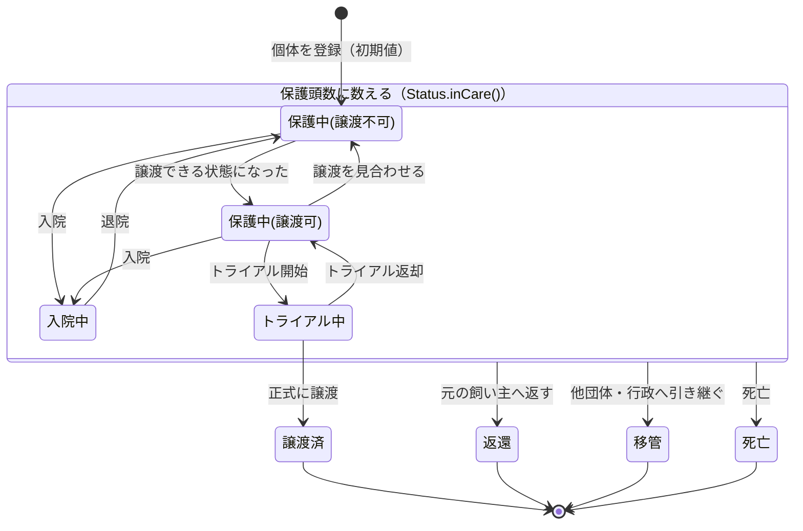
```mermaid
stateDiagram-v2
    [*] --> NOT_ADOPTABLE : 個体を登録（初期値）

    state "保護頭数に数える（Status.inCare()）" as inCare {
        NOT_ADOPTABLE : 保護中(譲渡不可)
        ADOPTABLE : 保護中(譲渡可)
        HOSPITALIZED : 入院中
        TRIAL : トライアル中

        NOT_ADOPTABLE --> ADOPTABLE : 譲渡できる状態になった
        ADOPTABLE --> NOT_ADOPTABLE : 譲渡を見合わせる
        NOT_ADOPTABLE --> HOSPITALIZED : 入院
        ADOPTABLE --> HOSPITALIZED : 入院
        HOSPITALIZED --> NOT_ADOPTABLE : 退院
        ADOPTABLE --> TRIAL : トライアル開始
        TRIAL --> ADOPTABLE : トライアル返却
    }

    ADOPTED : 譲渡済
    RETURNED : 返還
    TRANSFERRED : 移管
    DECEASED : 死亡

    TRIAL --> ADOPTED : 正式に譲渡
    inCare --> RETURNED : 元の飼い主へ返す
    inCare --> TRANSFERRED : 他団体・行政へ引き継ぐ
    inCare --> DECEASED : 死亡
    ADOPTED --> [*]
    RETURNED --> [*]
    TRANSFERRED --> [*]
    DECEASED --> [*]
```

- 図は業務で想定している流れ。保護状況は個体の新規登録（F-08）・編集（F-10）のプルダウンで選ぶので、システムは図に無い変更も止めない（入力ミスを直せるようにするため）。
- 保護状況を変えるのは個体の登録・編集だけ。イベントを完了にしても変わらない（入院・退院・トライアル開始・トライアル返却・譲渡のイベントも同じ。一部の矢印はイベント種別と同じ名前だが、個体の保護状況はスタッフが個体の編集で変える）。
- 保護状況がトライアル中・譲渡済のときは、里親の選択が必須（F-08・F-10 のチェック）。それ以外の保護状況で保存すると、里親は空になる（トライアル返却などで保護中に戻したときも同じ）。
- 譲渡済・返還・移管・死亡は記録として残す状態で、保護頭数には数えない。

#### イベントの対応状況（`events.done`）

|状態|`done`|`staff`|次の状態へ進む操作|
|---|:---:|---|---|
|未対応|false|null|スタンプ欄をクリック → F-18 → 対応済|
|対応済|true|完了にしたスタッフ|済スタンプをクリック → F-34 → 未対応|

- 新規登録（F-15）したイベントは未対応から始まる。
- 対応状況が変わるのは F-18 と F-34 だけ。編集（F-17）では変わらない。
- 対応済のスタッフが削除されると、`staff` は null になる（`ON DELETE SET NULL`）。対応済のままで、対応スタッフだけ表示されなくなる（S-08）。
