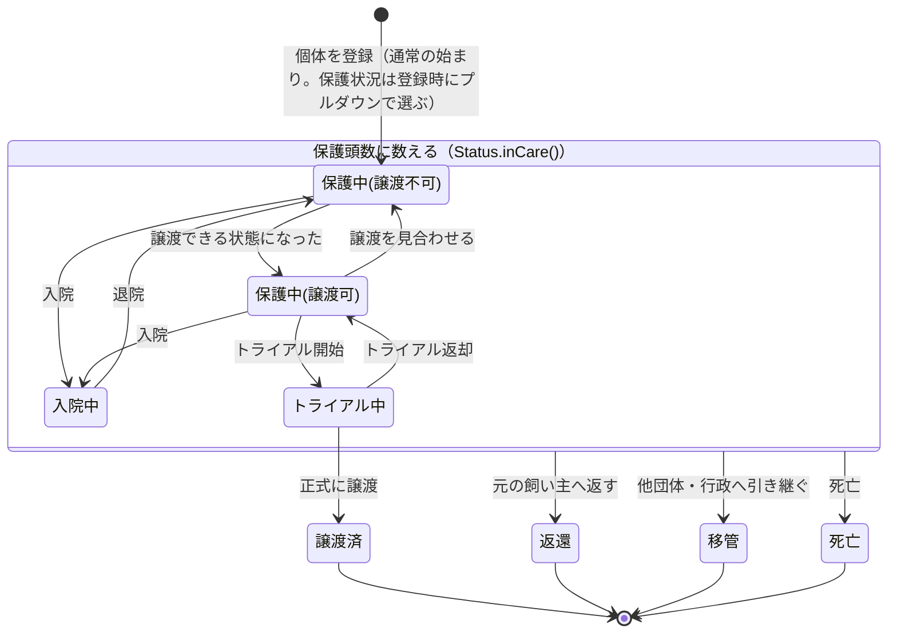

# 詳細設計(ホゴタロウ)

改訂: 2026-10-07 実装（hogotaro_6）に合わせて改訂

技術（Java・Spring 系のバージョンは pom.xml の値、画面のライブラリのバージョンは JSP が読み込む CDN の URL の値）:

- Java 25 / Spring Boot 4.1.1（`spring-boot-starter-parent`）。ビルドは Maven（`mvnw`）
- Spring MVC（`spring-boot-starter-webmvc`）/ Spring Security（`spring-boot-starter-security`、JSP の `sec:` タグに `spring-security-taglibs`）/ Spring Data JPA（`spring-boot-starter-data-jpa`）/ Bean Validation（`spring-boot-starter-validation`）
- JSP + JSTL（`jakarta.servlet.jsp.jstl-api`・`org.glassfish.web:jakarta.servlet.jsp.jstl`・`tomcat-embed-jasper`。taglib の uri は `jakarta.tags.core` など）
- MySQL（`mysql-connector-j`）/ Lombok / spring-boot-devtools
- テスト用（scope test）: `spring-boot-starter-data-jpa-test` `spring-boot-starter-security-test` `spring-boot-starter-webmvc-test`（いまテストは `HogotaroApplicationTests` のみ）
- 画面: Bootstrap 5.3.8 と Google Fonts の Zen Maru Gothic を CDN から読み込む。個体の写真トリミングに Cropper.js 1.6.2（CDN）

<br>

1. [共通仕様](#chapter1)
2. [トップページ](#chapter2)
3. [個体管理](#chapter3)
4. [イベント管理](#chapter4)
5. [里親管理](#chapter5)
6. [スタッフ管理](#chapter6)
7. [エラー](#chapter7)
8. [付録（DDL、初期データ、状態遷移図）](#chapter8)
9. [未実装一覧・今後の課題](#chapter9)

<br>
<a id="chapter1"></a>

## 1. 共通仕様

### 1.1 この文書の読み方

- 画面は `S-xx`（基本設計1章「画面一覧」の No）。例: S-03 個体一覧
- 機能は `F-xx`（基本設計3章「URL設計」の No）。例: F-05 GET /animal。F-34（未対応に戻す）は詳細設計で追加した機能で、基本設計3章にはまだ載っていない
- 各章は「画面 → 機能」の順。画面はカンプの画像と表で説明。新規登録と編集は同じ JSP を共用するので、カンプは新規登録の1枚だけ載せる（編集は同じレイアウトに現在値が入る）
- フォームの表の「name」は Form クラスのフィールド名（= `<form:input path>` の値）。「タグ・型」の `text, maxlength=10` は `<input type="text" maxlength="10">` の意味
- この版は 2026-10-07 時点の実装（アプリ本体のソースコード）を正として書き直したもの。設計にあったが実装されていないものは消さずに `> 【未実装】` で、意味が変わった設計変更は `> 【設計変更】` で本文中に示す。まとめは9章

### 1.2 ログインと権限

- ログインは Spring Security に任せる（`POST /login` と `POST /logout` の Controller は書かない）
- ログインしたときに Spring Security が持つのは標準の `User`（ログインIDとロール。パスワードハッシュはログイン時の照合にだけ使い、ログイン後は Spring Security の既定で消される）だけ。自作の `UserDetails` クラスは作らない。`User` は `LoginUserDetailsService`（`@Service`、`UserDetailsService` を実装）が `staffRepository.findByLoginId(loginId)` で staff を引いて作り、ロールは `User.withUsername(staff.getLoginId()).password(staff.getPasswordHash()).roles(staff.getUserType().getCode())` で付ける（`roles()` が `ROLE_` を付けるので、自分で `ROLE_` を付けない。付けると `ROLE_ROLE_ADMIN` になって全員 403）。ログインIDが無いときは `UsernameNotFoundException`（→ ログイン失敗）
- パスワードは BCrypt。`SecurityConfig` に `PasswordEncoder` の Bean（`new BCryptPasswordEncoder()`）を置き、スタッフ登録時は `passwordEncoder.encode(平文)` を保存する
- `LoginUser`（`security` パッケージ）は `@Component` の窓口クラス。Controller に `private final LoginUser loginUser;` で注入して使う（全画面の JSP には `LoginUserModelAdvice` が `loginUser` という名前で渡す。1.8）。呼ばれるたびに、ログインIDで staff を引き直して返す（1回呼ぶごとに SELECT が1回走る）。`@AuthenticationPrincipal` は使わない。`loginUser.getId()` は無い（スタッフIDは `getStaffId()`）
  - `getOrganizationId()`（団体ID）・`getOrganization()`（団体の Entity）・`getStaffId()`（スタッフID）・`getOrganizationName()`（団体名）・`getName()`（名前）・`getRole()`（`ADMIN` `STAFF` `VOLUNTEER`。`user_types.code`）・`getUserTypeName()`（管理ユーザー など。`user_types.name`）・`isLoggedIn()`（未ログイン・匿名なら false）
  - 団体IDは常に `loginUser.getOrganizationId()`。ログインしていないときに `isLoggedIn()` 以外を呼ぶと `IllegalStateException("ログインしていません")` になる
- 権限は基本設計3章のとおり。GETはV、POSTはS。ただし新規登録・編集のフォーム（`/xxx/new` `/xxx/{id}/edit`）はGETもS（ボランティアがURLを直接開いたら403）。削除・`/staff/new`・`/staff/{id}/edit`（GET・POST）はA。ログアウト（`POST /logout`）はボランティアも可
- `SecurityConfig`（`@Configuration` `@EnableWebSecurity`）に書いている設定（書かないとログイン画面が出ない・ログインできない）
  - `.formLogin(...)` に `.loginPage("/login")`・`.loginProcessingUrl("/login")`・`.usernameParameter("loginId")`・`.passwordParameter("password")`・`.defaultSuccessUrl("/", true)`（ログイン後は常にトップページ）・`.failureUrl("/login?error")`。ログインIDの name が Spring Security の既定（`username`）ではなく `loginId` のため `usernameParameter` が必要
  - `.logout(...)` に `.logoutUrl("/logout")`・`.logoutSuccessUrl("/login?logout")`
  - CSRF 対策は Spring Security の既定のまま有効。POST は `<form:form>` で書く（CSRF トークンの hidden が自動で入る）。トークンの無い生の `<form>` で POST すると 403。個体の削除（S-04）だけは生の `<form>` に `<input type="hidden" name="${_csrf.parameterName}" value="${_csrf.token}">` を手で書いている
  - `authorizeHttpRequests` のルールは上から順に評価され、先に書いたものが優先される。範囲の狭いものから順に、次の順で書いている。「GETはV」を先に書くと、ボランティアが登録・編集フォームを開けてしまう

|順|対象|権限|理由|
|:---:|---|:---:|---|
|1|`.dispatcherTypeMatchers(DispatcherType.FORWARD, DispatcherType.ERROR)`|`permitAll()`|JSP への転送と error.jsp の表示を通す（無いと、未ログインで `/login` を開いたときにリダイレクトが繰り返される）|
|2|`/login` `/css/**` `/js/**` `/img/**` `/images/**`|`permitAll()`|ログイン前でも画面・スタイル・ロゴを出す。写真の `/photos/**`（と写真なし画像の `/NoPhotos/**`）はログイン必須のまま|
|3|`/logout`|`authenticated()`|下の「POST すべて」より前に置いている（ログアウト自体は `.logout()` の設定で認可より先に処理されるので、念のためのルール）|
|4|`/staff/new` `/staff/*/edit` `/*/*/delete`|`hasRole("ADMIN")`|A。スタッフの新規登録・編集（GET も POST も）と全機能の削除|
|5|`/*/new` `/*/*/edit`|`hasAnyRole("ADMIN", "STAFF")`|S。登録・編集フォームは GET でも S（スタッフの分は4が先に当たるので A のまま）|
|6|`HttpMethod.POST, "/**"`|`hasAnyRole("ADMIN", "STAFF")`|S。登録・更新・完了・未対応に戻す|
|7|`.anyRequest()`|`authenticated()`|残り（全 GET）はログイン済みなら誰でも（V）。未ログインなら `/login` へ|

- 土台を動かしたら、未ログインでログイン画面が表示されること、正しいIDとパスワードでトップページへ進めること、ボランティアでログインしたときに編集・削除のボタンとスタンプ欄が出ず、代わりに対応状況が「未対応」「対応済」の文字で出ることを確かめる
- 画面のボタンは基本的に `<sec:authorize access="...">` で囲む。新規登録・編集・完了・未対応に戻すは `hasAnyRole('ADMIN','STAFF')`、削除とスタッフの新規登録は `hasRole('ADMIN')`（里親詳細の削除だけ `hasAnyRole('ADMIN')` と書いているが、意味は同じ）。ボランティアにはスタンプ欄の代わりに対応状況を文字で出す（`hasRole('VOLUNTEER')` で囲む。S-07・S-08）。`sec` のタグを使うため、pom.xml に `spring-security-taglibs` を入れている
  - 一部の画面は `sec:authorize` ではなく、`LoginUserModelAdvice` が渡す `loginUser` を `<c:if>` で見ている: 個体一覧の「新規登録」（`${loginUser.role == 'ADMIN' || loginUser.role == 'STAFF'}`）、スタッフ詳細の「編集」「削除」（`${loginUser.role == 'ADMIN'}`。削除はさらに `${staff.id != loginUser.staffId}` のときだけ）
  - 個体の削除（F-11）だけは、`SecurityConfig` に加えて Controller でも `loginUser.getRole()` が `ADMIN` でなければ `ResponseStatusException(HttpStatus.FORBIDDEN, "権限がありません")` を投げている（画面に出るのは error.jsp の 403 の文言で、この理由文は出ない）

### 1.3 団体の絞り込み

基本設計8章のとおり。Controller が `loginUser.getOrganizationId()` を取り、Service の引数で渡す。1件取得は必ず `findByIdAndOrganizationId(id, 団体ID)`、空なら Service が `throw new ResponseStatusException(HttpStatus.NOT_FOUND)`（404）。プルダウンで選んだ個体・里親の ID も `findByIdAndOrganizationId` で引き直す（イベント完了の対応スタッフも、ログイン中のスタッフIDで同じように引き直す）。登録するときの団体は `organizationRepository.getReferenceById(団体ID)` でセットする（団体IDは `loginUser` から）。

団体を持たないマスタ（`breeds` `event_types` `user_types`）は `findById` で引く。`organizations` はログイン中の団体だけを `findById(loginUser.getOrganizationId())` で読む（F-01）。

### 1.4 フラッシュメッセージとエラー

基本設計8章のとおり。

- フラッシュは、登録・編集・削除などの POST のあとに `redirectAttributes.addFlashAttribute("message", "…")` で渡し、リダイレクト先で1回だけ表示する。属性名は全画面 `message` の1つだけ
- 表示は各 JSP が `<c:if test="${not empty message}">` で自分で書いている（header.jspf では表示しない）。色は画面ごとに違う（個体・イベントは `alert-success`、里親・スタッフは `alert-warning`）。共通部品 `common/message.jspf`（`alert-warning`）もあるが、画面では使われていない（`_template` の3本だけが読み込む）
- 入力エラーはフラッシュではなく、同じフォームを再表示して項目の下に出す（1.5）
- 403・404 などは error.jsp（7章）

### 1.5 入力チェックの書き方

- Form に `@NotBlank` `@Size` `@NotNull` `@Email` `@Pattern` `@Past` `@PastOrPresent` `@PositiveOrZero` などを付け、メッセージはアノテーションに直接書く（例: `@NotBlank(message = "名前を入力してください")`）。検索用の `XxxSearchForm` には付けない
- 各章の表の `@Pattern("...")` は略記。実際は `@Pattern(regexp = "...", message = "...")` と書く。任意項目の形式チェックは `^$|` を先頭に付けて空を通す（例: `regexp = "^$|^[0-9-]+$"`）。表の中の `\|` は Markdown の表を崩さないための書き方で、Java では `|` と書く
- Controller は `@Validated XxxForm xxxForm, BindingResult result`（`@ModelAttribute("xxxForm")` を付けている Controller もある）で受け、`result.hasErrors()` なら同じフォームを再表示（プルダウン・ラジオの選択肢と `mode` などを Model に入れ直す）
- アノテーションで書けないチェックは Service で判定する。エラーがあれば保存せずに戻り、Controller は Service を呼んだあとでもう一度 `result.hasErrors()` を見て、エラーなら同じフォームを再表示する（イベントの更新（F-17）だけは、Controller が先に Service を呼び、Service が先頭で `result.hasErrors()` を見て戻る。Controller はそのあと1回だけ `hasErrors()` を見る）。実装のしかたは機能によって2通りある
  - `BindingResult` を Service に渡し `result.rejectValue("項目名", "コード", "メッセージ")` で乗せる（戻り値があるメソッドは null、void のメソッドは `return;` で戻る）: スタッフ（新規登録時のログインID必須・ログインID重複・新規登録時のパスワード必須・ユーザー種別の存在確認・自分自身のユーザー種別の変更）、イベント（個体・イベント種別・里親の存在確認、保護中でない個体、トライアル開始・譲渡の里親必須、猫の狂犬病ワクチンイベント）
  - 個体だけは、Service が `throw new ResponseStatusException(HttpStatus.BAD_REQUEST, "メッセージ")` を投げ、Controller が `catch` してメッセージの文言で項目を判別し `result.rejectValue()` に乗せ直す（犬猫と品種の組み合わせ、トライアル中・譲渡済の里親必須、犬の狂犬病ワクチン）。選んだ品種・里親が存在しないときは 404
- 日付は `<input type="date">` + `LocalDate` + `@DateTimeFormat(iso = DateTimeFormat.ISO.DATE)`
- 時刻は `<input type="time">` + `LocalTime` + `@DateTimeFormat(pattern = "HH:mm")`
- 数値や日付に変換できない値が送られたとき（typeMismatch）に英語のメッセージが出ないよう、`messages.properties` に `typeMismatch=入力形式が正しくありません` を書く

> 【未実装】`messages.properties` に `typeMismatch=入力形式が正しくありません` を書く。`src/main/resources` に `messages.properties` は無く、変換エラーのときは Spring 既定の英語メッセージが出る。

- 写真の種類（JPEG・PNG）のチェック

> 【未実装】写真の種類を Service で判定する。現状は JSP の `accept="image/jpeg,image/png"` で選べるファイルを絞っているだけで、サーバー側のチェックは無い（`AnimalService` は `getContentType()` が `image/png` なら `.png`、それ以外は `.jpg` として保存する）。

- プルダウン・ラジオは enum の定数名を送り、表示は `label`（例: `${a.status.label}`）。マスタ・他テーブルの選択（品種・個体・イベント種別・里親・ユーザー種別）は ID を送る
- 任意の文字列項目が空文字（空白だけを含む）なら Service で `null` にして保存（里親・スタッフは `blankToNull()`、イベントは `emptyToNull()`）

> 【未実装】個体（`AnimalService`）は任意の文字列項目（マイクロチップ番号・健康に関する特記事項・その他の特記事項）を空文字のまま保存しており、`null` への置き換えをしていない。

### 1.6 標準画面遷移（個体・里親・イベント・スタッフ共通）

ヘッダー: ログイン後の全画面で表示（`common/header.jspf`）。左からロゴ（クリックでトップ）/ 個体管理 / イベント管理 / 里親管理 / スタッフ管理  <br>右端にログイン中の「団体名 / 名前（ユーザー種別名）」/ ログアウト（POST フォーム）。今開いている画面のメニューは白背景・太字（`active`）になる

> 【設計変更】旧: メニューは「トップ / 個体一覧 / 里親一覧 / イベント / スタッフ一覧」→ 新: 「トップ」のメニューは無く、ロゴがトップへのリンク。名前は「個体管理 / イベント管理 / 里親管理 / スタッフ管理」。右端に名前に加えてユーザー種別名を出す。

|遷移元|操作|遷移先|
|:---:|:---:|:---:|
|一覧|「新規登録」| 新規登録画面（GET /xxx/new）|
|一覧| カード（個体）・名前（里親・スタッフ）をクリック | 詳細（GET /xxx/{id}）|
|詳細|「編集」|編集画面（GET /xxx/{id}/edit）|
|詳細|「削除」|確認 → POST /xxx/{id}/delete → 一覧へ。フラッシュ「〇〇を削除しました」|
|新規登録|「登録する」|POST /xxx/new → 詳細へ。フラッシュ「〇〇新規登録が完了しました」|
|編集|「更新する」|POST /xxx/{id}/edit → 詳細へ。フラッシュ「〇〇を編集しました」|
|新規登録・編集| 入力エラー | 同じフォームを再表示 |
|新規登録・編集| 「キャンセル」 | 新規 → 一覧、編集 → 詳細 |

〇〇は「個体」「里親」「イベント」「スタッフ」。

各機能の章では、この表と**違うところだけ**書く。主な違い（詳しくは各章）:

- イベント: 一覧はカレンダー（S-07）で、イベントを押すと概要ペインが開く。新規登録と削除のあとは詳細ではなく、そのイベントの月のカレンダー（`/event?year=&month=`）へ戻る
- 里親: 個体またはイベントに紐づいている里親は削除せず、詳細へ戻してフラッシュ「個体またはイベントに紐づいているため削除できません」
- スタッフ: 自分自身は削除できない（詳細に削除ボタンを出さず、POST されても詳細へ戻してフラッシュ「自分自身は削除できません」）。登録・更新のボタンは「登録」「更新」

### 1.7 命名

基本設計8章のとおり。追加分:

- Controller のメソッドは `list` `detail` `newForm` `create` `editForm` `update` `delete`（イベントだけ `complete` `uncomplete`、トップは `top` `login`）
- Service のメソッドは `search` `create` `update` `delete`（イベントはさらに `complete` `uncomplete`）と、1件取得・編集フォーム用・関連一覧や選択肢（`findXxxList`。例: `findEventList` `findAnimalList` `findEventTypeList` `findAdopterList`。ただしユーザー種別は `findUserTypes`）。トップは `TopService` の `countInCare` `findOrganization`。ただし名前は機能ごとにそろっていない（1件取得は個体 `findById`・里親 `detail`・イベント `findbyId`・スタッフ `find`、編集フォーム用は個体・里親・イベントが `getEditForm`、スタッフが `toForm(staff)`）。`getEditForm` は編集画面用に、取得した Entity の値を Form に詰めて返す
- 入力フォームは `XxxForm`、Model 名は `xxxForm`。検索条件は `XxxSearchForm`、Model 名は `searchForm`（Controller の引数に `@ModelAttribute("searchForm")` を付ける）。登録・編集の共用 JSP には `mode`（`"new"` / `"edit"`）と編集対象の ID（`animalId` `adopterId` `eventId`。スタッフは Entity の `staff`）を渡す。一覧・選択肢は `xxxList`
- BOOLEAN のフィールドは、誕生日推定だけ `is` を付けた `isBirthdayEstimated`（Entity・Form とも。`@Column` は付けず、Spring Boot の既定の名前変換で列 `is_birthday_estimated` に対応する）。それ以外（`done` `comboVaccine` `rabiesVaccine`）は `is` を付けない
- 避妊去勢は enum `NeuterStatus`（`DONE` 済 / `NOT_DONE` 未 / `UNKNOWN` 不明）で、列名・フィールド名とも `neutered`

> 【設計変更】旧: BOOLEAN のフィールドは `is_` を付けない（`birthdayEstimated`。列名は `@Column(name = "is_birthday_estimated")`）→ 新: フィールド名は `isBirthdayEstimated`（`@Column` 無し）。Lombok が作る getter は `getIsBirthdayEstimated()`、JSP の path も `isBirthdayEstimated`。

### 1.8 共通部品

- `jsp/common/head.jspf`: `<head>` の中で include する。taglib 宣言（`c` `fmt` `fn` `form` `spring` `sec`）、`ctx`（コンテキストパス）、meta（charset・viewport）、ファビコン、Bootstrap 5.3.8（CDN）、Zen Maru Gothic（Google Fonts）、共通CSS `/css/hogotarou.css`。`<title>` は各ページで書く。今これを読み込んでいるのは、画面では個体の3画面（animal/list・detail・form）だけ（ほかに `_template` の3本も読み込む）。ほかの画面は Bootstrap と Zen Maru Gothic の `<link>` と、hogotarou.css と同じ内容を写した `<style>` を各 JSP の `<head>` に直接書いている（ファビコンの `<link>` は無く、taglib の宣言も画面ごとにまちまち。event/form.jsp だけは hogotarou.css を `<link>` で読む）
- `jsp/common/header.jspf`: `<body>` の直後で include する。taglib 宣言（`c` `fmt` `fn` `form` `sec`）、`ctx`、Zen Maru Gothic の `<link>`（ページ側が読んでいなくても同じ見た目にするため）、ヘッダー用の CSS（`<style>` で header.jspf の中に持つ）、ロゴ（`/images/hogotarou_logo_peach.png`。クリックでトップ）、ナビ（1.6。`active` は、forward 前の URL（`requestScope['jakarta.servlet.forward.request_uri']` を入れた `currentUri`）が `${ctx}/animal` などで始まるか `fn:startsWith` で見て付ける）、ログイン中の「団体名 / 名前（ユーザー種別名）」（`LoginUserModelAdvice`（`@ControllerAdvice`）が全画面に `loginUser` を渡しているので、`${loginUser.organizationName}` `${loginUser.name}` `${loginUser.userTypeName}` で読む）、ログアウトの `<form:form action="${ctx}/logout" method="post">`。団体名・名前とログアウトは `<c:if test="${not empty loginUser}">` で囲む（ナビは囲まない）。フラッシュの表示は header.jspf ではなく各画面で行う（1.4）
  - login.jsp は header.jspf を読まず、ロゴだけの帯を自分で書く。error.jsp は `<c:if test="${loginUser.loggedIn}">` のときだけ header.jspf を読む（未ログインで読むと団体名の取得で例外になるため）

> 【設計変更】旧: ナビ・団体名と名前・ログアウトを `<sec:authorize access="isAuthenticated()">` で囲み、フラッシュも header.jspf で表示する → 新: 団体名・名前・ログアウトだけを `<c:if test="${not empty loginUser}">` で囲み、ナビは囲まない。`loginUser` は `LoginUserModelAdvice` が常に渡すのでこの条件は未ログインでも true になり、未ログインの画面では header.jspf を読まないこと（login.jsp は読まない、error.jsp は `${loginUser.loggedIn}` で囲む）で例外を避けている。フラッシュは各画面で表示する。

- `jsp/common/message.jspf`: フラッシュ（`message`）を `alert-warning` で表示する部品。画面では使われていない（`_template` の3本だけが読み込む）
- `jsp/_template/list.jsp` `detail.jsp` `form.jsp`: 一覧・詳細・新規登録/編集の画面を作るときにコピーして使う見本（見本の元は里親の画面）。`★` の付いた所と `○○`（画面名）・`xxx`（URL・変数名）を書き換える。Controller からは表示しない
- `static/css/hogotarou.css`: 共通スタイル（配色の CSS 変数、ヘッダー、カード `hogo-card`、入力欄、ボタン `btn-hogo` `btn-hogo-sub` `btn-hogo-danger`、表 `table-peach` など）。読み込んでいるのは head.jspf と event/form.jsp
- `static/images/`: ロゴ（`hogotarou_logo_*.png`）、`favicon.ico`、`apple-touch-icon.png`、`hogotarou_icon_512.png`、`preview.png`。URL は `/images/...`
- 削除・完了・未対応に戻すの確認は、各 JSP の form（個体の削除だけ生の `<form>`、ほかは `<form:form>`）に `onsubmit="return confirm('...')"` を直接書く（`return` が無いと、キャンセルしても送信される）。イベント詳細の削除だけは form に `data-confirm="..."` を書き、JSP の `<script>` で `window.confirm()` を出す

> 【未実装】`static/js/confirm.js` の `confirmSubmit(msg)`。`static/js/` は無く、各 JSP の `onsubmit` に `confirm()` を直接書いている。文言は画面ごとに違う（里親・スタッフ・イベント詳細「本当に削除しますか？」、個体「この個体を削除してもよろしいですか？」、イベントの完了「イベントを完了にしますか？個体の情報は自動では変わりません」、未対応に戻す「イベントを未対応に戻しますか？個体の情報は自動では変わりません」）。

> 【未実装】`static/js/calendar.js`（イベント一覧の概要ペインの表示（S-07））。ファイルは無く、event/calendar.jsp の中の `<script>` に書いている。

- 写真が無い個体は `/NoPhotos/NoPhotos.png`（プロジェクト直下の `uploads/NoPhotos/NoPhotos.png`。`spring.web.resources.static-locations` の `file:uploads/` から配信）を出す

> 【未実装】`static/img/placeholder-dog.png` `placeholder-cat.png` で犬猫を出し分ける。`static/img/` は無く、犬猫とも同じ `/NoPhotos/NoPhotos.png` を出している。

- 年齢は Entity（Animal・Adopter・Staff）の `@Transient getAge()` で誕生日から計算（`Period.between(birthday, LocalDate.now()).getYears()`。誕生日が無ければ null）。null のときの表示は画面ごとに違う（個体詳細・里親詳細は「不明」、個体一覧のカードは「-」。スタッフは生年月日が必須なので null にならない）

<br>
<a id="chapter2"></a>

## 2. トップページ

### 2.1 画面（S-01 〜 S-02）

#### S-01 ログインページ（login.jsp）


|項目|name|タグ・型|必須|備考|
|:---:|:---:|:---:|:---:|:---:|
|ログインID|loginId|text|○|`SecurityConfig` で `.usernameParameter("loginId")` を指定する（1.2）。`required` `autofocus`|
|パスワード|password|password|○|`SecurityConfig` の `.passwordParameter("password")` と合わせる。`required`|
|ログイン|—|submit||横幅いっぱいのボタン|
|メッセージ|—|—||`?error` で「ログインに失敗しました」（赤 `alert-danger`）、`?logout` で「ログアウトしました」（緑 `alert-success`）。フラッシュではなく、JSP で `${param.error != null}` `${param.logout != null}` を見て表示する|

`<form:form action="/login" method="post">` で書く（CSRF トークンが自動で入る。トークンの無い生の `<form>` だと 403）。入力欄は `<form:input>` ではなく `<input name="loginId">` `<input name="password">` を直接書く（ログイン用の Form クラスは無い）。

ヘッダーは header.jspf を読まず、ロゴだけの帯（header.jspf と同じクラス名・同じ CSS。ロゴはリンクにしない）を login.jsp に直接書く。見出しは「ログイン」、カードの見出しは「ログイン情報」。

#### S-02 トップページ（top.jsp）


|表示項目|内容|備考|
|:---:|:---:|:---:|
|個体管理へ/イベント管理へ/里親管理へ/スタッフ管理へ|リンク（ボタン）|S-03/S-07/S-11/S-15へ。見出しの下に横並び|
|保護頭数：受け入れ状況|「満員」「残りわずか」「受け入れOK」とアイコン（✕ / ! / ✓）、「空き N 頭」|空き = `${capacity - inCare}`。空きが0以下なら「満員」（赤）、使用率80%以上なら「残りわずか」（黄）、それ以外は「受け入れOK」（緑）。空きはマイナスにせず0と出す|
|保護頭数：保護中 / 定員|`${inCare}` / `${organization.capacity}` 頭|保護中は `Status.inCare()` の4つ（保護中(譲渡可)・保護中(譲渡不可)・入院中・トライアル中）の合計|
|保護頭数：使用状況のバー|Bootstrap の progress と「N% 使用中」|使用率 = 定員が0より大きければ `inCare * 100 / capacity`、0なら0。EL の `/` は小数になる（例: 83.33…）ので、80% の判定とバーの幅は小数のまま使い、「N% 使用中」は `<fmt:formatNumber maxFractionDigits="0">` で小数点以下を丸めて出す。バーは100%で止める|
|ミニカレンダー|見出し「カレンダー（yyyy年m月）」。日〜土の表で、マスに日付とその日のイベント|今月（日本時間）だけを表示し、月の切り替えは無い。前月・次月のはみ出したマスは文字を薄くし、そこにもその日のイベントを出す|
|ミニカレンダーのイベント|「個体名 種別（未）」または「個体名 種別（済）」。時刻は出さない|色は対応状況で変える（未対応＝オレンジ、対応済＝緑。イベント管理のカレンダーと同じ色）。イベントを押すと `/event?year=${d.date.year}&month=${d.date.monthValue}&selectedEventId=${e.id}`（そのマスの日付の月のイベント管理のカレンダーで、そのイベントを選んだ状態で開く。はみ出したマスなら前月・次月へ）|

見出しは「トップページ」。ボタンの下に2列で、左（PC では 4/12）に「保護頭数」カード、右（8/12）にカレンダーのカードを並べる（スマホでは縦1列）。フラッシュの表示は無い。

> 【設計変更】旧: 保護頭数/受入上限を `${animalCount}`/`${capacity}` で表示し、上限以上なら赤 → 新: 受け入れ状況（満員・残りわずか・受け入れOK の3段階と空き頭数）、保護中 / 定員、使用状況のバーを出す。Model の名前は `inCare` と `organization`。

> 【設計変更】旧: マスをクリックで `/event?year=&month=` → 新: マスの中のイベントをクリックで `/event?year=&month=&selectedEventId=`（マス自体はリンクにしない）。

### 2.2 機能（F-01 〜 F-04）

#### F-01 GET /（TopController#top）
1. 団体ID = `loginUser.getOrganizationId()`
2. 保護頭数 = `topService.countInCare(団体ID)`（中で `animalRepository.countByOrganizationIdAndStatusIn(団体ID, Status.inCare())`）
3. 団体 = `topService.findOrganization(団体ID)`（中で `organizationRepository.findById(団体ID)`、無ければ 404）。受入上限はこの団体の `capacity`
4. `eventService.search(organizationId, null, null)` で今月の `EventCalendar` を作る（F-12 と同じ。年月が null なので日本時間の今月）
   - `EventCalendar`: `year` `month` `prevYear` `prevMonth` `nextYear` `nextMonth` と `weeks`（`List<List<CalendarDay>>`。1週 = 日〜土の7日）
   - `CalendarDay`: `date`（`LocalDate`）・`inMonth`（表示中の月の日なら true）・`eventList`（その日のイベント）・`getDay()`（日にちだけ）
   - 表の左上の日曜〜右下の土曜までのイベントを `eventRepository.findByOrganizationIdAndEventDateBetweenOrderByEventDateAscEventTimeAsc` でまとめて取り、日付ごとに振り分ける
5. Model: `inCare`、`organization`、`calendar` → top.jsp

`TopService`（`service` パッケージ、`@Service`）は保護頭数と団体の取得をまとめたクラス。

#### F-02 GET /login（TopController#login）
1. ログイン済み（`loginUser.isLoggedIn()`）なら `redirect:/`。それ以外は login.jsp を返す。

#### F-03 POST /login、F-04 POST /logout（Controller 無し）
Controller 無し。Spring Security に任せる（設定は 1.2）

- F-03: 成功したら `/`（トップページ）、失敗したら `/login?error`
- F-04: ログアウトしたら `/login?logout`。ログアウトはヘッダーの `<form:form action="${ctx}/logout" method="post">` から送る

<br>
<a id="chapter3"></a>

## 3. 個体管理

### 3.1 画面（S-03 〜 S-06）

#### S-03 個体一覧（animal/list.jsp）


カード形式で個体の一覧を表示する。カードは `hogo-card`（白・角丸・うっすら影）で、写真は `hogo-card-img`（高さ 200px、`object-fit: cover`）。

> 【未実装】カードにマウスを乗せたとき（ホバー）は、枠や影を変えてクリックできることが分かるようにする。hogotarou.css に `.hogo-card` のホバー指定は無く、カードの見た目はホバーしても変わらない（カード全体が `<a>` なので、カーソルが指の形になるだけ）。

- 検索フォーム（見出し「個体を検索」）は生の `<form action="${pageContext.request.contextPath}/animal" method="get">` で書いている
- 絞り込み：種別（犬猫）・保護状況（どちらもチェックボックスで複数選択）と、名前（部分一致の text。placeholder「個体名を入力してください」）。保護状況の初期値は `Status.inCare()` の4つ（保護中(譲渡可)・保護中(譲渡不可)・入院中・トライアル中）
- チェックボックスは `<c:forEach>` + 生の `<input type="checkbox" name="species">` / `name="statuses"` で書き、`searchForm` に入っている値なら `checked` を付ける
- 検索ボタンは `<button type="submit" name="search" value="1">検索</button>`
- 一覧の上のフラッシュ（`${message}`）は、この JSP の中で `alert alert-success` で表示する
- 0件のときは、カード欄に何も表示しない（「〇件」「該当なし」などの表示は無い）

各カードの表示項目は以下の通り

|表示項目|内容|備考|
|---|---|---|
|写真|``、無ければ `/NoPhotos/NoPhotos.png`（alt「画像なし」、`object-fit: contain`）|犬猫の出し分けは無く、共通の1枚|
|名前|`<c:out value="${animal.name}"/>`| カード全体を `<a href="${pageContext.request.contextPath}/animal/${animal.id}" class="text-decoration-none">`|
|犬猫|`${animal.species.label}`|バッジ（ピーチ色）|
|性別|`${animal.sex.label}`|バッジ（うすいピーチ色）|
|品種|「品種：」+ `<c:out value="${animal.breed.name}"/>`|品種が無ければ「-」|
|年齢|「年齢：」+ `${animal.age}歳`|誕生日が無く年齢が null なら「-」|

> 【未実装】カードに保護状況（`${a.status.label}`）を表示する。list.jsp のカードには保護状況が出ていない。

|操作|権限|遷移先|
|---|:---:|---|
|新規登録ボタン|S|S-05|
|カードクリック|V|S-04|
|検索ボタン|V|S-03（条件つき）|

- 新規登録ボタンは `<sec:authorize>` ではなく `<c:if test="${loginUser.role == 'ADMIN' || loginUser.role == 'STAFF'}">` で囲んでいる

#### S-04 個体詳細（animal/detail.jsp）


画面は幅 700px までの1列で、カード（`hogo-card`）を「基本情報」「保護情報・健康情報」「イベント履歴」の3枚並べる。フラッシュ（`${message}`）はこの JSP の中で `alert alert-success` で表示する。

|表示項目|内容|
|---|---|
|写真|「基本情報」カードの先頭に1枚（最大幅 300px）。無ければ `/NoPhotos/NoPhotos.png`（alt「写真なし」）|
|基本（「基本情報」カード）|名前・種別（犬猫）・性別・品種（無ければ「不明」）・年齢（`${animal.age}歳`。無ければ「不明」）・誕生日（`${animal.birthday}` をそのまま表示。推定（`isBirthdayEstimated` が true）のときは後ろに「（推定）」を付ける。誕生日が無ければ「不明」）|
|保護（「保護情報・健康情報」カード）|保護日・保護場所・保護方法・保護状況|
|里親|保護状況がトライアル中・譲渡済のとき `<c:out value="${animal.adopter.name}"/>` を `/adopter/{id}` へのリンクで（里親が無ければ「-」）。それ以外は項目ごと表示しない|
|医療|避妊去勢（`${animal.neutered.label}`。済/未/不明）・混合ワクチン（済/未）・狂犬病ワクチン（済/未。犬のとき（`animal.species == 'DOG'`）だけ表示）・マイクロチップ（無ければ「-」）|
|特記事項|健康に関する特記事項・その他の特記事項（どちらも `<c:out>`。無ければ「-」）|
|イベント履歴|この個体に関連するイベントを日付の降順（同じ日は時刻の降順）で、表（日付・イベント種別・内容）。日付は `${event.eventDate}`、種別は `${event.eventType.name}`、内容は `<c:out value="${event.notes}"/>`。0件なら「イベント履歴はありません。」|

> 【未実装】特記事項の表示に `white-space: pre-wrap` を使う。hogotarou.css に `.hogo-notes`（`white-space: pre-wrap`）はあるが detail.jsp では使っておらず、入力した改行は詰めて表示される。

> 【未実装】イベント一覧の行を `/event/{id}` へのリンクにする。detail.jsp のイベント履歴の行はリンクになっていない。また、表の列は「日付・時刻・種別・場所・済/未」ではなく「日付・イベント種別・内容」になっている（時刻・場所・済/未は表示しない）。

|操作|権限|遷移先|
|---|:---:|---|
|編集するボタン|S|S-06|
|削除するボタン|A|確認「この個体を削除してもよろしいですか？」→ F-11 |
|一覧へ戻るボタン|V|S-03|

- 編集は `<sec:authorize access="hasAnyRole('ADMIN','STAFF')">`、削除は `<sec:authorize access="hasRole('ADMIN')">` で囲む（`sec` の taglib は head.jspf で宣言済み）
- 削除は生の `<form action="${pageContext.request.contextPath}/animal/${animal.id}/delete" method="post" onsubmit="return confirm('この個体を削除してもよろしいですか？');">` で、CSRF トークンは `<input type="hidden" name="${_csrf.parameterName}" value="${_csrf.token}">` を手で書いている

#### S-05 個体新規登録・S-06 個体編集（animal/form.jsp 共用）


`${mode}` が `new` / `edit`。`<c:choose>` で、新規用と編集用の `<form:form>` を丸ごと2つ書き分けている（中の項目は同じ）。

- 編集: `<form:form id="animalForm" modelAttribute="animalForm" method="post" enctype="multipart/form-data" action="/animal/${animalId}/edit">`
- 新規: `<form:form id="animalForm" modelAttribute="animalForm" method="post" enctype="multipart/form-data" action="/animal/new">`

画面は「基本情報」カード（写真・名前・犬猫・品種・新しい品種・性別）と「保護情報・健康情報」カード（それ以外）の2枚。必須の項目にはラベルの後ろに赤字で「（必須）」を付ける。下の表は画面の並び順。

|項目|name|タグ・型|必須|チェック|エラーメッセージ|
|---|---|---|:---:|---|---|
|写真|photo | file, accept="image/jpeg,image/png"（`<form:input path="photo" type="file">`。下に「JPEG または PNG / 5MB以下」と表示） | | Service: 空なら変更なし。上限は `spring.servlet.multipart.max-file-size=5MB`（リクエスト全体は `max-request-size=6MB`）。下の注記 | （413 のときの error.jsp の文言）ファイルは 5MB 以下にしてください |
|名前|name | text, maxlength=10 | ○ | `@NotBlank @Size(max=10)` | 名前を入力してください / 名前は10文字以内で入力してください |
|犬猫|species | radio（犬 `DOG` / 猫 `CAT`。JSP に直接書く。`onchange="toggleRabies()"`） | ○ | `@NotNull` | 犬猫を選択してください |
|品種|breedId | select（生の `<select id="breedId" name="breedId">`。先頭に「未選択」（value=""）。`breedList` を `<optgroup label="-- 猫 --">` `<optgroup label="-- 犬 --">` に分けて全部出す） | | 任意。Service: 指定時は `breedRepository.findById`、無ければ 404。品種の犬猫が個体の犬猫と違えば Controller が rejectValue | 犬猫と品種の組み合わせが不正です。 |
|新しい品種|newBreedName|text, maxlength=50||`@Size(max=50)`。空白だけでなければ `breedId` より優先（Service）|品種は50文字以内で入力してください|
|性別|sex | radio（オス `MALE` / メス `FEMALE` / 不明 `UNKNOWN`。JSP に直接書く） | ○ | `@NotNull` | 性別を選択してください |
|誕生日|birthday | date | | `@PastOrPresent` | 未来の日付は指定できません |
|誕生日は推定|isBirthdayEstimated | radio（推定 `true` / 推定ではない `false`。誕生日の入力欄の右に並べる（画面がせまいときは下）） | | — | — |
|保護日|intakeDate | date | ○ | `@NotNull @PastOrPresent` | 保護日を入力してください / 未来の日付は指定できません |
|保護場所|intakePlace | text, maxlength=50 | ○ | `@NotBlank @Size(max=50)` | 保護場所を入力してください / 保護場所は50文字以内で入力してください |
|保護方法|intakeMethod | text, maxlength=30 | ○ | `@NotBlank @Size(max=30)` | 保護方法を入力してください / 保護方法は30文字以内で入力してください |
|保護状況|status | select（生の `<select id="status" name="status">`。先頭に「未選択」（value=""）、続けて `statusList` の8種類を value=定数名・表示 `label` で） | ○ | `@NotNull` | 保護状況を選択してください |
|里親|adopterId | select（生の `<select id="adopterId" name="adopterId">`。先頭に「未選択」（value=""）、続けて `adopterList`（名前順）） | | 保護状況がトライアル中・譲渡済で空なら Controller が rejectValue（Service）。指定時は保護状況に関係なく `findByIdAndOrganizationId` で引き直し、無ければ 404 | このステータスの場合は里親を選択してください。 |
|避妊去勢|neutered | radio（済 `DONE` / 未 `NOT_DONE` / 不明 `UNKNOWN`。JSP に直接書く） | ○ | `@NotNull` | 避妊去勢を選択してください |
|混合ワクチン|comboVaccine | radio（済 `true` / 未 `false`） | ○ | `@NotNull` | 混合ワクチンを選択してください |
|狂犬病ワクチン|rabiesVaccine | radio（済 `true` / 未 `false`）。犬のときだけ表示（犬猫のラジオに合わせて JS で切り替え。ラベルに「（必須）」は付けていない） | 犬は○ | Service: 犬で空なら Controller が rejectValue。猫なら `false` で保存 | 犬の場合は狂犬病ワクチンを選択してください。 |
|マイクロチップ番号|microchipNo | text, maxlength=15（画面のラベルは「マイクロチップ」） | | `@Pattern("^$\|^[0-9]{15}$")` | マイクロチップ番号は15桁の数字で入力してください |
|健康に関する特記事項|healthNotes | textarea, maxlength=2000, rows=5 | | `@Size(max=2000)` | 2000文字以内で入力してください |
|その他の特記事項|notes | textarea, maxlength=2000, rows=5 | | `@Size(max=2000)` | 2000文字以内で入力してください |

> 【未実装】写真の種類（`getContentType()`）が `image/jpeg` `image/png` 以外なら rejectValue（「写真は JPEG または PNG を選択してください」）。Service に種類のチェックは無い。種類を絞っているのは JSP の `accept` と、下の Cropper.js による JPEG への変換だけ。

> 【未実装】品種・里親のプルダウンで選んだ ID が存在しないときに rejectValue（「品種の指定が不正です」「里親の指定が不正です」）。現状は `ResponseStatusException(HttpStatus.NOT_FOUND)` を投げ、404 のエラー画面になる。

- `<form:errors path="...">` は各項目の下に `text-danger small` で出す。
- 写真
  - 編集で現在の写真があるときは、それを表示する（`${animal.imagePath}`）。無いとき（新規を含む）は「写真をアップロードしてください」の枠（300×200）を出す。「変更しない / 差し替える」はファイルを選んだかどうかで判定する。
  - 写真を選ぶと、画面内の JS（`<script>` を form.jsp に直接書いている）がプレビューを出し、Cropper.js（cdnjs の 1.6.2。`<head>` で css と js を読み込む）でトリミング枠を出す。設定は `aspectRatio: 1`（正方形）、`viewMode: 1`（枠が画像の外にはみ出さない）、`dragMode: "move"`。
  - 送信時、トリミング枠があれば送信をいったん止め、`getCroppedCanvas({width: 600, height: 600})` で 600×600 の画像を作り、`toBlob(..., "image/jpeg", 0.9)` で JPEG にして、`photo.jpg`（`type: "image/jpeg"`）としてファイル欄の中身を差し替えてから `form.submit()` する。写真を選んでいなければそのまま送信する。
  - 入力エラーで再表示したときは、選んだファイルは消える（もう一度選び直す）。
  - 5MB の上限: 個体フォームは送信前に Cropper.js で 600×600 の JPEG に作り直すので、画面から普通に送る限り上限には当たらない。JS が動かない等で 5MB を超えるファイルが送られた場合、設定上（`max-file-size=5MB`、`max-request-size=6MB`）は 413 → error.jsp（「ファイルは 5MB 以下にしてください」。7章）の想定だが、CSRF トークンがマルチパート本文にあるため 403 になる可能性があり、実機で未確認。
- 年齢は入力欄に入れない（誕生日から計算して表示する）。
- 初期値は「誕生日は推定」= 推定（`true`）だけ（F-07）。保護状況・避妊去勢は初期値なし（保護状況は「未選択」、避妊去勢はどれも選ばれていない）。

> 【未実装】保護状況の初期値は保護中(譲渡不可)、避妊去勢の初期値は不明（DB の初期値と同じ）。`newForm` は `setIsBirthdayEstimated(true)` しかしておらず、保護状況・避妊去勢は空のまま画面を出す。

> 【設計変更】旧: 「誕生日は推定」は `<form:checkbox path="birthdayEstimated" label="推定"/>`（Form のフィールドは `boolean birthdayEstimated`）→ 新: `<form:radiobutton path="isBirthdayEstimated">` の2択（推定 / 推定ではない）。Form のフィールドは `Boolean isBirthdayEstimated`。ラジオなので隠し項目（`_birthdayEstimated`）は使わない。誕生日が空でも選んだ値をそのまま保存する（年齢は「不明」と表示されるので影響しない）。

- 品種のプルダウンは、全品種（`breedList`。`species` は文字列で保存しているので、文字列の昇順＝猫（`CAT`）→犬（`DOG`）、同じ犬猫の中は名前順で取得）を「-- 猫 --」「-- 犬 --」の optgroup に分けて出す。犬猫のラジオに関係なく、いつでも選べる。犬猫と合わない品種を選ぶと、保存時に「犬猫と品種の組み合わせが不正です。」になる。
- 編集画面では `${animalForm.breedId == breed.id}` の option に `selected` を付ける。新規画面の品種の option には `selected` を付けていない（入力エラーで再表示すると「未選択」に戻る）。

> 【未実装】入力エラーで再表示したとき、選んでいた品種を選択したまま表示する（当初の設計は `<form:option>` を使う形で、選択値は自動で保持される）。新規用の品種の option には `selected` の条件が無く、再表示すると「未選択」に戻る（編集用は `${animalForm.breedId == breed.id}` で保持される）。

> 【未実装】品種のプルダウンは、犬猫がまだ選ばれていないときは `disabled` にし、犬猫のラジオを選ぶと JS で有効にして、選んだ犬猫の品種だけを出す（option を配列に覚えて入れ直す方式。`<form:option ... data-species="${b.species}">`）。form.jsp に品種を絞る JS は無く、`data-species` も付いていない。

- 品種が選択肢に無いときは「新しい品種」に入力する。同じ犬猫・同じ名前の品種がすでにあればそれを使い、無ければ `breeds` に登録してから個体に設定する。品種マスタは全団体共通なので、登録した品種は他の団体の選択肢にも出る。

> 【未実装】「新しい品種」の前後の空白を除く。Service は `isBlank()` で空かどうかを見るだけで、入力された文字列をそのまま検索・登録する。

- 狂犬病ワクチンの行（`id="rabiesRow"`）は、`toggleRabies()` が犬のラジオ（`speciesDog`）にチェックが入っているときだけ表示し、それ以外（猫・未選択）は `display: none` にする。犬猫のラジオの `onchange` と、画面を開いたとき（`window` の `load`）に呼ぶ。
- 保護状況・里親・品種のプルダウンは `<form:select>` ではなく、生の `<select>` + `<c:forEach>` で書き、選択中の値に `selected` を付けている（ただし新規用の品種だけは付けていない。上記）。

| 操作 | 遷移先 |
|---|---|
| 登録する（new）| F-08 → S-04 |
| 更新する（edit）| F-10 → S-04 |
| キャンセル | new → S-03、edit → S-04 |

### 3.2 機能（F-05 〜 F-11）

#### F-05 GET /animal（AnimalController#list）
1. `AnimalSearchForm`（`species` `List<Species>`、`statuses` `List<Status>`、`name` `String`。どれも任意）を受ける
   - `@ModelAttribute("searchForm") AnimalSearchForm form, @RequestParam(value = "search", required = false) String search, Model model`
   - 検索ボタンには `name="search" value="1"` を付ける。`search` が null で、かつ `statuses` が null または空のとき（一覧を初めて開いたとき）だけ、`statuses` に `Status.inCare()` を入れる。チェックを全部外して検索したときは `search` があるので、初期値は入れない（全部が表示される）
2. `animalService.search(loginUser.getOrganizationId(), form)`
   - → null または空のリストは「全部」に置き換える（`species` が空なら `Species.values()` の全部、`statuses` が空なら `Status.values()` の全部）。`name` が null なら空文字にする
   - → `animalRepository.findByOrganizationIdAndSpeciesInAndStatusInAndNameContainingOrderByIdDesc(organizationId, speciesList, statusList, name)`（名前は部分一致。空文字なら名前では絞らない）
3. Model: `animalList`、`speciesList`、`statusList`、`loginUser` → animal/list.jsp（`searchForm` は `@ModelAttribute` で入る）
   - Model の `speciesList` `statusList` はチェックボックスの選択肢（`Species.values()` `Status.values()`）。`searchForm` の中のフィールド（`species` `statuses`。チェックされた値）とは別物

#### F-06 GET /animal/{id}（AnimalController#detail）
1. `@PathVariable Integer id, Model model` を受ける
2. `animalService.findById(id, loginUser.getOrganizationId())` → `animalRepository.findByIdAndOrganizationId(id, organizationId)`、空なら `ResponseStatusException(HttpStatus.NOT_FOUND)`
3. `animalService.findEventList(id, organizationId)` → `eventRepository.findByOrganizationIdAndAnimalIdOrderByEventDateDescEventTimeDesc(organizationId, id)`
4. Model: `animal`、`eventList`、`loginUser` → animal/detail.jsp

#### F-07 GET /animal/new（AnimalController#newForm）
1. 空の入力フォームを用意する。
   - `new AnimalForm()`
   - 初期値を入れる: `isBirthdayEstimated` = `true`（`animalForm.setIsBirthdayEstimated(true)`）

> 【未実装】初期値として `status` = `Status.NOT_ADOPTABLE`、`neutered` = `NeuterStatus.UNKNOWN` を入れる。`newForm` では設定しておらず、画面では保護状況「未選択」、避妊去勢は未選択で表示される。

2. ラジオボタンとプルダウンの選択肢を用意する。
   - `Species.values()`（犬 / 猫）
   - `Sex.values()`（オス / メス / 不明）
   - `NeuterStatus.values()`（済 / 未 / 不明）
   - `Status.values()`（保護状況8種類）
   - `breedRepository.findAllByOrderBySpeciesAscNameAsc()`（品種。全団体共通。`species` は文字列で保存しているので猫（`CAT`）→犬（`DOG`）、その中で名前順）
   - `adopterRepository.findByOrganizationIdOrderByNameAsc(loginUser.getOrganizationId())`（里親。自団体だけ、名前順）
   - 品種と里親は Service を通さず、Controller が Repository を直接呼んでいる
   - ワクチンは済/未の2択なので、選択肢の一覧は作らず JSP に直接書く
   - `speciesList` `sexList` `neuterStatusList` は Model に入れているが、form.jsp のラジオは値とラベルを直接書いていて、これらは使っていない（JSP で使っているのは `statusList` `breedList` `adopterList`）

> 【設計変更】旧: `animalService.findBreedList()`（→ `breedRepository.findAll()`）と `animalService.findAdopterList(organizationId)`（→ `adopterRepository.findByOrganizationIdOrderByIdDesc(organizationId)`）で選択肢を取る → 新: Controller が `breedRepository.findAllByOrderBySpeciesAscNameAsc()` と `adopterRepository.findByOrganizationIdOrderByNameAsc(organizationId)` を直接呼ぶ。AnimalService にこの2つのメソッドは無い。

3. 新規登録モードで画面を表示する。
   - Model: `animalForm`、`mode`="new"、`speciesList`、`sexList`、`neuterStatusList`、`statusList`、`breedList`、`adopterList`、`loginUser` → animal/form.jsp
- 権限は `SecurityConfig` で制御（`/*/new` は `hasAnyRole("ADMIN", "STAFF")`。ボランティアがURLを直接開いたら403）

#### F-08 POST /animal/new（AnimalController#create）
1. 入力値を`AnimalForm`で受け取り、入力チェックを行う。
   - `@Validated @ModelAttribute("animalForm") AnimalForm form, BindingResult result, Model model, RedirectAttributes redirectAttributes`
2. 入力エラーがあれば、同じフォームを再表示する。（リダイレクトしない）
   - `setFormModel(model)`（`speciesList`、`sexList`、`neuterStatusList`、`statusList`、`breedList`、`adopterList`、`loginUser` を入れる private メソッド）と `mode`="new" → animal/form.jsp（`animalForm` は `@ModelAttribute` で入る）
3. アノテーションで書けないチェックをしてから、個体を登録する。団体はフォームからではなくログイン情報から設定する。
   - `Animal animal = animalService.create(form, loginUser.getOrganizationId())`
   - Service は `BindingResult` を受け取らない。エラーのときは `ResponseStatusException(HttpStatus.BAD_REQUEST, "メッセージ")` を投げ、最初に見つかった1件で止まる（AnimalService はクラスに `@Transactional` が付いているので、それまでに登録した品種などの DB の変更は取り消される。新規登録では写真ファイルを Service のチェック（BAD_REQUEST・404）がすべて終わった後に保存するので、これらのエラーではファイルは残らない）。Service の中の順番は次のとおり
   - → `new Animal()`。`organization` = `organizationRepository.getReferenceById(organizationId)`。`name` `species` `sex` を詰める
   - → `newBreedName` が null でなく空白だけでもなければ、`breedRepository.findBySpeciesAndName(species, newBreedName)` で探し、無ければ `new Breed()` に `species` と `name` を入れて `breedRepository.save` で登録して、個体の品種にする（`breedId` は見ない）
   - → それ以外で `breedId` 指定時は `breedRepository.findById(breedId)`。無ければ `ResponseStatusException(HttpStatus.NOT_FOUND)`（404）
   - → 品種があって、品種の `species` が個体の `species` と違えば BAD_REQUEST「犬猫と品種の組み合わせが不正です。」
   - → `adopterId` 指定時は `adopterRepository.findByIdAndOrganizationId(adopterId, organizationId)`。無ければ 404。あれば個体の里親にする（保護状況に関係なく設定する）
   - → 品種を個体に設定する（`setBreed`）
   - → `birthday` `isBirthdayEstimated` `intakeDate` `intakePlace` `intakeMethod` `status` を詰める
   - → 保護状況がトライアル中（`TRIAL`）・譲渡済（`ADOPTED`）で `adopterId` が null なら BAD_REQUEST「このステータスの場合は里親を選択してください。」
   - → `adopterId` 指定時は、もう一度 `findByIdAndOrganizationId` で引き直して里親に設定する（上と同じ処理の重複。結果は変わらない）
   - → `neutered` `comboVaccine` を詰める。`species` が `DOG` で `rabiesVaccine` が null なら BAD_REQUEST「犬の場合は狂犬病ワクチンを選択してください。」。`species` が `CAT` なら `rabiesVaccine` を false、それ以外は Form の値
   - → `microchipNo` `healthNotes` `notes` は Form の値をそのまま詰める
   - → 写真が選ばれていれば（`photo` が null でなく空でもない）、`savePhoto(photo)` で保存し、戻り値を `imagePath` に入れる
     - `savePhoto`: 拡張子は `getContentType()` が `image/png` なら `.png`、それ以外は `.jpg`（元のファイル名の拡張子は使わない）。ファイル名は `UUID.randomUUID() + 拡張子`。保存先は `uploads/photos/`（相対パス。アプリを起動したフォルダ＝通常はプロジェクト直下が基準。公開側の `file:uploads/` も同じ基準）。保存は `Files.createDirectories` で作ってから `Files.copy(photo.getInputStream(), ...)`（`transferTo` に相対パスを渡すと Tomcat の一時フォルダに入るため）。失敗したら `ResponseStatusException(HttpStatus.INTERNAL_SERVER_ERROR, "写真を保存できませんでした")`。戻り値は `/photos/ファイル名`
     - `uploads/` は `application.properties` の `spring.web.resources.static-locations=classpath:/static/,file:uploads/` で公開しているので、`/photos/ファイル名` で表示できる（写真が無いときの `/NoPhotos/NoPhotos.png` も `uploads/NoPhotos/` に置いてある）
   - → `animalRepository.save(animal)`、登録した `Animal` を返す
   - Controller は `ResponseStatusException` を受け、ステータスが `BAD_REQUEST` なら、メッセージ（`e.getReason()`）で項目を決めて `result.rejectValue(項目, コード, e.getReason())` してから、2. と同じく再表示する。BAD_REQUEST 以外（404・500）はそのまま投げ直す（エラー画面。7章）

|メッセージ|rejectValue の項目|コード|
|---|---|---|
|犬の場合は狂犬病ワクチンを選択してください。|`rabiesVaccine`|`rabiesVaccine.required`|
|犬猫と品種の組み合わせが不正です。|`breedId`|`breed.speciesMismatch`|
|上の2つ以外（このステータスの場合は里親を選択してください。）|`adopterId`|`adopter.required`|

> 【設計変更】旧: Service が `result.rejectValue()` を直接呼ぶ（`animalService.create(animalForm, result, organizationId)`。エラーがあれば保存せずに戻る）→ 新: Service は `BindingResult` を受け取らず `ResponseStatusException(HttpStatus.BAD_REQUEST, 文言)` を投げ、Controller が文言で項目を決めて `result.rejectValue()` する（上の表）。

> 【未実装】保護状況がトライアル中・譲渡済以外のときは `adopterId` を見ず、保存時に `adopter` を null にする。現状は保護状況に関係なく、`adopterId` が選ばれていれば里親を設定して保存する。

> 【未実装】`microchipNo` `healthNotes` `notes` が空文字なら null に変換する。現状は空文字のまま保存する。

> 【未実装】写真の種類（`getContentType()`）が `image/jpeg` `image/png` 以外なら `result.rejectValue("photo", ...)`。種類のチェックは無く、PNG 以外はすべて `.jpg` として保存する。

4. フラッシュメッセージを設定し、登録した個体の詳細へリダイレクトする。
   - フラッシュ「個体新規登録が完了しました」→ `"redirect:/animal/" + animal.getId()`（F-06）

#### F-09 GET /animal/{id}/edit（AnimalController#editForm）
1. パス変数 `id`（Integer）を受ける。
2. 編集する個体を取得する。他団体のデータを編集させないよう団体IDも条件に含める。
   - `animalService.getEditForm(id, loginUser.getOrganizationId())` → `findById(id, organizationId)`（→ `animalRepository.findByIdAndOrganizationId`）。空なら `ResponseStatusException(HttpStatus.NOT_FOUND)`
3. 取得した`Animal`の値を`AnimalForm`に詰めて返す。（null の項目は空欄表示）
   - 詰める項目: `name` `species` `sex` `breedId`（品種があるとき）`birthday` `isBirthdayEstimated` `intakeDate` `intakePlace` `intakeMethod` `status` `adopterId`（里親があるとき）`neutered` `comboVaccine` `rabiesVaccine` `microchipNo` `healthNotes`
   - `notes`（その他の特記事項）は詰めていない（編集画面では空欄で表示され、そのまま更新すると元の内容が消える。9.3 P-01）
4. 編集モードで画面を表示する。
   - 現在の写真を表示するため、Controller は `animalService.findById(id, organizationId)` で `Animal` を取り、`animal` と、その `imagePath` を Model に入れる（form.jsp は `${animal.imagePath}` を使っている）
   - Model: `animalForm`、`animalId`、`mode`="edit"、`speciesList`、`sexList`、`neuterStatusList`、`statusList`、`breedList`、`adopterList`、`animal`、`imagePath`、`loginUser` → animal/form.jsp
   - `breedList` `adopterList` は F-07 と同じく Controller が Repository を直接呼ぶ
- 権限は `SecurityConfig` で制御（`/*/*/edit` は `hasAnyRole("ADMIN", "STAFF")`。ボランティアは403）

#### F-10 POST /animal/{id}/edit（AnimalController#update）
1. パス変数 `id`（Integer）と入力値`AnimalForm`を受け取り、入力チェックを行う。
   - `@PathVariable Integer id, @Validated @ModelAttribute("animalForm") AnimalForm form, BindingResult result, Model model, RedirectAttributes redirectAttributes`
2. 入力エラーがあれば、同じフォームを再表示する。（リダイレクトしない）
   - `setFormModel(model)` と `animalId`、`mode`="edit"、`animal`、`imagePath` → animal/form.jsp
   - `animal` `imagePath` は F-09 と同じく `animalService.findById` で取る
3. アノテーションで書けないチェックをしてから、個体を更新する。更新前に団体ID付きで取り直す。
   - `animalService.update(id, organizationId, form)`（戻り値なし）。Service の中の順番は次のとおり
   - → `animalRepository.findByIdAndOrganizationId(id, organizationId)`。空なら `ResponseStatusException(HttpStatus.NOT_FOUND)`
   - → 写真が選ばれていれば、最初に処理する。更新前の `imagePath` を覚えておき、F-08 と同じ `savePhoto` で新しい写真を保存して `imagePath` を差し替え、古い `imagePath` が null でも空白でもなければ、古い写真（`uploads` + 古い `imagePath`）を `Files.deleteIfExists` で削除する。削除に失敗したら `ResponseStatusException(HttpStatus.INTERNAL_SERVER_ERROR, "古い写真を削除できませんでした")`。この後の Service のチェックで BAD_REQUEST（または 404）になると DB は元に戻る（ロールバック）が、写真ファイルの保存・削除は元に戻らない（9.3 P-02）
   - → `name` `species` `sex` を上書き。品種は F-08 と同じ手順（`newBreedName` 優先 → `breedId` を `findById`（無ければ 404）→ 犬猫が違えば BAD_REQUEST「犬猫と品種の組み合わせが不正です。」）
   - → `birthday` `isBirthdayEstimated` `intakeDate` `intakePlace` `intakeMethod` `status` を上書き。トライアル中・譲渡済で `adopterId` が null なら BAD_REQUEST「このステータスの場合は里親を選択してください。」
   - → `adopterId` 指定時は `findByIdAndOrganizationId` で引き直して（無ければ 404）里親を差し替える。`adopterId` が null のときは里親を変更しない（元の里親が残る）
   - → `neutered` `comboVaccine`、狂犬病ワクチンは F-08 と同じ（犬で null なら BAD_REQUEST、猫なら false）
   - → `microchipNo` `healthNotes` `notes` は Form の値をそのまま上書き
   - → `organization` には触らない。`createdAt` `updatedAt` は Entity で `insertable = false, updatable = false` なので Java からは書き込まない
   - → `animalRepository.save(animal)`
   - Controller のエラー処理は F-08 と同じ（BAD_REQUEST ならメッセージで項目を決めて rejectValue し、2. と同じく編集画面を再表示。それ以外は投げ直す）

> 【未実装】保護状況がトライアル中・譲渡済以外なら `adopter` を null にする（トライアル中・譲渡済から戻したとき、里親の紐づきが残らないようにするため。残ると、里親詳細（S-12）に出ないのに里親を削除できなくなる）。現状は null にする処理が無く、里親の選択を「未選択」に戻しても元の里親が残る。

> 【未実装】`microchipNo` `healthNotes` `notes` が空文字なら null に変換する（F-08 と同じ）。

4. フラッシュメッセージを設定し、個体詳細へリダイレクトする。
   - フラッシュ「個体を編集しました」→ `"redirect:/animal/" + id`（F-06）

#### F-11 POST /animal/{id}/delete（AnimalController#delete）
1. パス変数 `id`（Integer）を受ける。
   - `@PathVariable Integer id, RedirectAttributes redirectAttributes`
2. Controller でも権限を確かめる。`loginUser.getRole()` が `"ADMIN"` でなければ `ResponseStatusException(HttpStatus.FORBIDDEN, "権限がありません")`（`SecurityConfig` の `/*/*/delete` は `hasRole("ADMIN")` なので、通常はその前に403になる）
3. 削除する個体を取得する。他団体のデータを削除させないよう団体IDも条件に含める。
   - `animalService.delete(id, loginUser.getOrganizationId())` → `animalRepository.findByIdAndOrganizationId(id, organizationId)`。空なら `ResponseStatusException(HttpStatus.NOT_FOUND)`
4. 削除する。紐づくイベントは DB の CASCADE（`events.animal_id` の `ON DELETE CASCADE`）で一緒に消えるので、紐づきの確認は不要。
   - 削除前に `imagePath` を覚えておき、`animalRepository.delete(animal)`
   - → `imagePath` が null でも空白でもなければ、`uploads` + `imagePath`（= `uploads/photos/ファイル名`。相対パスで、基準は F-08 と同じ）の写真ファイルも削除する（`Files.deleteIfExists`）。失敗したら `ResponseStatusException(HttpStatus.INTERNAL_SERVER_ERROR, "写真を削除できませんでした")`
5. フラッシュメッセージを設定し、個体一覧へリダイレクトする。
   - フラッシュ「個体を削除しました」→ `redirect:/animal`（F-05）
- 権限は `SecurityConfig` で制御（管理ユーザー以外は403）。上の 2. のとおり Controller でも確かめている
- 削除ボタン押下時は、detail.jsp の form の `onsubmit="return confirm('この個体を削除してもよろしいですか？');"` で確認を表示（S-04）

> 【未実装】削除ボタン押下時は `confirm.js`（`confirmSubmit(msg)`）で「紐づくイベントと写真も削除されます。本当に削除しますか？」を表示する。`static/js/confirm.js` は存在せず、JSP の `onsubmit` に直接 `confirm()` を書いている。文言も「この個体を削除してもよろしいですか？」に変わっている。

<br>
<a id="chapter4"></a>

## 4. イベント管理

### 4.1 画面（S-07 〜 S-10）

#### S-07 イベント一覧（event/calendar.jsp）


画面の動き
- タブのタイトルは「イベントカレンダー | ホゴタロウ」。
- 見出しは「イベント管理」、その下に説明文「保護している子たちの予定を、カレンダーで確認できます。」を出す。
- 月間カレンダーでその月のイベントを表示する。初期表示は今月（日本時間）。
- ◁▷で前月・次月に切り替える（`/event?year=&month=`）。表示できる年は 1900〜2100 年なので、前月が 1899 年になるときは ◁、次月が 2101 年になるときは ▷ を出さない（`<c:if test="${calendar.prevYear >= 1900}">` `<c:if test="${calendar.nextYear <= 2100}">`）。
- 年月の右に「今月を表示」ボタン（`/event`。年月なし）を置く。
- 表の上に案内文（`<caption>`）「色付きの予定をクリックすると、イベントの概要を表示します。」を出す。
- 曜日の見出しは 日〜土。日曜の列は曜日見出しと日付を赤系（`#b95143`）、土曜の列は青系（`#426b8c`）にする。表示中の月以外の日（前月・次月のはみ出したマス）は `outside` クラスで背景を薄くし、日付は曜日に関係なく灰色（`#93867b`）にする。
- カレンダーの右に概要ペインを置く。画面の幅が 1100px 以下のときは1列になり、ペインはカレンダーの下に回る。カレンダーの表は最小幅 700px で、それより狭いときは横スクロールになる。
- 同じ日に複数のイベントがあれば縦に並べる。1日に5件以上あるときだけ、そのマスのイベント欄を縦スクロールにする（`is-scrollable`。高さ 200px まで）。
- イベントバーは未対応と対応済で色を分ける（未対応 `pending`、対応済 `done`。色は calendar.jsp の `<style>` に書いてある）。表の下に凡例「未対応」「対応済」を出す。
- 概要ペインの初期状態は、見出し「イベントを選択」と案内文「カレンダーの色付きの予定を選ぶと、ここに内容が表示されます。」。「選択を解除」ボタンは初期状態では隠しておく。
- バーをクリックすると、概要ペインにそのイベントを表示する。ペインの見出しは「{日付}のイベント」になる（日付はマスの `data-date` = `LocalDate` の文字列なので「2026-10-11のイベント」の形）。案内文を隠し、「選択を解除」ボタンを出し、フォーカスをペインの見出しに移す。選んだバーは `aria-pressed="true"`、そのマスは `is-selected` で枠を付けて目立たせる。
- 概要ペインの「選択を解除」ボタンで、ペインを初期状態（「イベントを選択」と案内文）に戻し、フォーカスを選んでいたバーに戻す。URL に `selectedEventId` が付いていれば、あわせて消す（`history.replaceState`）。
- URL に `selectedEventId` が付いているとき（スタンプ操作のあと、トップページのミニカレンダーのイベントを押したとき）は、表示後に JS がそのイベントのバーを自動でクリックし、概要ペインを開いた状態にする。
- スタンプ欄は、概要ペインに出すイベントごとに `<form:form method="post">` を置く。JSP がサーバー側で、未対応なら `action` を `/event/{id}/complete`、対応済なら `/event/{id}/uncomplete` にした form を作る（`<form:form>` なので CSRF トークンの hidden が自動で入る）。form には hidden の `reopenPane=true` を入れ、保存後にこのカレンダーへ戻って概要ペインを開き直す（F-18・F-34）。確認メッセージは form の `onsubmit="return confirm('...')"` に直接書く。
- 対応済のスタンプを押すと、確認のうえ、未対応に戻す。
- ボランティアにはスタンプ欄（ボタン）ごと出さず、代わりに対応状況を文字（未対応／対応済）で出す。スタンプ欄の form を `<sec:authorize access="hasAnyRole('ADMIN', 'STAFF')">`、文字を `<sec:authorize access="hasRole('VOLUNTEER')">` で囲む。出し分けは JSP がサーバー側で行うので、JS は関係しない。
- 「＋ 新規登録」ボタンは `<sec:authorize access="hasAnyRole('ADMIN', 'STAFF')">` で囲む（ボランティアには出さない）。
- フラッシュメッセージ（`${message}`）は、calendar.jsp 自身が説明文の下（「＋ 新規登録」ボタンの上）に `alert alert-success hogo-flash` で表示する。
- `calendar` が空のときは見出し「イベントカレンダー」と「カレンダーを表示できませんでした。」を出す（`eventService.search` は必ず `EventCalendar` を返すので、通常は起きない）。

> 【設計変更】旧: スタンプ欄は概要ペインに `<form:form>` を1つだけ置き、バーをクリックしたときに JS で `action` と確認メッセージ（form の `data-msg`）を差し替える。JS はスタンプ欄の form が無ければ（ボランティア）文字の要素に「未対応」か「対応済」を入れる → 新: JSP がイベントごとに完了用／未対応に戻す用の form（確認メッセージ入り）とボランティア用の文字を最初から作っておき（上記）、JS は差し替えをしない。`data-msg` はどこにも無い。

> 【未実装】スタンプ欄の確認は `onsubmit="return confirmSubmit(this.dataset.msg)"`（`confirm.js`）で出す。`confirm.js`・`confirmSubmit` は存在せず、form の `onsubmit` に直接 `confirm('...')` を書いている。

カレンダー表示項目

|表示項目|内容|備考|
|---|---|---|
|年月|`${calendar.year}年${calendar.month}月`|現在表示中の年月|
|日付|`${d.day}`|月間カレンダー形式。`<time datetime="${d.date}">` で囲む|
|イベントバー|時刻`${e.eventTime}`、個体名`${e.animal.name}`、`：`、種別`${e.eventType.name}`、`（未）`／`（済）`|dが持つイベント一覧をループ（e）。時刻は入っているときだけ1行目に太字で出す。`title` 属性にも「時刻 個体名：種別」を入れる|

概要ペイン表示項目

ペインの中身は JSP がサーバー側で作っておく。各マスの中に `<template class="day-details">` を置き、その日のイベントを1件ずつ `<article class="event-card" data-event-id="${e.id}">` として書いておく（文字はすべて `<c:out>` でエスケープ）。バーをクリックすると、JS（calendar.jsp 末尾のインライン `<script>`）が同じマスの `<template>` から `data-event-id` が同じ `event-card` を探し、`cloneNode(true)` でコピーしてペイン（`#pane-content`）に入れる。ペインの見出し（`#pane-heading`）は `textContent` で「{そのマスの日付}のイベント」にする。`<template>` には「予定： N件」「この日の予定はありません。」も書いてあるが、JS がコピーするのは `event-card` だけなので画面には出ない。

> 【設計変更】旧: ペインの値はすべてバーの data 属性から JS で表示し、JS は `innerHTML` ではなく `textContent` で入れる → 新: ペインの中身を data 属性から組み立てることはせず（バーの `data-event-id` は、コピーするカードを探すためだけに使う）、JSP が `<c:out>` でエスケープして書いた `<template>` の `event-card` を JS が `cloneNode(true)` でコピーして表示する（`innerHTML` も使っていないので、エスケープは保たれる）。

|表示項目|内容|備考|
|---|---|---|
|見出し|個体名`${e.animal.name}`：種別`${e.eventType.name}`|`<h3>`|
|対応状況|未/済|見出しのすぐ下。未対応なら空のスタンプ欄と「未対応：クリックで対応済にする」、対応済なら済スタンプと「クリックで未対応に戻す」。ボランティアにはスタンプ欄を出さず、文字で「未対応」「対応済」と出す|
|基本|日付、時刻、個体名、イベント種別、場所、費用|時刻・場所・費用は任意。無ければ表示しない。個体名は `/animal/{id}` へのリンク。費用は「{金額} 円」|
|里親|`${e.adopter.name}`|里親が紐づいているときだけ表示（リンクなし）|
|特記事項|`${e.notes}`（改行を保って表示）|入っているときだけ表示。`white-space: pre-wrap`|
|詳細を見る|`/event/{id}` へのボタン||

|操作|権限|遷移先|
|---|:---:|---|
|新規登録ボタン|S|S-09|
|イベントバークリック|V|概要ペインに表示（画面遷移なし）|
|◁▷|V|S-07（前月・次月の年月つき）|
|今月を表示|V|S-07（年月なし = 今月）|
|選択を解除|V|概要ペインを初期状態に戻す（画面遷移なし）|
|スタンプ欄のクリック（未対応のとき）|S|確認「イベントを完了にしますか？個体の情報は自動では変わりません」→ F-18 → S-07（このイベントの年月。概要ペインを開いた状態）|
|スタンプ欄のクリック（対応済のとき）|S|確認「イベントを未対応に戻しますか？個体の情報は自動では変わりません」→ F-34 → S-07（このイベントの年月。概要ペインを開いた状態）|
|個体名リンク|V|S-04|
|詳細を見るボタン|V|S-08|
|編集リンク|S|S-10|

> 【未実装】概要ペインの「編集リンク（S → S-10）」。現状、概要ペインには「詳細を見る」ボタンだけがあり、編集へは詳細画面（S-08）の「編集」から進む。

#### S-08 イベント詳細（event/detail.jsp）


選択したイベントの詳細を表示する。上に「← 一覧へ戻る」（左）と「編集」「削除」（右）を並べ、その下を「基本情報」「対応状況」「特記事項」の3つのカードに分ける。フラッシュメッセージ（`${message}`）は detail.jsp 自身が見出しの下に `alert alert-success` で表示する。

|表示項目|内容|
|---|---|
|基本|「基本情報」カードの1つの表。行の並びは 日付 → 時刻 → 個体名 → イベント種別 → 場所 → 里親 → 対応スタッフ → 費用（下の「個体」「里親」「対応スタッフ」もこの表の行）。時刻・場所・費用は任意のため、無ければ行を出さない。費用は「{金額} 円」|
|個体|行の見出しは「個体名」。`${event.animal.name}` を `/animal/{id}` へのリンクで|
|里親|`${event.adopter.name}` を `/adopter/{id}` へのリンクで。里親が紐づいているときだけ表示|
|対応スタッフ|行は常に表示する。`${event.staff.name}` を `/staff/{id}` へのリンクで出すのは、対応済でスタッフが入っているときだけ（`${event.done and not empty event.staff}`）。未対応のとき・スタッフが削除されたときは空欄|
|対応状況|「対応状況」カード。未対応なら空のスタンプ欄と「未対応：クリックで対応済にする」、対応済なら済スタンプと「クリックで未対応に戻す」。ボランティアにはスタンプ欄を出さず、バッジの文字で「未対応」「対応済」と出す（S-07 と同じく、`hasAnyRole('ADMIN', 'STAFF')` と `hasRole('VOLUNTEER')` の `<sec:authorize>` で出し分ける）|
|特記事項|「特記事項」カード。`<c:out value="${event.notes}"/>` + `white-space: pre-wrap`。空なら「特記事項はありません」|

- スタンプ欄の form には `reopenPane` を入れない。このため F-18・F-34 のあとは、この詳細画面に戻る。
- 削除の確認は、form に `data-confirm="本当に削除しますか？"` を書き、detail.jsp 末尾のインライン `<script>`（`submit` イベントで `form.dataset.confirm` を `window.confirm()` に渡し、キャンセルなら `preventDefault()`）で出す。完了・未対応に戻すの確認は、form の `onsubmit="return confirm('...')"` に直接書く。

> 【未実装】確認ダイアログは共通部品 `static/js/confirm.js` の `confirmSubmit(msg)` で出す。`confirm.js` は存在せず（`static/` には `css` と `images` だけ）、上記のとおり detail.jsp の中で直接 `confirm()` を呼んでいる。

|操作|権限|遷移先|
|---|:---:|---|
|スタンプ欄のクリック（未対応のとき）|S|確認「イベントを完了にしますか？個体の情報は自動では変わりません」→ F-18 → S-08（このイベントの詳細）|
|スタンプ欄のクリック（対応済のとき）|S|確認「イベントを未対応に戻しますか？個体の情報は自動では変わりません」→ F-34 → S-08（このイベントの詳細）|
|個体名リンク|V|S-04|
|里親名リンク|V|S-12|
|対応スタッフ名リンク|V|S-16|
|編集ボタン|S|S-10|
|削除ボタン|A|確認「本当に削除しますか？」→ F-19|
|一覧へ戻る|V|S-07（このイベントの年月。`/event?year=&month=`）|

#### S-09 イベント新規登録・S-10 イベント編集（event/form.jsp 共用）


`<form:form modelAttribute="eventForm" action="${submitUrl}" method="post">`、`${mode}` が `new` / `edit`。`submitUrl` は new なら `/event/new`、edit なら `/event/${eventId}/edit`。見出し・タブのタイトルは new なら「イベント新規登録」、edit なら「イベント編集」。カードの見出しは「イベント情報」、その下に「「必須」の項目を入力してください。里親はトライアル開始・譲渡の場合に必須です。」と出す。必須の項目のラベルには「必須」バッジ（`hogo-required`）を付ける。

|項目|name|タグ・型|必須|チェック|エラーメッセージ|
|---|---|---|:---:|---|---|
|日付|eventDate|date|○|`@NotNull`。`LocalDate` + `@DateTimeFormat(iso = DateTimeFormat.ISO.DATE)`（1.5）|日付を入力してください|
|時刻|eventTime|time||任意。`LocalTime` + `@DateTimeFormat(pattern = "HH:mm")`（1.5）|—|
|個体|animalId|select（`animalList`。先頭に「選択してください」）|○|`@NotNull`。Service で `animalRepository.findByIdAndOrganizationId` が空なら rejectValue。保護状況が `Status.inCare()` に入っていない個体なら rejectValue（編集で、保存済みのイベントの個体のままなら通す）|個体を選択してください / 個体の指定が不正です / 選択できない個体です|
|イベント種別|eventTypeId|select（`eventTypeList`。先頭に「選択してください」）|○|`@NotNull`。Service で `eventTypeRepository.findById` が空なら rejectValue。個体が猫で種別が狂犬病ワクチンなら rejectValue|種別を選択してください / 種別の指定が不正です / 猫には狂犬病ワクチンを登録できません|
|場所|place|text, maxlength=100||`@Size(max=100)`|場所は100文字以内で入力してください|
|里親|adopterId|select（`adopterList`。先頭に「なし」）||種別がトライアル開始・譲渡なら必須（Service）。指定時は `adopterRepository.findByIdAndOrganizationId` で引き直し。下に「トライアル開始・譲渡の場合は選択してください。」と補足を出す|トライアル開始・譲渡の場合は里親を選択してください / 里親の指定が不正です|
|費用（円）|cost|text, inputmode=numeric||`Integer`。`@PositiveOrZero`。数字以外（「abc」「1,000」など）や Integer の範囲を超える数は、`@PositiveOrZero` より前の Integer への変換で失敗し、typeMismatch エラーになる|費用は0以上で入力してください / （typeMismatch のとき）`messages.properties` が無いため、Spring 既定の英語の変換エラー文（正確な文面は未確認）|
|特記事項|notes|textarea, rows=6, maxlength=2000||`@Size(max=2000)`|2000文字以内で入力してください|

> 【設計変更】旧: 費用は `number, min=0` → 新: `<form:input type="text" inputmode="numeric">`（スマホでは数字キーボードが出る）。ブラウザ側のチェックは無いので、数字以外も送信できる。数字以外・範囲外の値は Integer への変換エラー（typeMismatch）になり、`messages.properties` が無いため `<form:errors path="cost">` に Spring 既定の英語メッセージが出る（正確な文面は、アプリを動かしていないため未確認）。負の数は `@PositiveOrZero` で「費用は0以上で入力してください」になる。typeMismatch も `result.hasErrors()` が true になるので、F-15・F-17 と同じくフォームを再表示する。

- プルダウンの選択肢は `itemValue="id"` `itemLabel="name"`。
- 団体ID・対応スタッフ・対応状況は画面から受け取らない。団体IDは `loginUser` から設定し、対応スタッフと対応状況は完了（F-18）と未対応に戻す（F-34）のときだけ変わる。
- `place` `notes` が空（空文字、または空白だけ）のときは、Service（`emptyToNull`。`value.isBlank()` で判定）で `null` に変換して保存する。
- 個体の選択肢は、保護状況が `Status.inCare()`（`ADOPTABLE` 保護中(譲渡可)・`NOT_ADOPTABLE` 保護中(譲渡不可)・`HOSPITALIZED` 入院中・`TRIAL` トライアル中）の個体だけ（名前順）。ただし編集のときは、現在の個体がこの4つに入っていなくても選択肢に含める（末尾に足す）。送信された個体も Service で同じ条件を確かめる（上の表の「選択できない個体です」）。
- イベントを登録・編集・完了・未対応に戻す・削除しても、個体の情報は変わらない。個体の情報を変えるのは個体の編集（F-10）だけ。
- イベント種別は11種類（通院・入院・退院・避妊去勢手術・混合ワクチン・狂犬病ワクチン・マイクロチップ装着・トライアル開始・トライアル返却・譲渡・その他。`sql/schema.sql` の `INSERT INTO event_types`）。種別の `code` で入力チェックするのは、狂犬病ワクチン（`RABIES_VACCINE`。猫には登録できない）と、トライアル開始・譲渡（`TRIAL_START` `ADOPTION`。里親必須）だけ。ほかの種別に特別なチェックは無い（トライアル返却も里親は任意）。
- アノテーションのチェック（`@NotNull` など）でエラーがあるときは、Service のチェック（個体・種別・里親の存在確認、狂犬病ワクチン、里親必須）は行わない。アノテーションのエラーを直して送り直したときに、Service のエラーが出る。

| 操作 | 遷移先 |
|---|---|
| 登録する（new）| F-15 → S-07（登録したイベントの年月） |
| 更新する（edit）| F-17 → S-08 |
| キャンセル | new → S-07（`/event`。今月）、edit → S-08 |

### 4.2 機能（F-12 〜 F-19、F-34）

#### F-12 GET /event（EventController#list）
1. 表示する年月 `year` `month`（Integer。どちらも任意）を受ける。
   - `@RequestParam(name = "year", required = false) Integer year, @RequestParam(name = "month", required = false) Integer month`
   - year か month のどちらかが未指定、year が 1900〜2100 以外、または month が 1〜12 以外なら今月（`YearMonth.now(ZoneId.of("Asia/Tokyo"))`）を表示する。数字でない値（`year=abc` など）は 400 になり error.jsp が出る（URL を手で書き換えたときだけ起きるので、そのままにする）。
   - `selectedEventId` は Controller では受け取らない。calendar.jsp の JS が URL から直接読む（S-07）。
2. カレンダーを組み立てる。
   - `eventService.search(loginUser.getOrganizationId(), year, month)`
   - → 表示期間は「1日を含む週の日曜」〜「末日を含む週の土曜」（前月・次月のはみ出したマスも含む）
   - → `eventRepository.findByOrganizationIdAndEventDateBetweenOrderByEventDateAscEventTimeAsc(organizationId, 開始日, 終了日)`
   - → 取得したイベントを日ごとに振り分け、`EventCalendar` を作って返す。
3. Model: `calendar` → event/calendar.jsp
- 前月・次月は `YearMonth` の `minusMonths(1)` `plusMonths(1)` で求める（12月の次月は翌年1月になる）。
- F-01（トップページ）も同じ `eventService.search(organizationId, null, null)` で今月のカレンダーを作る。

`EventCalendar`（カレンダー1か月分）

|フィールド|型|内容|
|---|---|---|
|year|int|表示中の年|
|month|int|表示中の月|
|prevYear / prevMonth|int|前月の年・月（◁ のリンク用）|
|nextYear / nextMonth|int|次月の年・月（▷ のリンク用）|
|weeks|`List<List<CalendarDay>>`|週のリスト。1週は日曜〜土曜の7日|

`CalendarDay`（カレンダー1マス分）

|フィールド|型|内容|
|---|---|---|
|date|`LocalDate`|日付|
|day|int|日（1〜31）。フィールドではなく `getDay()`（`date.getDayOfMonth()`）で返す。JSPでは `${d.day}`|
|inMonth|boolean|表示中の月の日なら true。false のマスは薄く表示|
|eventList|`List<Event>`|その日のイベント（時刻の早い順。並びは Repository の `OrderByEventDateAscEventTimeAsc` のまま。時刻なしのイベントは、MySQL の昇順では NULL が先になるため先頭に並ぶ（動かしての確認はしていない））|

`EventCalendar` と `CalendarDay` は `com.example.hogotaro.dto` パッケージに置く。画面に渡すための入れ物で、テーブルとは対応しない（Entityではない）。`EventCalendar` は `@Getter @Setter`、`CalendarDay` は `@Getter` で、`date` `inMonth` はコンストラクタ `CalendarDay(LocalDate date, boolean inMonth)` で受け取る（`CalendarDay` には、ほかにどこからも使われていないフィールド `private int a = 1;` が残っている。9章）。

#### F-13 GET /event/{id}（EventController#detail）
1. パス変数 `id`（Integer）を受ける。
2. イベントを取得する。団体IDも条件に含める。
   - `eventService.findbyId(id, loginUser.getOrganizationId())` → `eventRepository.findByIdAndOrganizationId(id, organizationId)`。空なら `ResponseStatusException(HttpStatus.NOT_FOUND)`
3. Model: `event` → event/detail.jsp
- 「一覧へ戻る」の年月は `${event.eventDate.year}` `${event.eventDate.monthValue}` から作る。

#### F-14 GET /event/new（EventController#newForm）
1. 空の入力フォームを用意する。
   - `new EventForm()`
2. プルダウンの選択肢を用意する。個体・里親は自団体のものだけ。（`setNewModel(organizationId, model)` にまとめてある。F-15 の再表示でも使う）
   - `eventService.findAnimalList(organizationId, null)` → `animalRepository.findByOrganizationIdAndStatusInOrderByNameAsc(organizationId, Status.inCare())`（名前順）
   - `eventService.findEventTypeList()` → `eventTypeRepository.findAllByOrderById()`（id 順 = 通院 → … → その他。`findAll()` は並び順が決まっていない）
   - `eventService.findAdopterList(organizationId)` → `adopterRepository.findByOrganizationIdOrderByNameAsc(organizationId)`（名前順）
3. 新規登録モードで画面を表示する。
   - Model: `eventForm`、`animalList`、`eventTypeList`、`adopterList`、`mode`="new" → event/form.jsp
- 権限は `SecurityConfig` で制御（ボランティアがURLを直接開いたら403）

#### F-15 POST /event/new（EventController#create）
1. 入力値を`EventForm`で受け取り、入力チェックを行う。
   - `@Validated @ModelAttribute("eventForm") EventForm form, BindingResult result`
2. 入力エラーがあれば、同じフォームを再表示する。（リダイレクトしない。Service は呼ばない）
   - Model: `eventForm`（入力値とエラー）、`animalList`、`eventTypeList`、`adopterList`、`mode`="new" → event/form.jsp
3. アノテーションで書けないチェックをしてから、イベントを登録する。団体はフォームからではなくログイン情報から設定する。
   - `Event eventService.create(EventForm form, BindingResult result, Integer organizationId)` を `eventService.create(form, result, organizationId)` で呼ぶ
   - → 最初に `result.hasErrors()` なら何もせず null を返す
   - → `animalRepository.findByIdAndOrganizationId(animalId, organizationId)`。空なら `result.rejectValue("animalId", "invalid", "個体の指定が不正です")`。取れても保護状況が `Status.inCare()` に入っていなければ `result.rejectValue("animalId", "invalid", "選択できない個体です")`
   - → `eventTypeRepository.findById(eventTypeId)`。空なら `result.rejectValue("eventTypeId", "invalid", "種別の指定が不正です")`
   - → `adopterId` 指定時は `adopterRepository.findByIdAndOrganizationId(adopterId, organizationId)`。空なら `result.rejectValue("adopterId", "invalid", "里親の指定が不正です")`
   - → 種別が取れていて、その `code` が `TRIAL_START` `ADOPTION` で `adopterId` が空なら `result.rejectValue("adopterId", "required", "トライアル開始・譲渡の場合は里親を選択してください")`
   - → 種別が取れていて、個体も取れていて、個体の `species` が `CAT` で種別の `code` が `RABIES_VACCINE` なら `result.rejectValue("eventTypeId", "invalid", "猫には狂犬病ワクチンを登録できません")`
   - → エラーがあれば保存せずに null を返す（Controller が `result.hasErrors()` を見て 2. と同じく再表示）
   - → Formの値を`Event`に詰め替え、`place` `notes` が空なら null に変換。`done` は false、`staff` は null。
   - → `organization` = `organizationRepository.getReferenceById(organizationId)`
   - → `eventRepository.save(event)`、登録したイベントを返す。
4. フラッシュメッセージを設定し、登録したイベントの年月のカレンダーへリダイレクトする。
   - フラッシュ「イベント新規登録が完了しました」→ `redirect:/event?year={年}&month={月}`（F-12）

#### F-16 GET /event/{id}/edit（EventController#editForm）
1. パス変数 `id`（Integer）を受ける。
2. 編集するイベントを取得する。他団体のデータを編集させないよう団体IDも条件に含める。
   - `eventService.getEditForm(id, loginUser.getOrganizationId())` → `findbyId(id, organizationId)` → `eventRepository.findByIdAndOrganizationId(id, organizationId)`。空なら `ResponseStatusException(HttpStatus.NOT_FOUND)`
3. 取得した`Event`の値を`EventForm`に詰めて返す。（null の項目は空欄表示）
   - `animalId` は `event.getAnimal().getId()`、`eventTypeId` は `event.getEventType().getId()`、`adopterId` は里親が無ければ null
4. プルダウンの選択肢を用意する。個体は現在の個体も含める。（`setEditModel(id, organizationId, model)` にまとめてある。F-17 の再表示でも使う）
   - `eventService.findbyId(id, organizationId)` で保存済みのイベントを取り直し、その個体IDを使う
   - `eventService.findAnimalList(organizationId, 現在の個体ID)`（現在の個体を `animalRepository.findByIdAndOrganizationId` で引き（空なら 404）、保護状況が `Status.inCare()` の選択肢に入っていなければ、末尾に追加する）
   - 種別・里親は F-14 と同じ
5. 編集モードで画面を表示する。
   - Model: `eventForm`（現在値入り）、`eventId`、`animalList`、`eventTypeList`、`adopterList`、`mode`="edit" → event/form.jsp
- 権限は `SecurityConfig` で制御（ボランティアは403）

#### F-17 POST /event/{id}/edit（EventController#update）
1. パス変数 `id`（Integer）と入力値`EventForm`を受け取り、入力チェックを行う。
   - `@PathVariable("id") Integer id, @Validated @ModelAttribute("eventForm") EventForm form, BindingResult result`
2. アノテーションで書けないチェックをしてから、イベントを更新する。更新前に団体ID付きで取り直す。（F-15 と違い、Controller は Service を呼ぶ前に `result.hasErrors()` を見ない。アノテーションのエラーも Service の中で見る）
   - `void eventService.update(Integer id, EventForm form, BindingResult result, Integer organizationId)` を `eventService.update(id, form, result, organizationId)` で呼ぶ
   - → `findbyId(id, organizationId)` → `eventRepository.findByIdAndOrganizationId(id, organizationId)`。空なら `ResponseStatusException(HttpStatus.NOT_FOUND)`
   - → `result.hasErrors()`（アノテーションのエラー）なら何もせずに戻る
   - → F-15 の 3. と同じチェック。ただし個体の「選択できない個体です」は、保護状況が `Status.inCare()` に入っていなくても、保存済みのイベントの個体と同じなら出さない。エラーがあれば保存せずに戻る
   - → 取得した`Event` に Form の値（日付・時刻・個体・種別・里親・場所・費用・特記事項）を上書き。`place` `notes` が空なら null に変換。
   - → `organization` `done` `staff` `createdAt` は変更しない
   - → `eventRepository.save(event)`
3. 入力エラー（アノテーション・Service のどちらでも）があれば、同じフォームを再表示する。（リダイレクトしない）
   - Model: `eventForm`（入力値とエラー）、`eventId`、`animalList`、`eventTypeList`、`adopterList`、`mode`="edit" → event/form.jsp（選択肢は F-16 と同じ `setEditModel`。個体の選択肢に渡す「現在の個体ID」は、送信された値ではなく保存済みのイベントの個体。`eventService.findbyId` で取り直す）
4. フラッシュメッセージを設定し、イベント詳細へリダイレクトする。
   - フラッシュ「イベントを編集しました」→ `redirect:/event/{id}`（F-13）

#### F-18 POST /event/{id}/complete（EventController#complete）
1. パス変数 `id`（Integer）と、どの画面から押したかを表す `reopenPane`（boolean）を受ける。
   - `@PathVariable("id") Integer id, @RequestParam(name = "reopenPane", defaultValue = "false") boolean reopenPane`
   - カレンダーの概要ペインの form は hidden で `reopenPane=true` を送る。詳細画面の form は送らない（false になる）。
2. イベントを完了にする。
   - `eventService.complete(id, loginUser.getOrganizationId(), loginUser.getStaffId())`
   - → `findbyId(id, organizationId)` → `eventRepository.findByIdAndOrganizationId(id, organizationId)`。空なら `ResponseStatusException(HttpStatus.NOT_FOUND)`
   - → すでに対応済なら何もせずに返す（二重クリックや、別の人が先に完了にした場合）
   - → 完了にした人を `staffRepository.findByIdAndOrganizationId(staffId, organizationId)` で引く。空なら `ResponseStatusException(HttpStatus.NOT_FOUND)`
   - → `done` を true、`staff` をその人にする。
   - → `eventRepository.save(event)`、イベントを返す（リダイレクト先に使う）
3. 押した画面に戻す。フラッシュメッセージは設定しない。
   - `reopenPane` が true（カレンダーから）→ `redirect:/event?year={年}&month={月}&selectedEventId={id}`（F-12。このイベントの年月のカレンダーで、概要ペインを開いた状態）
   - `reopenPane` が false（詳細から）→ `redirect:/event/{id}`（F-13）
- 権限は `SecurityConfig` で制御（ボランティアは403）
- スタンプ欄押下時は form の `onsubmit="return confirm('イベントを完了にしますか？個体の情報は自動では変わりません')"` で確認する（S-07・S-08）

> 【未実装】完了後のフラッシュ「イベントを完了にしました」。現状、`complete` はフラッシュを設定しない（`RedirectAttributes` を受け取っていない）。カレンダーからは概要ペインが開き直り、詳細からは詳細画面が再表示されて、スタンプの見た目が変わることで結果がわかる。

> 【未実装】スタンプ欄押下時の確認は `confirm.js`（`confirmSubmit`）で出す。`confirm.js` は存在せず、JSP の `onsubmit` に直接 `confirm()` を書いている。

#### F-34 POST /event/{id}/uncomplete（EventController#uncomplete）
1. パス変数 `id`（Integer）と `reopenPane`（boolean）を受ける（F-18 と同じ）。
   - `@PathVariable("id") Integer id, @RequestParam(name = "reopenPane", defaultValue = "false") boolean reopenPane`
2. イベントを未対応に戻す。
   - `eventService.uncomplete(id, loginUser.getOrganizationId())`
   - → `findbyId(id, organizationId)` → `eventRepository.findByIdAndOrganizationId(id, organizationId)`。空なら `ResponseStatusException(HttpStatus.NOT_FOUND)`
   - → すでに未対応なら何もせずに返す
   - → `done` を false、`staff` を null にする。個体は更新しない。
   - → `eventRepository.save(event)`、イベントを返す（リダイレクト先に使う）
3. 押した画面に戻す。フラッシュメッセージは設定しない。
   - `reopenPane` が true（カレンダーから）→ `redirect:/event?year={年}&month={月}&selectedEventId={id}`（F-12）
   - `reopenPane` が false（詳細から）→ `redirect:/event/{id}`（F-13）
- 権限は `SecurityConfig` で制御（ボランティアは403）
- スタンプ欄押下時は form の `onsubmit="return confirm('イベントを未対応に戻しますか？個体の情報は自動では変わりません')"` で確認する（S-07・S-08）

> 【未実装】未対応に戻したあとのフラッシュ「イベントを未対応に戻しました」。現状、`uncomplete` はフラッシュを設定しない。

> 【未実装】スタンプ欄押下時の確認は `confirm.js` で表示する。`confirm.js` は存在せず、JSP の `onsubmit` に直接 `confirm()` を書いている。

> 【設計変更】旧: 確認「未対応に戻しますか？」 → 新: 「イベントを未対応に戻しますか？個体の情報は自動では変わりません」（S-07・S-08 共通）

#### F-19 POST /event/{id}/delete（EventController#delete）
1. パス変数 `id`（Integer）を受ける。
2. 削除するイベントを取得する。他団体のデータを削除させないよう団体IDも条件に含める。
   - `eventService.delete(id, loginUser.getOrganizationId())` → `findbyId(id, organizationId)` → `eventRepository.findByIdAndOrganizationId(id, organizationId)`。空なら `ResponseStatusException(HttpStatus.NOT_FOUND)`
3. 削除する。イベントに紐づくデータは無いので、紐づきの確認は不要。
   - `eventRepository.delete(event)`、削除したイベントの日付（`LocalDate`）を返す（リダイレクト先の年月に使う）
   - → 個体は更新しない
4. フラッシュメッセージを設定し、削除したイベントの年月のカレンダーへリダイレクトする。
   - フラッシュ「イベントを削除しました」→ `redirect:/event?year={年}&month={月}`（F-12）
- 権限は `SecurityConfig` で制御（管理ユーザー以外は403）
- 削除ボタン押下時は、form の `data-confirm="本当に削除しますか？"` を detail.jsp のインライン `<script>` が読み、`window.confirm()` で確認する（S-08）

> 【未実装】削除ボタン押下時の確認は `confirm.js` で表示する。`confirm.js` は存在せず、detail.jsp の中のスクリプトで確認している。

<br>
<a id="chapter5"></a>

## 5. 里親管理

### 5.1 画面（S-11 〜 S-14）

#### S-11 里親一覧（adopter/list.jsp）


表形式で里親の一覧を表示する。

- 絞り込み：名前、電話番号（`<form:form modelAttribute="searchForm" method="get" action="${pageContext.request.contextPath}/adopter">`。入力欄は `<form:input path="name">` `<form:input path="phoneNumber">`。maxlength なし。プレースホルダーは 名前「例：山田 花子」、電話番号「例：090-1234-5678」）
- 「クリア」リンクと「検索」ボタンをこの順に並べる（「検索」が右）。「クリア」は条件なしの `/adopter` へ移動して入力をリセットする
- 表の上に件数「検索結果 N 件」（`${fn:length(adopterList)}`）を出し、右側に新規登録リンク「＋ 新規登録」を置く
- 0件なら表の代わりに「該当する里親はいません」
- フラッシュ（`${message}`）があれば、画面上部に `alert alert-warning` で表示する（削除後の「里親を削除しました」など）

> 【未実装】入力欄に、自団体の里親の名前・電話番号を候補として出す（`nameList` `phoneNumberList` を datalist 等で表示）。現状、候補は出さない。Controller は `nameList` `phoneNumberList` を Model に入れておらず、list.jsp にも候補の表示は無い（F-20 の 3. も参照）。

各行の表示項目は以下の通り

|表示項目|内容|備考|
|---|---|---|
|名前|`<c:out value="${a.name}"/>`| 名前を `<a href="${pageContext.request.contextPath}/adopter/${a.id}">`|
|電話番号|`<c:out value="${a.phoneNumber}"/>`||
|住所|`<c:out value="${a.address}"/>`||

|操作|権限|遷移先|
|---|:---:|---|
|新規登録リンク|S（`<sec:authorize access="hasAnyRole('ADMIN','STAFF')">`）|S-13|
|名前クリック|V|S-12|
|検索ボタン|V|S-11（条件つき）|
|クリア|V|S-11（条件なし）|

#### S-12 里親詳細（adopter/detail.jsp）


2列レイアウト（PC では左5：右7、スマホでは縦1列）。左に「基本情報」「メモ」、右に「関連する個体」「関連するイベント」のカードを並べる。フラッシュ（`${message}`）があれば、画面上部に `alert alert-warning` で表示する（削除できなかったときの「個体またはイベントに紐づいているため削除できません」など）。

|表示項目|内容|
|---|---|
|基本情報|名前・性別・生年月日・年齢・住所・電話番号・メールアドレス。性別は `${adopter.gender.label}`。生年月日・年齢は無ければ「不明」（年齢は「○歳」）。住所・電話番号・メールアドレスは無ければ「-」（`<c:out ... default="-"/>`）|
|関連する個体|トライアル中・譲渡済の個体（名前・犬猫・保護状況）。見出しに件数（`${fn:length(animalList)}件`）。名前を `/animal/{id}` へのリンクにする。並びはトライアル中 → 譲渡済。0件なら「関連する犬猫はいません」|
|関連するイベント|この里親に関連するイベントを日付の降順で（日付・種別・個体名・対応状況）。見出しに件数（`${fn:length(eventList)}件`）。日付を `/event/{id}` へのリンクにする。対応状況は済/未のバッジ（`${e.done}` で出し分け）。0件なら「関連するイベントはありません」|
|メモ|`<p class="hogo-notes"><c:out value="${adopter.notes}"/></p>`（`hogo-notes` で `white-space: pre-wrap`）。`notes` のこと（他の画面の「特記事項」にあたる）。空なら「メモはありません」|

|操作|権限|遷移先|
|---|:---:|---|
|編集リンク|S（`<sec:authorize access="hasAnyRole('ADMIN','STAFF')">`）|S-14|
|削除ボタン|A（`<sec:authorize access="hasAnyRole('ADMIN')">`。意味は `hasRole('ADMIN')` と同じだが、1.2 の書き方とは違う）|確認「本当に削除しますか？」→ F-26 |
|← 一覧へ戻る|V|S-11|

- 削除ボタンは `<form:form method="post" action="${pageContext.request.contextPath}/adopter/${adopter.id}/delete" onsubmit="return confirm('本当に削除しますか？')">` で囲む（`<form:form>` なので CSRF トークンが自動で入る）

#### S-13 里親新規登録・S-14 里親編集（adopter/form.jsp 共用）


`<form:form modelAttribute="adopterForm" method="post" action="${action}">`、`${mode}` が `new` / `edit`。

- `action`（送り先）と `cancelUrl`（キャンセルの戻り先）は、フォームの前（ヘッダーの include と `<h1>` の後）で `<c:set>` しておく。先に `ctx` = `${pageContext.request.contextPath}` を `<c:set>` し、それを先頭に付ける。new: `action` = `${ctx}/adopter/new`、`cancelUrl` = `${ctx}/adopter`。edit: `action` = `${ctx}/adopter/${adopterId}/edit`、`cancelUrl` = `${ctx}/adopter/${adopterId}`
- 見出しとタイトルは「里親新規登録」/「里親編集」（`${mode == 'new' ? '新規登録' : '編集'}`）
- フォームは「里親情報」という見出しのカード（`cssClass="hogo-card"`）にまとめる
- フォームの上にフラッシュ（`${message}`）の `alert alert-warning` 表示欄もある（この画面へはリダイレクトしないので、通常は出ない）
- 入力エラーがあるときは、フォームの上に「入力内容に誤りがあります。赤枠の項目を確認してください。」を出す（`<spring:hasBindErrors name="adopterForm">`）。各項目のエラーは `<form:errors>` で項目の下に出し、入力欄は `cssErrorClass` で赤枠にする
- 必須の項目には、ラベルに「必須」の印を付ける
- 画面上の並びは 名前・性別・生年月日・電話番号・住所・メールアドレス・メモ

|項目|name|タグ・型|必須|チェック|エラーメッセージ|
|---|---|---|:---:|---|---|
|名前|name | text, maxlength=30（placeholder「例：山田 花子」） | ○ | `@NotBlank @Size(max=30)` | 名前を入力してください / 名前は30文字以内で入力してください |
|性別|gender | radio（男性 / 女性 / その他。`genderList` から作る） | ○ | `@NotNull` | 性別を選択してください |
|生年月日|birthday | date | | `@PastOrPresent`（変換用に `@DateTimeFormat(iso = ISO.DATE)`） | 未来の日付は指定できません |
|住所|address | text, maxlength=100（placeholder「例：兵庫県神戸市中央区○○町1-2-3」） |  | `@Size(max=100)` | 住所は100文字以内で入力してください  |
|電話番号|phoneNumber | tel, maxlength=20（placeholder「例：090-1234-5678」） | ○ | `@NotBlank @Size(max=20) @Pattern("^$\|^[0-9-]+$")` | 電話番号を入力してください / 電話番号は20文字以内で入力してください / 電話番号は数字とハイフンで入力してください |
|メールアドレス|email | email, maxlength=255（placeholder「例：hogotaro@example.com」） |  | `@Size(max=255) @Email` | メールアドレスは255文字以内で入力してください / メールアドレスの形式が正しくありません |
|メモ|notes | textarea（rows=5、maxlength なし） | | `@Size(max=2000)` | 2000文字以内で入力してください |

| 操作 | 遷移先 |
|---|---|
| 登録する（new）| F-23 → S-12 |
| 更新する（edit）| F-25 → S-12 |
| キャンセル | new → S-11、edit → S-12 |

### 5.2 機能（F-20 〜 F-26）

#### F-20 GET /adopter（AdopterController#list）
1. `AdopterSearchForm`（`name` `phoneNumber`。どちらも任意）を受ける。
   - `@ModelAttribute("searchForm") AdopterSearchForm form`（検索したあとも、入力欄に検索した文字が残る）
2. 名前・電話番号とも部分一致で絞り込む。未入力なら、その条件では絞らない（全件に当たる）。電話番号はハイフンを無視して比べる（`080-1111` でも `0801111` でも同じ里親が当たる）。
   - `adopterService.search(loginUser.getOrganizationId(), form)`
   - → `name` が null なら空文字にし、前後の空白を除く
   - → `phoneNumber` が null なら空文字にし、ハイフン（`-`）を取り除いて、前後の空白を除く
   - → `adopterRepository.search(organizationId, name, phone)`。**null は渡さない**（`concat('%', null, '%')` は null になり、どの行にも当たらず0件になる）。空文字なら `like '%%'` で全件に当たる
   - `@Query` には団体の条件を必ず入れる（無くてもエラーにならず、他団体の里親が出てしまう）: `select a from Adopter a where a.organization.id = :organizationId and a.name like concat('%', :name, '%') and replace(a.phoneNumber, '-', '') like concat('%', :phone, '%') order by a.id desc`。メソッドの引数には `@Param("organizationId")` `@Param("name")` `@Param("phone")` を付ける
3. 絞り込みの候補として、自団体の名前一覧・電話番号一覧を取得する。
   > 【未実装】`adopterService.findNameList(organizationId)` → `adopterRepository.findNameList(organizationId)`（`@Query` で `select distinct a.name from Adopter a where a.organization.id = :organizationId order by a.name`）、電話番号も同じ形で `findPhoneNumberList(organizationId)`。現状、AdopterService・AdopterRepository にどちらのメソッドも無く、Controller は候補を Model に入れていない。
4. Model: `adopterList`（検索結果）、`searchForm` → adopter/list.jsp
   > 【未実装】Model の `nameList`（名前の候補）、`phoneNumberList`（電話番号の候補）。現状は入れていない。

#### F-21 GET /adopter/{id}（AdopterController#detail）
1. パス変数 `id`（Integer）を受ける。
2. 里親を取得する。団体IDも条件に含める。
   - `adopterService.detail(id, loginUser.getOrganizationId())` → `adopterRepository.findByIdAndOrganizationId(id, organizationId)`。空なら `ResponseStatusException(HttpStatus.NOT_FOUND)`
3. 里親に紐づく個体のうち、トライアル中・譲渡済のものを取得する。
   - `adopterService.findAnimalList(id, organizationId)` → `animalRepository.findByOrganizationIdAndAdopterIdAndStatusInOrderByStatusDesc(organizationId, id, List.of(Status.TRIAL, Status.ADOPTED))`（status は文字列で保存しているので、降順で TRIAL → ADOPTED の順になる）
4. 里親に紐づくイベントを取得する。
   - `adopterService.findEventList(id, organizationId)` → `eventRepository.findByOrganizationIdAndAdopterIdOrderByEventDateDescEventTimeDesc(organizationId, id)`
5. Model: `adopter`、`animalList`、`eventList` → adopter/detail.jsp

#### F-22 GET /adopter/new（AdopterController#newForm）
1. 空の入力フォームを用意する。
   - `new AdopterForm()`
2. 性別のラジオボタンの選択肢を用意する。
   - `Gender.values()`（男性 / 女性 / その他。表示は `label`）
3. 新規登録モードで画面を表示する。
   - Model: `adopterForm`、`genderList`、`mode`="new" → adopter/form.jsp
- DB へのアクセスはないため、団体IDの絞り込みは不要。
- 権限は `SecurityConfig` で制御（ボランティアがURLを直接開いたら403）

#### F-23 POST /adopter/new（AdopterController#create）
1. 入力値を`AdopterForm`で受け取り、入力チェックを行う。
   - `@Validated AdopterForm adopterForm, BindingResult result, Model model, RedirectAttributes redirectAttributes`
2. 入力エラーがあれば、同じフォームを再表示する。（リダイレクトしない）
   - Model: `adopterForm`（入力値とエラー）、`genderList`、`mode`="new" → adopter/form.jsp
3. エラーがなければ里親を登録する。団体はフォームからではなくログイン情報から設定する。
   - `adopterService.create(adopterForm, loginUser.getOrganizationId())`
   - → Formの値を`Adopter`に詰め替え、`address` `email` `notes`が空文字（空白だけも含む）なら null に変換（`blankToNull`）。
   - → `organization` = `organizationRepository.getReferenceById(organizationId)`
   - → `adopterRepository.save(adopter)`、登録された `id` を返す。
   - アノテーションで書けないチェックは無いので、Service は `BindingResult` を受け取らない
4. フラッシュメッセージを設定し、登録した里親の詳細へリダイレクトする。
   - フラッシュ「里親新規登録が完了しました」→ `redirect:/adopter/{id}`（F-21）
- 権限は `SecurityConfig` で制御（ボランティアは403）

#### F-24 GET /adopter/{id}/edit（AdopterController#editForm）
1. パス変数 `id`（Integer）を受ける。
2. 編集する里親を取得する。他団体のデータを編集させないよう団体IDも条件に含める。
   - `adopterService.getEditForm(id, loginUser.getOrganizationId())` → `adopterService.detail(id, organizationId)` → `adopterRepository.findByIdAndOrganizationId(id, organizationId)`。空なら `ResponseStatusException(HttpStatus.NOT_FOUND)`
3. 取得した`Adopter`の値を`AdopterForm`に詰めて返す。（null の項目は空欄表示）
4. 編集モードで画面を表示する。
   - Model: `adopterForm`（現在値入り）、`adopterId`、`genderList`、`mode`="edit" → adopter/form.jsp
   - `adopterId` は form.jsp の送り先（`/adopter/{id}/edit`）とキャンセルの戻り先に使う
- 権限は `SecurityConfig` で制御（ボランティアは403）

#### F-25 POST /adopter/{id}/edit（AdopterController#update）
1. パス変数 `id`（Integer）と入力値`AdopterForm`を受け取り、入力チェックを行う。
   - `@PathVariable Integer id, @Validated AdopterForm adopterForm, BindingResult result, Model model, RedirectAttributes redirectAttributes`
2. 入力エラーがあれば、同じフォームを再表示する。（リダイレクトしない）
   - Model: `adopterForm`（入力値とエラー）、`adopterId`、`genderList`、`mode`="edit" → adopter/form.jsp
3. エラーがなければ里親を更新する。更新前に団体ID付きで取り直す。
   - `adopterService.update(id, adopterForm, loginUser.getOrganizationId())`
   - → `adopterService.detail(id, organizationId)`（`adopterRepository.findByIdAndOrganizationId(id, organizationId)`）。空なら `ResponseStatusException(HttpStatus.NOT_FOUND)`
   - → 取得した`Adopter` に Form の値を上書き。`address` `email` `notes`が空文字なら null に変換。
   - → `organization` `createdAt` は変更しない（`createdAt` `updatedAt` は `insertable = false, updatable = false` で、値は DB が入れる）
   - → `adopterRepository.save(adopter)`
4. フラッシュメッセージを設定し、里親詳細へリダイレクトする。
   - フラッシュ「里親を編集しました」→ `redirect:/adopter/{id}`（F-21）
- 権限は `SecurityConfig` で制御（ボランティアは403）

#### F-26 POST /adopter/{id}/delete（AdopterController#delete）
1. パス変数 `id`（Integer）を受ける。
2. 削除する里親を取得する。他団体のデータを削除させないよう団体IDも条件に含める。
   - `adopterService.delete(id, loginUser.getOrganizationId())` → `adopterService.detail(id, organizationId)`（`adopterRepository.findByIdAndOrganizationId(id, organizationId)`）。空なら `ResponseStatusException(HttpStatus.NOT_FOUND)`
3. 紐づく個体・イベントがあるか確認する（個体は保護状況に関係なくすべて対象）
   - `animalRepository.existsByOrganizationIdAndAdopterId(organizationId, id)`
   - `eventRepository.existsByOrganizationIdAndAdopterId(organizationId, id)`
   - どちらかが true なら false を返す。
   - → フラッシュ「個体またはイベントに紐づいているため削除できません」→ `redirect:/adopter/{id}`（F-21）
4. 紐づきがなければ削除し、true を返す
   - `adopterRepository.delete(adopter)`
   - → フラッシュ「里親を削除しました」→ `redirect:/adopter`（F-20）
- 権限は `SecurityConfig` で制御（管理ユーザー以外は403）
- 削除ボタン押下時は、form の `onsubmit="return confirm('本当に削除しますか？')"` で確認ダイアログを表示（S-12）

> 【未実装】削除ボタン押下時は `confirm.js`（`confirmSubmit(msg)`）で「本当に削除しますか？」を表示する。confirm.js は存在せず、adopter/detail.jsp の form の onsubmit に直接 `confirm()` を書いている。

<br>
<a id="chapter6"></a>

## 6. スタッフ管理

### 6.1 画面（S-15 〜 S-18）

#### S-15 スタッフ一覧（staff/list.jsp）


表形式でスタッフの一覧を表示する。

- 絞り込み：名前、電話番号（`<form:form modelAttribute="searchForm" method="get" action="${pageContext.request.contextPath}/staff">`。入力欄は `<form:input path="name">` `<form:input path="phoneNumber">`。maxlength なし。プレースホルダーは 名前「例：山田 太郎」、電話番号「例：090-1234-5678」）
- 「クリア」リンクと「検索」ボタンをこの順に並べる（「検索」が右）。「クリア」は条件なしの `/staff` へ移動して入力をリセットする
- 表の上に件数「検索結果 N 件」（`${fn:length(staffList)}`）を出し、右側に新規登録リンク「＋ 新規登録」を置く
- 0件なら表の代わりに「該当するスタッフはいません」
- フラッシュ（`${message}`）があれば、画面上部に `alert alert-warning` で表示する（削除後の「スタッフを削除しました」など）

各行の表示項目は以下の通り

|表示項目|内容|備考|
|---|---|---|
|名前|`<c:out value="${s.name}"/>`| 名前を `<a href="${pageContext.request.contextPath}/staff/${s.id}">`|
|性別|`<c:out value="${s.gender.label}"/>`||
|電話番号|`<c:out value="${s.phoneNumber}"/>`||
|メールアドレス|`<c:out value="${s.email}"/>`|空なら「未登録」|
|ユーザー種別|`<c:out value="${s.userType.name}"/>`||

|操作|権限|遷移先|
|---|:---:|---|
|新規登録リンク|A（`<sec:authorize access="hasRole('ADMIN')">`）|S-17|
|名前クリック|V|S-16|
|検索ボタン|V|S-15（条件つき）|
|クリア|V|S-15（条件なし）|

#### S-16 スタッフ詳細（staff/detail.jsp）


2列レイアウト（PC では左5：右7、スマホでは縦1列）。左に「基本情報」「特記事項」、右に「対応したイベント」のカードを並べる。フラッシュ（`${message}`）があれば、画面上部に `alert alert-warning` で表示する（「自分自身は削除できません」など）。

|表示項目|内容|
|---|---|
|基本情報|ID（スタッフID）・ログインID・名前・性別・年齢・生年月日・住所・電話番号・メールアドレス・登録日・ユーザー種別。年齢は「○歳」。住所・メールアドレス・登録日は空なら「未入力」|
|対応したイベント|このスタッフが対応した（完了にした）イベントを日付の降順で（日付・種別・個体名）。見出しに件数（`${fn:length(eventList)}件`）。日付を `/event/{id}` へのリンクにする。0件なら「イベントはありません」|
|特記事項|`<p class="hogo-notes"><c:out value="${staff.notes}"/></p>`（`hogo-notes` で `white-space: pre-wrap`）。空なら「未入力」|

|操作|権限|遷移先|
|---|:---:|---|
|編集リンク|A|S-18|
|削除ボタン|A（自分自身の詳細では表示しない）|確認「本当に削除しますか？」→ F-33 |
|← 一覧へ戻る|V|S-15|

- 編集・削除のボタンは `<sec:authorize>` ではなく `<c:if test="${loginUser.role == 'ADMIN'}">` で囲む（`loginUser` は `LoginUserModelAdvice` が全画面に渡している。`getRole()` は呼ばれるたびに DB から staff を引き直して `user_types.code` を返す）。このため、ユーザー種別を変えるとこのボタンの出し分けにはすぐ反映されるが、URL の権限（`SecurityConfig`）はログイン時のロールのまま（S-17 の注意を参照）
- 削除ボタンはさらに `<c:if test="${staff.id != loginUser.staffId}">` で囲み、自分自身の詳細では出さない
- 削除ボタンは `<form:form method="post" action="/staff/${staff.id}/delete" onsubmit="return confirm('本当に削除しますか？')">` で囲む
- この画面のリンク・送り先（`/staff`、`/staff/${staff.id}/edit`、`/staff/${staff.id}/delete`、`/event/${e.id}`）は `${pageContext.request.contextPath}` を付けずに書いている

#### S-17 スタッフ新規登録・S-18 スタッフ編集（staff/form.jsp 共用）


`<form:form modelAttribute="staffForm" method="post">`、`${mode}` が `new` / `edit`。

- `action` は書かない。今開いている URL（`/staff/new` か `/staff/{id}/edit`）にそのまま POST する
- 見出しとタイトルは「スタッフ新規登録」/「スタッフ編集」
- フォームは「スタッフ情報」という見出しのカード（`cssClass="hogo-card"`）にまとめる
- フォームの上にフラッシュ（`${message}`）の `alert alert-warning` 表示欄もある（この画面へはリダイレクトしないので、通常は出ない）
- 入力欄にプレースホルダーは付けていない（里親フォームとの違い）
- キャンセルのリンク（`/staff`、`/staff/${staff.id}`）は `${pageContext.request.contextPath}` を付けずに書いている（S-16 と同じ。S-13 の里親フォームは contextPath 付き）
- 編集画面では、Model の `staff`（取得した `Staff` Entity）を使って、ログインIDの表示・キャンセルの戻り先・自分自身かどうかの判定をする
- 各項目のエラーは `<form:errors>` で項目の下に出し、入力欄は `cssErrorClass` で赤枠にする。フォーム上部のまとめのエラー表示は無い
- 必須の項目には、ラベルに「必須」の印を付ける（パスワードは new だけ）
- 画面上の並びは ログインID・パスワード・名前・性別・生年月日・電話番号・住所・メールアドレス・登録日・ユーザー種別・特記事項

|項目|name|タグ・型|必須|チェック|エラーメッセージ|
|---|---|---|:---:|---|---|
|ログインID|loginId|new: text, maxlength=30（`autocomplete="off"`） / edit: 表示のみ（入力欄にしない。`<c:out value="${staff.loginId}"/>`）|new は○|Form: `@Pattern("^$\|^[a-zA-Z0-9]{4,30}$")`。Service（new）: 空・重複。edit では変更しない|ログインIDを入力してください / ログインIDは半角英数字4〜30文字で入力してください / 既に登録済みのログインIDです|
|パスワード|password|password, maxlength=72（`autocomplete="new-password"`）。edit では下に「変更する場合だけ入力してください」。`<form:password>`（`showPassword` 指定なし）なので、入力エラーで再表示すると空欄に戻る（入れ直しが必要）|new は○（edit は任意）|Form: `@Pattern("^$\|^[!-~]{8,72}$")`（`!` から `~` まで = 半角の英数字・記号だけ。BCrypt の上限が72バイトなので、全角文字は受け付けない）。Service: new は空不可、edit は空なら変更なし|パスワードを入力してください / パスワードは半角の英数字・記号8〜72文字で入力してください|
|名前|name|text, maxlength=30|○|`@NotBlank @Size(max=30)`|名前を入力してください / 名前は30文字以内で入力してください|
|性別|gender|radio（男性/女性/その他。`genderList` から作る）|○|`@NotNull`|性別を選択してください|
|生年月日|birthday|date|○|`@NotNull @Past`（変換用に `@DateTimeFormat(iso = ISO.DATE)`）|生年月日を入力してください / 過去の日付を指定してください|
|住所|address|text, maxlength=100||`@Size(max=100)`|住所は100文字以内で入力してください|
|電話番号|phoneNumber|tel, maxlength=20|○|`@NotBlank @Size(max=20) @Pattern("^$\|^[0-9-]+$")`|電話番号を入力してください / 電話番号は20文字以内で入力してください / 電話番号は数字とハイフンで入力してください|
|メールアドレス|email|email, maxlength=255||`@Size(max=255) @Email`|メールアドレスは255文字以内で入力してください / メールアドレスの形式が正しくありません|
|登録日|joinedDate|date。下に「団体にスタッフとして登録した日」||`@PastOrPresent`（変換用に `@DateTimeFormat(iso = ISO.DATE)`）|未来の日付は指定できません|
|ユーザー種別|userTypeId|select（先頭に「選択してください」（値は空）、続けて `userTypeList` を `itemValue="id" itemLabel="name"` で）|○|`@NotNull`。Service で `userTypeRepository.findById` が空なら rejectValue。edit で自分自身のユーザー種別を変えていたら rejectValue|ユーザー種別を選択してください / ユーザー種別の指定が不正です / 自分自身のユーザー種別は変更できません|
|特記事項|notes|textarea（rows=4、maxlength=2000）||`@Size(max=2000)`|2000文字以内で入力してください|

- 団体ID・登録日時（`created_at`）・更新日時は画面から受け取らない。団体IDは Service が `loginUser` から設定し、登録日時・更新日時は DB が自動で入れる。登録日（`joinedDate`）は画面から入力する。
- `address` `email` `notes` が空文字（空白だけも含む）のときは、Service で `null` に変換して保存する。
- 編集で自分自身のユーザー種別は変更できない（URL の権限が見るロールはログイン時にセッションへ入るため、変えても次にログインするまで反映されない）。自分自身の編集でも、ユーザー種別のプルダウンは `disabled` にしない（`disabled` にすると値が送られず、必須エラーになる）。変えて送られたときは Service がエラーにする（F-32）。
- 自分自身の編集画面（`mode == 'edit' && staff.id == loginUser.staffId`）では、ユーザー種別のプルダウンの下に赤字で「自分自身のユーザー種別は変更できません」と出しておく。
- ほかのスタッフのユーザー種別を変えた場合、URL の権限（`SecurityConfig`）と `<sec:authorize>` で出し分けているボタンは、そのスタッフが次にログインするまで前の権限のまま動く。ロールはログイン時に `LoginUserDetailsService` が `.roles(staff.getUserType().getCode())`（`user_types.code`）で決め、セッションに入るため。
- 一方、`LoginUser` の getter は呼ばれるたびに DB から読み直すので、これを使っている次の箇所には変更がすぐに反映される。
  - JSP の `${loginUser.role}`: スタッフ詳細の「編集」「削除」、個体一覧の「新規登録」
  - ヘッダーのユーザー種別名（`${loginUser.userTypeName}`）
  - 個体の削除（F-11）で Controller が行う `loginUser.getRole()` のチェック
- このため次のログインまでは、ボタンの表示と実際に操作できるかどうかが食い違うことがある。
  - 例1（管理ユーザー → 常勤スタッフ）: スタッフ詳細の「編集」「削除」はすぐ出なくなるが、編集画面の URL（`/staff/{id}/edit`）を直接開けば、次のログインまで編集できる（削除は POST だけなので、URL を開いても削除はできない）。`<sec:authorize>` で出している里親詳細・イベント詳細の「削除」は出たままで、押せば削除できる。個体詳細の「削除する」も出たままだが、押すと Controller のチェックで 403 になる。
  - 例2（常勤スタッフ → 管理ユーザー）: スタッフ詳細の「編集」「削除」はすぐ出るが、押すと次のログインまで 403 になる。

|操作|遷移先|
|---|---|
|登録（new）|F-30 → S-16|
|更新（edit）|F-32 → S-16|
|キャンセル|new → S-15（`/staff`）、edit → S-16（`/staff/${staff.id}`）|

### 6.2 機能（F-27 〜 F-33）

#### F-27 GET /staff（StaffController#list）
1. `StaffSearchForm`（`name` `phoneNumber`。どちらも任意）を受ける。
   - `@ModelAttribute("searchForm") StaffSearchForm form`（検索したあとも、入力欄に検索した文字が残る）
2. 名前・電話番号とも部分一致で絞り込む。未入力なら、その条件では絞らない（全件に当たる）。電話番号はハイフンを無視して比べる。F-20（里親）と同じ。
   - `staffService.search(loginUser.getOrganizationId(), form)`
   - → `name` が null なら空文字にし、前後の空白を除く
   - → `phoneNumber` が null なら空文字にし、ハイフン（`-`）を取り除いて、前後の空白を除く
   - → `staffRepository.search(organizationId, name, phone)`。**null は渡さない**（`concat('%', null, '%')` は null になり、どの行にも当たらず0件になる）。空文字なら `like '%%'` で全件に当たる
   - `@Query` には団体の条件を必ず入れる（無くてもエラーにならず、他団体のスタッフが出てしまう）: `select s from Staff s where s.organization.id = :organizationId and s.name like concat('%', :name, '%') and replace(s.phoneNumber, '-', '') like concat('%', :phone, '%') order by s.id desc`。メソッドの引数には `@Param("organizationId")` `@Param("name")` `@Param("phone")` を付ける
3. Model: `staffList`、`searchForm` → staff/list.jsp

#### F-28 GET /staff/{id}（StaffController#detail）
1. パス変数 `id`（Integer）を受ける。
2. スタッフを取得する。団体IDも条件に含める。
   - `staffService.find(id, loginUser.getOrganizationId())` → `staffRepository.findByIdAndOrganizationId(id, organizationId)`。空なら `ResponseStatusException(HttpStatus.NOT_FOUND)`
3. このスタッフが完了にしたイベントを取得する。
   - `staffService.findEventList(id, organizationId)` → `eventRepository.findByOrganizationIdAndStaffIdOrderByEventDateDescEventTimeDesc(organizationId, id)`
4. Model: `staff`、`eventList` → staff/detail.jsp

#### F-29 GET /staff/new（StaffController#newForm）
1. 空の入力フォームを用意する。
   - `new StaffForm()`
2. プルダウンとラジオボタンの選択肢を用意する。
   - `staffService.findUserTypes()` → `userTypeRepository.findAllByOrderById()`（ユーザー種別。全団体共通。id 順 = 管理ユーザー → 常勤スタッフ → ボランティア）
   - `Gender.values()`（男性 / 女性 / その他。表示は `label`）
3. 新規登録モードで画面を表示する。
   - Model: `staffForm`、`mode`="new"、`userTypeList`、`genderList` → staff/form.jsp
- 権限は `SecurityConfig` で制御（管理ユーザー以外は403）

#### F-30 POST /staff/new（StaffController#create）
1. 入力値を `StaffForm` で受け取り、入力チェックを行う。
   - `@Validated @ModelAttribute("staffForm") StaffForm staffForm, BindingResult result, Model model, RedirectAttributes redirectAttributes`
2. 入力エラーがあれば、同じフォームを再表示する。（リダイレクトしない）
   - Model: `staffForm`（入力値とエラー）、`mode`="new"、`userTypeList`、`genderList` → staff/form.jsp
3. アノテーションで書けないチェックをしてから、スタッフを登録する。団体はフォームからではなくログイン情報から設定する。
   - `staffService.create(staffForm, result, loginUser.getOrganizationId())`
   - → `loginId` が null か空（空白だけも含む）なら `result.rejectValue("loginId", "required", "ログインIDを入力してください")`。そうでなく `staffRepository.existsByLoginId(loginId)` が true なら `result.rejectValue("loginId", "duplicate", "既に登録済みのログインIDです")`（ログインIDは全団体で一意なので、ここだけ団体を条件に入れない。`existsByOrganizationIdAndLoginId` にしない）
   - → `password` が null か空（空白だけも含む）なら `result.rejectValue("password", "required", "パスワードを入力してください")`
   - → `userTypeId` が null でなければ `userTypeRepository.findById(userTypeId)`。空なら `result.rejectValue("userTypeId", "invalid", "ユーザー種別の指定が不正です")`
   - → エラーがあれば保存せずに null を返す（Controller がもう一度 `result.hasErrors()` を見て、2. と同じく再表示）
   - → Form の値を `Staff` に詰め替える（`loginId` もここで入れる。`userType` は上で `findById` した `UserType` を入れる）。`address` `email` `notes` が空文字なら null に変換。
   - → `passwordHash` に、`passwordEncoder.encode(password)` の値を入れる。`PasswordEncoder` は `SecurityConfig` の `@Bean`（`new BCryptPasswordEncoder()`）を StaffService に注入して使う。
   - → `organization` = `organizationRepository.getReferenceById(organizationId)`
   - → `staffRepository.save(staff)`、登録された `id` を返す。（`created_at` `updated_at` は DB が自動で入れる）
4. フラッシュメッセージを設定し、登録したスタッフの詳細へリダイレクトする。
   - フラッシュ「スタッフ新規登録が完了しました」→ `redirect:/staff/{id}`（F-28）
- 権限は `SecurityConfig` で制御（管理ユーザー以外は403）

#### F-31 GET /staff/{id}/edit（StaffController#editForm）
1. パス変数 `id`（Integer）を受ける。
2. 編集するスタッフを取得する。他団体のデータを編集させないよう団体IDも条件に含める。
   - `staffService.find(id, loginUser.getOrganizationId())` → `staffRepository.findByIdAndOrganizationId(id, organizationId)`。空なら `ResponseStatusException(HttpStatus.NOT_FOUND)`
3. 取得した `Staff` の値を `StaffForm` に詰める。（null の項目は空欄表示）
   - `staffService.toForm(staff)`
   - `password` は空のまま、`userTypeId` は `staff.getUserType().getId()`。`loginId` は Form に入れない（表示は Model の `staff` から読む）
4. 編集モードで画面を表示する。
   - プルダウンとラジオボタンの選択肢は F-29 と同じ
   - Model: `staffForm`（現在値入り）、`mode`="edit"、`staff`（取得した Entity。ログインIDの表示・キャンセルの戻り先・自分自身の判定に使う）、`userTypeList`、`genderList` → staff/form.jsp
- 権限は `SecurityConfig` で制御（管理ユーザー以外は403）

#### F-32 POST /staff/{id}/edit（StaffController#update）
1. パス変数 `id`（Integer）と入力値 `StaffForm` を受け取り、入力チェックを行う。
   - `@PathVariable Integer id, @Validated @ModelAttribute("staffForm") StaffForm staffForm, BindingResult result, Model model, RedirectAttributes redirectAttributes`
2. 入力エラーがあれば、同じフォームを再表示する。（リダイレクトしない）
   - Model: `staffForm`（入力値とエラー）、`staff`、`mode`="edit"、`userTypeList`、`genderList` → staff/form.jsp
   - ログインIDは表示のみで送られてこないので、再表示のときは `staffService.find(id, organizationId)` で取り直した `Staff` を `staff` として Model に入れ、JSP は `${staff.loginId}` を表示する
3. アノテーションで書けないチェックをしてから、スタッフを更新する。更新前に団体ID付きで取り直す。
   - `staffService.update(id, staffForm, result, loginUser.getOrganizationId(), loginUser.getStaffId())`
   - → `staffService.find(id, organizationId)`（`staffRepository.findByIdAndOrganizationId(id, organizationId)`）。空なら `ResponseStatusException(HttpStatus.NOT_FOUND)`
   - → `userTypeId` が null でなければ `userTypeRepository.findById(userTypeId)`。空なら `result.rejectValue("userTypeId", "invalid", "ユーザー種別の指定が不正です")`
   - → ユーザー種別が取得でき、`id` がログイン中のスタッフIDと同じ（自分自身の編集）で、かつ `userTypeId` が現在のユーザー種別と違うときだけ `result.rejectValue("userTypeId", "self", "自分自身のユーザー種別は変更できません")`。ユーザー種別を変えなければ、自分の名前や電話番号は編集できる。ID の比較は `==` ではなく `equals` で行う
   - → エラーがあれば保存せずに戻る（Controller がもう一度 `result.hasErrors()` を見て、2. と同じく再表示）。ここまでは、取得した `Staff` に値を入れない（先に入れると、エラーで戻っても更新されてしまう）
   - → 取得した `Staff` に Form の値を上書き（`userType` も反映）。`address` `email` `notes` が空文字なら null に変換。
   - → `password` が null でも空文字でもなければ、`passwordEncoder.encode(password)` で `passwordHash` を更新する。空なら変更しない。（この URL を開けるのは管理ユーザーだけなので、本人と他人の区別は不要）
   - → `loginId` `organization` `createdAt` は変更しない
   - → `staffRepository.save(staff)`（`updated_at` は DB が自動で更新する）
4. フラッシュメッセージを設定し、スタッフ詳細へリダイレクトする。
   - フラッシュ「スタッフを編集しました」→ `redirect:/staff/{id}`（F-28）
- 権限は `SecurityConfig` で制御（管理ユーザー以外は403）

#### F-33 POST /staff/{id}/delete（StaffController#delete）
1. パス変数 `id`（Integer）を受ける。
2. 削除するスタッフを取得する。他団体のデータを削除させないよう団体IDも条件に含める。
   - `staffService.delete(id, loginUser.getOrganizationId(), loginUser.getStaffId())` → `staffService.find(id, organizationId)`（`staffRepository.findByIdAndOrganizationId(id, organizationId)`）。空なら `ResponseStatusException(HttpStatus.NOT_FOUND)`
3. 自分自身かどうかを確認する。
   - `id` がログイン中のスタッフIDと同じ（`equals` で比較）なら、削除せずに false を返す。
   - → フラッシュ「自分自身は削除できません」→ `redirect:/staff/{id}`（F-28）
4. 自分自身でなければ削除し、true を返す。このスタッフが完了にしたイベントは、対応スタッフが空になる（`ON DELETE SET NULL`）。
   - `staffRepository.delete(staff)`
   - → フラッシュ「スタッフを削除しました」→ `redirect:/staff`（F-27）
- 権限は `SecurityConfig` で制御（管理ユーザー以外は403）
- 削除ボタン押下時は、form の `onsubmit="return confirm('本当に削除しますか？')"` で確認ダイアログを表示（S-16）

> 【未実装】削除ボタン押下時は `confirm.js`（`confirmSubmit(msg)`）で「本当に削除しますか？」を表示する。confirm.js は存在せず、staff/detail.jsp の form の onsubmit に直接 `confirm()` を書いている。

<br>
<a id="chapter7"></a>

## 7. エラー

### 7.1 画面（S-19）

#### S-19 エラー（error.jsp）

カンプは無し。見出し「エラー」、カード（見出し「エラー ${status}」）にメッセージ、その下に「トップページへ」ボタン（`/` へのリンク）だけを表示する。ヘッダーはログインしているとき（`${loginUser.loggedIn}`）だけ出す。

Java のクラスは書かない。application.properties に `spring.web.error.whitelabel.enabled=false` を書いておくと Spring Boot が 400 / 403 / 404 / 413 / 500 などで `jsp/error.jsp` を表示する（Spring Boot 4 で名前が変わった。3 系の `server.error.whitelabel.enabled` は 4 では効かない）。`${status}` で文言を分ける。

|`${status}`|文言|
|:---:|---|
|400|送信された内容に誤りがあります。画面を開き直してから、もう一度操作してください|
|403|この操作を行う権限がありません|
|404|指定されたデータは存在しません|
|413|ファイルは 5MB 以下にしてください|
|その他|システムエラーが発生しました。時間を置いて再度お試しください|

- 404 は Service が `throw new ResponseStatusException(HttpStatus.NOT_FOUND)`（他団体の id も 404）
- 403 は Spring Security。CSRF トークンを付けずに POST しても 403 になるので、POST は `<form:form>` で書く（個体の削除だけは生の `<form>` にトークンの hidden を手書き。1.2）。個体の削除は Controller でも `ResponseStatusException(HttpStatus.FORBIDDEN, "権限がありません")` を投げる（1.2）
- 400 は、送られた値の形がおかしいとき（普通に画面を使っていれば起きない）
- 500 は想定外のエラー。写真の保存・削除に失敗したときは `AnimalService` が `ResponseStatusException(HttpStatus.INTERNAL_SERVER_ERROR, ...)` を投げる
- 写真の上限は application.properties の `spring.servlet.multipart.max-file-size=5MB`。`spring.servlet.multipart.max-request-size` は 5MB より大きい `6MB` にしている
- 個体フォームは、送信前に Cropper.js で写真を 600×600 の JPEG に作り直して送る（3章 S-05）ので、画面から普通に送る限り上限には当たらない
- JS が動かないなどで 5MB を超えるファイルが送られた場合、設定上は 413 → error.jsp（「ファイルは 5MB 以下にしてください」）の想定。ただし CSRF トークンがマルチパートの本文の中にあるため、サイズ超過で本文が読めずに 403 になる可能性があり、実機では未確認
- 5MB を大きく超える写真を送ると、Tomcat が途中で接続を切り、error.jsp ではなくブラウザの接続エラーになることがある。その場合は application.properties に `server.tomcat.max-swallow-size=-1` を足す

> 【未実装】（20MB などの写真で接続エラーになった場合に）application.properties に `server.tomcat.max-swallow-size=-1` を足す。今の application.properties には書かれていない。画面からは Cropper.js が縮小して送るので、この状況になるのは JS が動かなかったとき（または写真を選んでトリミング枠が出る前に送信したとき）だけ。

- 土台を動かしたら、存在しない URL（404）・V で POST（403）の 2 つを試して、error.jsp にそれぞれの文言が出ることを確かめる。写真の上限（413）は、画面から送ると Cropper.js が縮小するので確かめられない。確かめるならブラウザの JS を切って 6MB・20MB の画像を送るが、上のとおり 403 や接続エラーになる可能性があり、結果は実機で確認してから書き足す

<br>
<a id="chapter8"></a>

## 8. 付録（DDL、初期データ、状態遷移図）

- 8.1 と 8.2 の SQL は、実物の `sql/schema.sql` `sql/data.sql` をそのまま載せている。
- テーブルは `sql/schema.sql` で作る。アプリは Hibernate にテーブルを作らせない（application.properties の `spring.jpa.hibernate.ddl-auto=none`）。
- `sql/` フォルダには `scheme.sql` というファイルもあるが、これは内容（`animals` の列が `neutered` ではなく `is_neutered BOOLEAN`、`status` の既定値が `Status` に無い `'SHELTERED'`、マスタ（`user_types`・`event_types`）の INSERT が無い など）と更新日（scheme.sql 9/29、schema.sql 10/5）から見て schema.sql より前の古い版で、どこからも参照されておらず使っていない。流すと今のアプリは動かない。流すのは `schema.sql` → `data.sql` の順だけ。

### 8.1 DDL（sql/schema.sql）

- 流し方は `mysql -u root -p --default-character-set=utf8mb4 < sql/schema.sql`（ファイル先頭のコメントのとおり）。
- テーブルは、参照される側から先に作る（団体 → マスタ（ユーザー種別・イベント種別・品種） → スタッフ → 里親 → 個体 → イベント）。
- 基本設計4章から変わるのは `animals.neutered` の1か所だけ（旧 `is_neutered BOOLEAN`。「不明」を保存するため `NeuterStatus` の定数名 `DONE` / `NOT_DONE` / `UNKNOWN` を入れる）。
- 先頭の `DROP DATABASE` は、開発中に作り直しやすいように入れたもの。実行すると登録済みのデータはすべて消える。列を変えたら、schema.sql → data.sql の順に流し直す。
- マスタ（`user_types`・`event_types`）の INSERT も schema.sql の最後に入っている。マスタはプログラムが `code` で参照するので、テーブルと一緒に作る（id を明示しているのは、data.sql のデモデータが id で参照しているため）。
- Entity（`entity/*.java`）の列との対応: フィールド名を snake_case にした列に自動で対応する（`phoneNumber` → `phone_number`）。enum の列（`species` `sex` `gender` `status` `neutered`）は `@Enumerated(EnumType.STRING)` で定数名の文字列を保存する。`notes` `health_notes` は `@Column(columnDefinition = "TEXT")`。`created_at` `updated_at` は `insertable = false, updatable = false` で、値は MySQL の `DEFAULT` / `ON UPDATE` が入れる。

```sql
-- ホゴタロウ DDL（基本設計 4 章）。mysql -u root -p --default-character-set=utf8mb4 < sql/schema.sql
-- このファイルは「DB を丸ごと作り直す」スクリプト。流すたびに hogotaro の中身は全部消える（開発用）。
-- 列を変えたら、このファイル → data.sql の順に流し直す。
-- 下の方にマスタ（user_types・event_types）の INSERT も入っている。マスタはプログラムが code で参照するので、テーブルと一緒に作る。
DROP DATABASE IF EXISTS hogotaro;
CREATE DATABASE hogotaro CHARACTER SET utf8mb4 COLLATE utf8mb4_unicode_ci;
USE hogotaro;

CREATE TABLE organizations (
  id            INT AUTO_INCREMENT PRIMARY KEY,
  name          VARCHAR(50)  NOT NULL,
  address       VARCHAR(100) NOT NULL,
  phone_number  VARCHAR(20),
  email         VARCHAR(255),
  capacity      INT NOT NULL,
  notes         TEXT                     -- 代表者名などもここに書く（代表者の列は作らない。決定 2-16）
);

CREATE TABLE user_types (
  id    INT AUTO_INCREMENT PRIMARY KEY,
  code  VARCHAR(20) NOT NULL UNIQUE,    -- ADMIN / STAFF / VOLUNTEER。Spring Security のロール名になる
  name  VARCHAR(20) NOT NULL
);

CREATE TABLE event_types (
  id    INT AUTO_INCREMENT PRIMARY KEY,
  code  VARCHAR(20) NOT NULL UNIQUE,    -- プログラムが見るのは RABIES_VACCINE / TRIAL_START / ADOPTION の 3 つだけ（入力チェック用）
  name  VARCHAR(20) NOT NULL
);

CREATE TABLE breeds (
  id       INT AUTO_INCREMENT PRIMARY KEY,
  species  VARCHAR(20) NOT NULL,
  name     VARCHAR(50) NOT NULL,
  UNIQUE KEY uk_breeds (species, name)
);

CREATE TABLE staff (
  id               INT AUTO_INCREMENT PRIMARY KEY,
  organization_id  INT NOT NULL,
  login_id         VARCHAR(30)  NOT NULL UNIQUE,
  password_hash    VARCHAR(255) NOT NULL,
  user_type_id     INT NOT NULL,
  name             VARCHAR(30)  NOT NULL,
  gender           VARCHAR(20)  NOT NULL,
  birthday         DATE NOT NULL,
  joined_date      DATE,
  address          VARCHAR(100),
  phone_number     VARCHAR(20)  NOT NULL,
  email            VARCHAR(255),
  notes            TEXT,
  created_at       TIMESTAMP NOT NULL DEFAULT CURRENT_TIMESTAMP,
  updated_at       TIMESTAMP NOT NULL DEFAULT CURRENT_TIMESTAMP ON UPDATE CURRENT_TIMESTAMP,
  FOREIGN KEY (organization_id) REFERENCES organizations(id),
  FOREIGN KEY (user_type_id)    REFERENCES user_types(id)
);

CREATE TABLE adopters (
  id               INT AUTO_INCREMENT PRIMARY KEY,
  organization_id  INT NOT NULL,
  name             VARCHAR(30)  NOT NULL,
  gender           VARCHAR(20)  NOT NULL,
  birthday         DATE,
  address          VARCHAR(100),
  phone_number     VARCHAR(20)  NOT NULL,
  email            VARCHAR(255),
  notes            TEXT,
  created_at       TIMESTAMP NOT NULL DEFAULT CURRENT_TIMESTAMP,
  updated_at       TIMESTAMP NOT NULL DEFAULT CURRENT_TIMESTAMP ON UPDATE CURRENT_TIMESTAMP,
  FOREIGN KEY (organization_id) REFERENCES organizations(id)
);

CREATE TABLE animals (
  id                     INT AUTO_INCREMENT PRIMARY KEY,
  organization_id        INT NOT NULL,
  name                   VARCHAR(10) NOT NULL,
  species                VARCHAR(20) NOT NULL,
  sex                    VARCHAR(20) NOT NULL,
  breed_id               INT,
  birthday               DATE,
  is_birthday_estimated  BOOLEAN NOT NULL DEFAULT TRUE,
  intake_date            DATE NOT NULL,
  intake_place           VARCHAR(50) NOT NULL,
  intake_method          VARCHAR(30) NOT NULL,
  status                 VARCHAR(20) NOT NULL DEFAULT 'NOT_ADOPTABLE',
  adopter_id             INT,
  neutered               VARCHAR(20) NOT NULL DEFAULT 'UNKNOWN',   -- 旧 is_neutered BOOLEAN。DONE（済）/ NOT_DONE（未）/ UNKNOWN（不明）
  combo_vaccine          BOOLEAN NOT NULL DEFAULT FALSE,
  rabies_vaccine         BOOLEAN NOT NULL DEFAULT FALSE,           -- 猫は常に FALSE（画面に出さない。決定 2-5）
  microchip_no           VARCHAR(15),
  health_notes           TEXT,
  notes                  TEXT,
  image_path             VARCHAR(255),
  created_at             TIMESTAMP NOT NULL DEFAULT CURRENT_TIMESTAMP,
  updated_at             TIMESTAMP NOT NULL DEFAULT CURRENT_TIMESTAMP ON UPDATE CURRENT_TIMESTAMP,
  FOREIGN KEY (organization_id) REFERENCES organizations(id),
  FOREIGN KEY (breed_id)        REFERENCES breeds(id)   ON DELETE SET NULL,
  FOREIGN KEY (adopter_id)      REFERENCES adopters(id)
);

CREATE TABLE events (
  id               INT AUTO_INCREMENT PRIMARY KEY,
  organization_id  INT NOT NULL,
  event_type_id    INT NOT NULL,
  animal_id        INT NOT NULL,
  adopter_id       INT,
  staff_id         INT,                  -- 対応スタッフ = 完了にした人。未対応のあいだは NULL
  event_date       DATE NOT NULL,
  event_time       TIME,
  place            VARCHAR(100),
  done             BOOLEAN NOT NULL DEFAULT FALSE,
  cost             INT,
  notes            TEXT,
  created_at       TIMESTAMP NOT NULL DEFAULT CURRENT_TIMESTAMP,
  updated_at       TIMESTAMP NOT NULL DEFAULT CURRENT_TIMESTAMP ON UPDATE CURRENT_TIMESTAMP,
  FOREIGN KEY (organization_id) REFERENCES organizations(id),
  FOREIGN KEY (event_type_id)   REFERENCES event_types(id),
  FOREIGN KEY (animal_id)       REFERENCES animals(id)  ON DELETE CASCADE,   -- 個体を消すとイベントも消える
  FOREIGN KEY (adopter_id)      REFERENCES adopters(id),
  FOREIGN KEY (staff_id)        REFERENCES staff(id)    ON DELETE SET NULL   -- スタッフを消すと対応スタッフが空になる
);

-- ===== マスタ（全団体共通） =====
-- id を明示しているのは、data.sql のデモデータが id で参照しているため。プログラムは id ではなく code で探す。

INSERT INTO user_types (id, code, name) VALUES
  (1, 'ADMIN',     '管理ユーザー'),
  (2, 'STAFF',     '常勤スタッフ'),
  (3, 'VOLUNTEER', 'ボランティア');

-- 完了しても個体は自動で更新しない（決定 2-18）。code は入力チェックだけに使う
INSERT INTO event_types (id, code, name) VALUES
  (1,  'HOSPITAL_VISIT',     '通院'),
  (2,  'HOSPITAL_ADMISSION', '入院'),
  (3,  'HOSPITAL_DISCHARGE', '退院'),
  (4,  'NEUTERING',          '避妊去勢手術'),
  (5,  'COMBO_VACCINE',      '混合ワクチン'),
  (6,  'RABIES_VACCINE',     '狂犬病ワクチン'),   -- 猫には登録できない（決定 2-5）
  (7,  'MICROCHIP',          'マイクロチップ装着'),
  (8,  'TRIAL_START',        'トライアル開始'),   -- 里親必須
  (9,  'TRIAL_RETURN',       'トライアル返却'),
  (10, 'ADOPTION',           '譲渡'),             -- 里親必須
  (11, 'OTHER',              'その他');
```

### 8.2 初期データ（sql/data.sql）

`schema.sql` の後に実行する（`mysql -u root -p --default-character-set=utf8mb4 < sql/data.sql`）。マスタのうちユーザー種別・イベント種別は schema.sql に入っているので、data.sql に入るのは品種と、動作確認用のデモデータ（団体2つ・スタッフ6人・里親3人・個体7頭・イベント6件）。

内訳

|データ|件数|内容|
|---|:---:|---|
|ユーザー種別|3行|schema.sql に入っている。基本設計4章の `code` と `name` のとおり|
|イベント種別|11行|schema.sql に入っている。2026-10-01 のチーム決定（11種類）。基本設計4章の7種類からは変わっている（基本設計は未反映）|
|品種|12行（犬6・猫6）|全団体共通の初期値。個体フォームの「新しい品種」から画面でも増やせる|
|団体|2つ|他団体のデータが見えないことを確かめるため|
|スタッフ|6人|団体1・団体2に、管理ユーザー・常勤スタッフ・ボランティアを1人ずつ。パスワードは全員 `pass1234`|
|里親|3人|団体1に2人、団体2に1人|
|個体|7頭|団体1に6頭、団体2に1頭。保護状況の絞り込みを確かめるため、入院中（ハナ）と返還（クロ）を含む|
|イベント|6件|日付は `CURDATE()` からの相対値（流した日によって変わる）。対応済は1件だけで、`staff_id` はその1件だけに入れる|

ログインID

|団体|管理ユーザー|常勤スタッフ|ボランティア|
|---|---|---|---|
|1（わんにゃんの家）|admin1|staff1|vol1|
|2（みなと保護猫クラブ）|admin2|staff2|vol2|

```sql
-- デモデータ。schema.sql（テーブルとマスタ）を流したあとに流す。mysql -u root -p --default-character-set=utf8mb4 < sql/data.sql
-- 全アカウントのパスワードは pass1234（BCrypt 済み）。
USE hogotaro;

-- 品種の初期値（全団体共通）。個体フォームの「新しい品種」から画面でも増やせる
INSERT INTO breeds (species, name) VALUES
  ('DOG', '雑種'), ('DOG', '柴犬'), ('DOG', 'トイプードル'), ('DOG', 'チワワ'), ('DOG', 'ミニチュアダックスフンド'), ('DOG', '甲斐犬'),
  ('CAT', '雑種'), ('CAT', 'アメリカンショートヘア'), ('CAT', 'スコティッシュフォールド'), ('CAT', 'ノルウェージャンフォレストキャット'), ('CAT', 'マンチカン'), ('CAT', 'ロシアンブルー');

-- 団体は運営が SQL で登録する（登録画面は作らない。基本設計 8 章「団体の追加手順」）
INSERT INTO organizations (id, name, address, phone_number, email, capacity, notes) VALUES
  (1, 'わんにゃんの家', '東京都新宿区1-1-1', '03-0000-0001', 'info@wannyan.example', 30, '代表: 山田 太郎'),
  (2, 'みなと保護猫クラブ', '神奈川県横浜市2-2-2', '045-000-0002', 'info@minato.example', 15, NULL);

-- ログイン ID: admin1 / staff1 / vol1（団体 1）、admin2 / staff2 / vol2（団体 2）。パスワードは全員 pass1234
-- password_hash は BCryptPasswordEncoder.encode("pass1234") の結果。{bcrypt} は付けない（SecurityConfig が BCryptPasswordEncoder だから）
-- user_type_id は 1 = ADMIN、2 = STAFF、3 = VOLUNTEER（schema.sql のマスタ）
INSERT INTO staff (organization_id, login_id, password_hash, user_type_id, name, gender, birthday, joined_date, phone_number, email) VALUES
  (1, 'admin1', '$2b$10$9yRU3BKtyFtcmegXvhFcieVJqKk30fmk8fvqc...rDyT.lmJemrxi', 1, '山田 太郎', 'MALE',   '1980-04-01', '2020-04-01', '090-0000-0001', 'admin1@wannyan.example'),
  (1, 'staff1', '$2b$10$9yRU3BKtyFtcmegXvhFcieVJqKk30fmk8fvqc...rDyT.lmJemrxi', 2, '佐藤 花子', 'FEMALE', '1990-05-02', '2022-04-01', '090-0000-0002', 'staff1@wannyan.example'),
  (1, 'vol1',   '$2b$10$9yRU3BKtyFtcmegXvhFcieVJqKk30fmk8fvqc...rDyT.lmJemrxi', 3, '鈴木 一朗', 'MALE',   '2000-06-03', '2024-04-01', '090-0000-0003', NULL),
  (2, 'admin2', '$2b$10$9yRU3BKtyFtcmegXvhFcieVJqKk30fmk8fvqc...rDyT.lmJemrxi', 1, '高橋 次郎', 'MALE',   '1975-07-04', '2019-04-01', '090-0000-0004', 'admin2@minato.example'),
  (2, 'staff2', '$2b$10$9yRU3BKtyFtcmegXvhFcieVJqKk30fmk8fvqc...rDyT.lmJemrxi', 2, '田中 美咲', 'FEMALE', '1995-08-05', '2023-04-01', '090-0000-0005', NULL),
  (2, 'vol2',   '$2b$10$9yRU3BKtyFtcmegXvhFcieVJqKk30fmk8fvqc...rDyT.lmJemrxi', 3, '伊藤 健',   'OTHER',  '2001-09-06', '2025-04-01', '090-0000-0006', NULL);

INSERT INTO adopters (organization_id, name, gender, birthday, address, phone_number, email, notes) VALUES
  (1, '中村 恵子', 'FEMALE', '1985-01-15', '東京都杉並区3-3-3', '080-1111-0001', 'nakamura@example.com', '一戸建て。先住猫1匹。日中在宅'),
  (1, '小林 大輔', 'MALE',   '1992-11-20', '東京都練馬区4-4-4', '080-1111-0002', NULL, 'マンション（ペット可）。子ども2人'),
  (2, '渡辺 さくら', 'FEMALE', '1988-03-30', '神奈川県川崎市5-5-5', '080-2222-0001', 'watanabe@example.com', NULL);

-- neutered は DONE（済）/ NOT_DONE（未）/ UNKNOWN（不明）。猫の rabies_vaccine は常に FALSE
INSERT INTO animals (organization_id, name, species, sex, breed_id, birthday, is_birthday_estimated, intake_date, intake_place, intake_method, status, adopter_id, neutered, combo_vaccine, rabies_vaccine, microchip_no, health_notes, notes) VALUES
  (1, 'ファイア', 'CAT', 'MALE',   10, '2018-05-01', TRUE,  '2025-09-01', '新宿区役所前',   '保健所から引き取り', 'NOT_ADOPTABLE', NULL, 'DONE',     TRUE,  FALSE, NULL, '右目に軽い結膜炎。点眼中', '人懐こい。子どもが苦手'),
  (1, 'アクア',   'CAT', 'FEMALE', 7,  '2022-03-15', TRUE,  '2025-08-20', '高田馬場駅周辺', '迷子',               'TRIAL',         1,    'DONE',     TRUE,  FALSE, NULL, NULL, 'トライアル中（中村さん宅）'),
  (1, 'ポチ',     'DOG', 'MALE',   2,  '2020-01-10', FALSE, '2025-07-05', '中野区',         '飼い主放棄',         'ADOPTABLE',     NULL, 'NOT_DONE', TRUE,  TRUE,  '392140000000001', NULL, '散歩が大好き'),
  (1, 'モモ',     'DOG', 'FEMALE', 1,  '2015-06-20', TRUE,  '2024-12-01', '練馬区',         '保健所から引き取り', 'ADOPTED',       2,    'DONE',     TRUE,  TRUE,  NULL, '高齢。関節に注意', '2025-06 に小林さん宅へ譲渡'),
  (2, 'レオ',     'CAT', 'MALE',   8,  '2021-09-09', TRUE,  '2025-09-10', '横浜駅西口',     '迷子',               'NOT_ADOPTABLE', NULL, 'UNKNOWN',  FALSE, FALSE, NULL, NULL, NULL),
  -- 以下 2 頭は絞り込みの確認用（id 6, 7）。ハナは入院中（保護頭数に入る）、クロは返還済（初期表示では出ない）
  (1, 'ハナ',     'DOG', 'FEMALE', 1,  '2019-02-14', TRUE,  '2025-08-01', '杉並区',         '保健所から引き取り', 'HOSPITALIZED',  NULL, 'DONE',     TRUE,  TRUE,  NULL, '骨折の手術で入院中（10/10 退院予定）', NULL),
  (1, 'クロ',     'CAT', 'MALE',   7,  '2023-04-01', TRUE,  '2025-09-15', '新宿御苑付近',   '迷子',               'RETURNED',      NULL, 'UNKNOWN',  FALSE, FALSE, '392140000000002', NULL, 'マイクロチップから飼い主が判明し 9/20 に返還');

-- event_type_id は schema.sql のマスタ（1 通院 / 4 避妊去勢手術 / 5 混合ワクチン / 6 狂犬病ワクチン / 10 譲渡 など）
-- staff_id（対応スタッフ）は完了済みのイベントだけに入れる。未対応は NULL
INSERT INTO events (organization_id, event_type_id, animal_id, adopter_id, staff_id, event_date, event_time, place, done, cost, notes) VALUES
  (1, 1,  1, NULL, NULL, CURDATE(),                            '10:00:00', 'さくら動物病院',       FALSE, 3000,  '結膜炎の経過観察'),
  (1, 6,  3, NULL, NULL, DATE_ADD(CURDATE(), INTERVAL 2 DAY),  '14:00:00', 'さくら動物病院',       FALSE, 3500,  NULL),
  (1, 10, 2, 1,    NULL, DATE_ADD(CURDATE(), INTERVAL 5 DAY),  '11:00:00', '中村さん宅',           FALSE, NULL,  'トライアル終了後に正式譲渡'),
  (1, 5,  1, NULL, 2,    DATE_SUB(CURDATE(), INTERVAL 30 DAY), '10:00:00', 'さくら動物病院',       TRUE,  5000,  NULL),
  (1, 3,  6, NULL, NULL, DATE_ADD(CURDATE(), INTERVAL 9 DAY),  NULL,       'さくら動物病院',       FALSE, NULL,  '退院の迎え'),
  (2, 4,  5, NULL, NULL, DATE_ADD(CURDATE(), INTERVAL 10 DAY), '09:30:00', 'みなと動物クリニック', FALSE, 20000, NULL);
```

- `password_hash` には、平文ではなく BCrypt でハッシュ化した値を入れる（平文のままだとログインできない）。`SecurityConfig` の `PasswordEncoder` が `new BCryptPasswordEncoder()` なので、先頭に `{bcrypt}` は付けない。
- ハッシュ値は `new BCryptPasswordEncoder().encode("パスワード")` の結果を出力して貼り付ける。`$2` から始まる60文字になる（data.sql の値は `$2b$10$` から始まる60文字）。
- 品種の id は書いていないので、AUTO_INCREMENT で INSERT の順に 1〜6 が犬、7〜12 が猫になる（schema.sql で DB を作り直した直後に流す前提）。個体の `breed_id` はこの番号を使っている。
- 団体と最初の管理ユーザーは、この SQL で運営が登録する（登録画面は作らない。data.sql のコメントでは基本設計8章「団体の追加手順」、元の設計書では要件定義8章を出典としている）。

### 8.3 状態遷移図

#### 個体の保護状況（`animals.status`）



- 図は業務で想定している流れ。保護状況は個体の新規登録（F-08）・編集（F-10）のプルダウン（`Status.values()` の8種類すべて）で選ぶので、システムは図に無い変更も止めない（入力ミスを直せるようにするため）。新規登録でも8種類のどれでも選べる。
- 新規登録画面（F-07）の保護状況は「未選択」から始まり、選ばずに登録すると「保護状況を選択してください」（`@NotNull`）。DB の `DEFAULT 'NOT_ADOPTABLE'` は、アプリが必ず値を入れて INSERT するので使われない（SQL で直接 INSERT したときだけ効く）。
- 保護状況を変えるのは個体の登録・編集だけ。イベントを完了にしても変わらない（入院・退院・トライアル開始・トライアル返却・譲渡のイベントも同じ。一部の矢印はイベント種別と同じ名前だが、個体の保護状況はスタッフが個体の編集で変える）。完了・未対応に戻すときの確認ダイアログにも「個体の情報は自動では変わりません」と出る。
- 保護状況がトライアル中・譲渡済のときは、里親の選択が必須（F-08・F-10 のチェック。`AnimalService` が「このステータスの場合は里親を選択してください。」を返し、里親の欄に表示する）。

> 【未実装】トライアル中・譲渡済以外の保護状況で保存すると、里親は空になる（トライアル返却などで保護中に戻したときも同じ）。現状は `AnimalService` の create / update が「里親が選ばれていればその里親をセットする」だけで、里親を null にする処理が無い。そのため、トライアル中・譲渡済以外でも里親を選べばそのまま保存され、編集で里親を「未選択」にしても前の里親が残る。

- 譲渡済・返還・移管・死亡は記録として残す状態で、保護頭数には数えない。
- `Status.inCare()`（`ADOPTABLE` `NOT_ADOPTABLE` `HOSPITALIZED` `TRIAL` の4つ）を使うのは、トップページの保護頭数（F-01）、個体一覧の絞り込みの初期値（F-05）、イベント登録・編集の個体の選択肢（F-14・F-16）と、イベント登録・更新のチェック（F-15・F-17）。
- inCare に入らない保護状況（譲渡済・返還・移管・死亡）の個体には、新しいイベントを登録できない（F-15 で「選択できない個体です」）。編集（F-17）では、そのイベントに今付いている個体だけは、inCare に入っていなくてもそのまま保存できる。

#### イベントの対応状況（`events.done`）

|状態|`done`|`staff`|次の状態へ進む操作|
|---|:---:|---|---|
|未対応|false|null|スタンプ欄をクリック → F-18 → 対応済|
|対応済|true|完了にしたスタッフ|済スタンプをクリック → F-34 → 未対応|

- 新規登録（F-15）したイベントは未対応から始まる（`done` を false、`staff` を null にして保存する）。
- 対応状況が変わるのは F-18 と F-34 だけ。編集（F-17）では変わらない。
- F-18 はすでに対応済なら何もしない。F-34 はすでに未対応なら何もしない。F-34 で未対応に戻すと、`staff`（完了にした人）も null に戻る。
- スタンプ欄を操作できるのは管理ユーザー・常勤スタッフだけ（S-07・S-08）。ボランティアには対応状況を文字で出す。どちらの操作も確認ダイアログ（完了:「イベントを完了にしますか？個体の情報は自動では変わりません」、未対応に戻す:「イベントを未対応に戻しますか？個体の情報は自動では変わりません」）を出してから送る。
- 操作後の戻り先は、押した場所で変わる（フラッシュメッセージは出さない）。カレンダー（S-07）の概要ペインから押したときは `reopenPane=true` が送られ `redirect:/event?year={年}&month={月}&selectedEventId={id}`（同じイベントの概要を開き直す）、イベント詳細（S-08）から押したときは `redirect:/event/{id}`。
- 対応済のスタッフが削除されると、`staff` は null になる（`ON DELETE SET NULL`）。対応済のままで、S-08 の「対応スタッフ」欄だけが空になる。

<br>
<a id="chapter9"></a>

## 9. 未実装一覧・今後の課題

この章は、2026-10-07 の改訂（実装 hogotaro_6 から逆算した書き直し）で分かったことのまとめ。本文中の `> 【未実装】` はすべて 9.1 に、`> 【設計変更】` と、本文で実装どおりに書き換えた変更のうち主なものを 9.2 にまとめた。

### 9.1 未実装一覧（当初の設計にあったが、実装されていないもの）

|No|章・番号|当初の設計|現状|
|---|---|---|---|
|U-01|1.5|`messages.properties` に `typeMismatch=入力形式が正しくありません` を書く|ファイルが無い。数値・日付に変換できない値を送ると Spring 既定の英語のメッセージが出る（イベントの費用欄は `type="text"` なので起きやすい。P-07）|
|U-02|1.5 / S-05 / F-08|写真の種類（`getContentType()`）が JPEG・PNG 以外なら rejectValue「写真は JPEG または PNG を選択してください」|サーバー側のチェックは無い。JSP の `accept="image/jpeg,image/png"` で選べるファイルを絞っているだけ|
|U-03|1.5 / F-08 / F-10|個体の任意の文字列（`microchipNo` `healthNotes` `notes`）が空文字なら null にして保存|個体だけ未対応（空文字のまま保存）。里親・スタッフ・イベントは実装済み|
|U-04|1.8 ほか（3〜6章の削除、4章の完了・未対応に戻す）|`static/js/confirm.js` の `confirmSubmit(msg)` で確認ダイアログを出す|ファイルが無い。各 JSP の `onsubmit` に `confirm()` を直接書いている（イベント詳細の削除だけは `data-confirm` + JSP 内のスクリプト）。確認の文言も一部変わった（個体の削除「この個体を削除してもよろしいですか？」、未対応に戻す「イベントを未対応に戻しますか？個体の情報は自動では変わりません」）|
|U-05|1.8 / S-07|`static/js/calendar.js` で概要ペインを表示する|ファイルが無い。event/calendar.jsp 内の `<script>` に書いている|
|U-06|1.8 / S-03 / S-04|写真が無い個体は `static/img/placeholder-dog.png` `placeholder-cat.png` を犬猫で出し分ける|犬猫共通の `/NoPhotos/NoPhotos.png`（実物は `uploads/NoPhotos/`）|
|U-07|7章|5MB を大きく超える写真で接続エラーになった場合は、application.properties に `server.tomcat.max-swallow-size=-1` を足す|書かれていない。ただし画面から送る写真は Cropper.js で 600×600 の JPEG に作り直されるので、普通に使う限り上限には当たらない（7章）|
|U-08|S-03|カードにマウスを乗せたとき、枠や影を変える|ホバー時のスタイルが無い|
|U-09|S-03|カードに保護状況を表示する|カードに保護状況が出ない|
|U-10|S-04|特記事項を `white-space: pre-wrap` で表示（改行をそのまま出す）|pre-wrap を使っていない|
|U-11|S-04|イベント一覧の行を `/event/{id}` へのリンクにする|リンクが無い（表の列も「日付・時刻・種別・場所・済/未」ではなく「日付・イベント種別・内容」になった）|
|U-12|S-05|品種のプルダウンは犬猫が選ばれるまで `disabled`。犬猫を選ぶと JS でその犬猫の品種だけに絞る|絞り込みの JS も `data-species` も無い。品種は猫・犬のグループに分けて全件を出す|
|U-13|S-05|入力エラーの再表示では、選んでいた品種をそのまま表示する|新規登録の再表示では品種が「未選択」に戻る（編集では保持される）|
|U-14|S-05 / F-07|初期値 `status` = 保護中（譲渡不可）、`neutered` = 不明|「誕生日は推定」の初期値（推定）だけ入れている。保護状況・避妊去勢は未選択|
|U-15|S-05（F-08 / F-10）|「新しい品種」は前後の空白を除いてから探す・登録する|空白を除かずにそのまま使う|
|U-16|F-08 / F-10 / 8.3|保護状況がトライアル中・譲渡済以外なら、保存時に里親を null にする|null にする処理が無い。トライアル中・譲渡済以外でも里親を選べばそのまま保存され、編集で里親を「未選択」にしても前の里親が残る（P-03）|
|U-17|S-05（F-08 / F-10）|品種・里親の ID が存在しないとき、入力エラー「品種の指定が不正です」「里親の指定が不正です」|入力エラーではなく 404 になる|
|U-18|S-07|概要ペインに「編集」リンク（S-10 へ）|「詳細を見る」ボタンだけ|
|U-19|F-18 / F-34|フラッシュ「イベントを完了にしました」「イベントを未対応に戻しました」|フラッシュは設定していない|
|U-20|S-11 / F-20|検索欄に自団体の里親の名前・電話番号を候補として出す（`findNameList` `findPhoneNumberList`、Model の `nameList` `phoneNumberList`）|メソッドも Model 属性も、画面の候補表示も無い|

### 9.2 主な設計変更（当初の設計から変えて実装したもの）

本文はすでに実装どおりに書き直してある。ここでは、読み違えやすい大きな変更を挙げる。細かい差分は各章の本文を参照。

|章・番号|当初の設計|実装|
|---|---|---|
|1.2|ボタンはすべて `<sec:authorize>` で出し分け。ボランティア向け表示は `!hasAnyRole('ADMIN','STAFF')`|一部（個体一覧の新規登録、スタッフ詳細の編集・削除）は `<c:if test="${loginUser.role ...}">`。ボランティア向け表示は `hasRole('VOLUNTEER')`|
|1.5 / F-08 / F-10|Service が `result.rejectValue()` でエラーを乗せる|個体だけは、Service が `ResponseStatusException(BAD_REQUEST, 文言)` を投げ、Controller が文言を見て `rejectValue` する（一度に出るエラーは1件。P-05）|
|1.6|ヘッダーのメニューは「トップ / 個体一覧 / 里親一覧 / イベント / スタッフ一覧」|「ロゴ（トップへ）/ 個体管理 / イベント管理 / 里親管理 / スタッフ管理」。右端に団体名・名前とユーザー種別名|
|1.7|Service の1件取得は `findById`、編集用は `getEditForm`|里親は `detail`、イベントは `findbyId`、スタッフは `find`。スタッフの編集用 Form は Controller が `find` + `toForm` で作る|
|1.7 / S-05|BOOLEAN のフィールドは `is_` を付けない（`birthdayEstimated`）。「誕生日は推定」は checkbox|フィールドは `Boolean isBirthdayEstimated`。「推定 / 推定ではない」のラジオ|
|1.8|ナビ・団体名と名前・ログアウトを `<sec:authorize access="isAuthenticated()">` で囲む。フラッシュは header.jspf が表示|団体名・名前とログアウトだけを `<c:if test="${not empty loginUser}">` で囲む（常に true になる。P-06）。フラッシュは各 JSP が直接表示（`common/message.jspf` は画面では使われていない。`_template` だけが読み込む）|
|S-02 / F-01|Model は `animalCount` `capacity` `calendar`。処理は Controller に直接書く|TopService を経由。保護頭数は「満員・残りわずか・受け入れOK」の3段階と使用状況のバーで表示。ミニカレンダーのイベントは `selectedEventId` 付きでイベント画面へ|
|S-03 / F-05|絞り込みは犬猫・保護状況|名前の部分一致が加わった|
|S-05 / F-07 / F-09|品種・里親の選択肢は `animalService.findBreedList()` `findAdopterList()` から取る|Controller が `breedRepository.findAllByOrderBySpeciesAscNameAsc()`・`adopterRepository.findByOrganizationIdOrderByNameAsc()` を直接呼ぶ|
|S-05|写真はファイルをそのまま送る|Cropper.js で正方形にトリミングし、600×600 の JPEG にして送る|
|S-07|概要ペインはバーの data 属性から JS が `textContent` で組み立てる。スタンプ欄は form を1つ置き、JS で action と `data-msg` を差し替える|JSP が書いた `<template>` のカードを JS がコピーする（スタンプの form もイベントごとに JSP が作る）。`selectedEventId` で開いた状態の表示もできる|
|S-09|費用は数値の入力欄|`type="text" inputmode="numeric"`（数字以外を入れると変換エラー。U-01・P-07）|
|F-18 / F-34|完了・未対応に戻すのあとはカレンダーへ。未対応に戻すの確認は「未対応に戻しますか？」|`reopenPane` で戻り先が変わる（カレンダーから押したらその月のカレンダーで概要を開いた状態、詳細から押したらイベント詳細）。確認は「イベントを未対応に戻しますか？個体の情報は自動では変わりません」|
|8.1 / 8.2|マスタ（user_types・event_types）の INSERT は data.sql|schema.sql の末尾にある。data.sql はデモデータ（2団体・スタッフ6人・里親3人・個体7頭・イベント6件）|

### 9.3 実装で見つかった問題点（修正候補）

改訂の作業中にコードを読んで気づいた点。設計書の本文は「今の実装の事実」を書いており、ここに挙げた問題も本文ではそのまま（直っていない状態）で書いている。

重要度: 高 = データが消える・壊れる、中 = 誤動作・セキュリティ上の弱さ・混乱のもと、低 = 整理すると良いもの、確認 = 意図や動作を確かめたいもの

|No|重要度|内容|主な場所|
|---|---|---|---|
|P-01|高|個体の編集画面で「その他の特記事項」が空欄で表示され、そのまま更新すると元の内容が消える。`getEditForm` が `notes` を Form に詰めていない|`AnimalService#getEditForm`|
|P-02|高|個体の編集で写真を差し替えると、Service のチェック（犬猫と品種の組み合わせ・里親必須・犬の狂犬病ワクチン、品種・里親の存在確認）より前に、新しい写真を保存して古い写真ファイルを削除している。そのあと Service のチェックでエラーになると、DB は元の写真のパスに戻る（ロールバック）が、古いファイルはもう無いので写真が表示されなくなる。保存した新しい写真ファイルも、どこからも参照されないまま残る|`AnimalService#update`|
|P-03|中|U-16 の影響で、トライアル返却などで保護中に戻しても里親との紐づきが残る。里親詳細（S-12）にはその個体が出ないのに、里親を削除しようとすると「紐づく個体がある」ので削除できない|`AnimalService#create` `#update`、`AdopterService#delete`|
|P-04|中|個体画面でエスケープされていない値がある（検索欄の `value="${searchForm.name}"`、写真の `alt="${animal.name}"`）。名前に `"` や `<` を含めると画面が崩れ、悪意のある文字列が実行されるおそれ（XSS）|animal/list.jsp、detail.jsp、form.jsp|
|P-05|中|個体の入力エラーを、Service のエラー文言の文字列一致で項目に振り分けている。文言を変えると別の項目（里親）にエラーが出る|`AnimalController#create` `#update`|
|P-06|中|header.jspf の `<c:if test="${not empty loginUser}">` は常に true（`LoginUserModelAdvice` が必ず `loginUser` を渡すため）。未ログインで header.jspf を読む画面を作ると例外になる。`${loginUser.loggedIn}` で判定する方が安全|common/header.jspf|
|P-07|中|U-01 のとおり `messages.properties` が無いので、イベントの費用欄に数字以外を入れると英語のエラー文が出る|event/form.jsp|
|P-08|中|ユーザー種別を変えたとき、URL の権限（`SecurityConfig`）と `<sec:authorize>` はそのスタッフが次にログインするまで前のままだが、`LoginUser` を使う箇所（スタッフ詳細の編集・削除ボタンと個体一覧の新規登録ボタンの `${loginUser.role}`、個体削除の Controller の `loginUser.getRole()` チェック）は呼ぶたびに DB から読み直すのですぐ変わる。変更直後は、ボタンが出ないのに編集画面の URL を直接開けば編集できる、ボタンが出るのに押すと 403、という食い違いが起きる（詳しくは 6章 S-17 の注意）|staff/detail.jsp、animal/list.jsp、`AnimalController#delete`、`LoginUser#getRole`|
|P-09|低|ファビコンのパスがずれている（head.jspf は `/favicon.ico`、実物は `static/images/favicon.ico`）|common/head.jspf|
|P-10|低|使われていないコード: `security/TopService.java`（空のクラス。`service/TopService` と同名）、`TopService#buildCalendar`、`CalendarDay` の `private int a = 1;`、`AnimalService#findAll`・`EventService#findAll` とそれだけが使う `AnimalRepository`・`EventRepository` の `findByOrganizationIdOrderByIdDesc`、`AnimalController#detail(Integer, Integer)` とそのための `animalRepository` の注入、`AdopterRepository#findByOrganizationIdOrderByIdDesc`、`LoginUser#getOrganization()`。event/calendar.jsp の `<template>` 内の「予定： N件」「この日の予定はありません。」も表示されることが無い|各ファイル|
|P-11|低|`sql/scheme.sql` は schema.sql より前の古い版で、今の Entity と合わない（流すとアプリが動かない）。削除するか別フォルダへ移す|sql/|
|P-12|低|`SecurityConfig` の permitAll にある `/js/**` `/img/**` に対応するフォルダが無い（画像は `/images/**`）|SecurityConfig|
|P-13|低|リンクの書き方が画面によって混在（`${ctx}`・`${pageContext.request.contextPath}` を付ける画面と、`/staff` のように直書きの画面）。コンテキストパス付きで動かすと直書きのリンクが切れる|staff/detail.jsp、staff/form.jsp、top.jsp ほか|
|P-14|低|画面ごとの書き方の不統一: CSS が各 JSP の `<style>` に重複（`hogotarou.css`・`head.jspf` を使う画面と使わない画面がある）、フラッシュの色、空欄の表示（「未登録」「未入力」「-」「不明」）、ボタンの文言（「登録する」と「登録」）、入力エラーのまとめ表示の有無|各 JSP|
|P-15|低|animal/detail.jsp で `<main>` と幅 700px の `<div class="detail-container">` が閉じられていない（ブラウザが自動で閉じるので表示は崩れないが、HTML としては不正）|animal/detail.jsp|
|P-16|低|Service のメソッド名の不統一（`findById` / `detail` / `findbyId` / `find`）。同じ行を2回 SELECT している箇所（個体・イベントの編集画面、スタッフ編集の入力エラー再表示、個体の新規登録での里親の引き直し、TopController の `getOrganizationId()` 3回）|各 Service・Controller|
|P-17|低|コメントが実装と食い違う箇所: `AnimalForm`（存在しない `AnimalService.check()`、里親を「Service が null にして保存する」、写真の種類を「Service で調べる」）、`AnimalRepository`（「空なら Service が呼ばずに 0 件を返す」→ 実際は全部に置き換えて呼ぶ）、`AdopterRepository`（存在しない `AdopterService.findAll`）、`BreedRepository`（品種の並びを「犬 → 猫」と書いているが、`species` は文字列で保存しているので実際は猫（CAT）→ 犬（DOG）の順）、`EventRepository`（存在しない `EventService.calendar`）|各ファイル|
|P-18|低|`@Size(max=2000)` のメッセージは全項目「2000文字以内で入力してください」で項目名が無い。個体は 2000 文字の項目が2つ（健康に関する特記事項・その他の特記事項）あるので、どちらのエラーか項目の位置でしか分からない（当初の設計では里親は「メモは…」、スタッフは「特記事項は…」と項目名付きだった）|AnimalForm、EventForm、AdopterForm、StaffForm|
|P-19|確認|ボランティアもスタッフ一覧・詳細（住所・電話番号・生年月日など）を閲覧できる。「GETはV」のルールどおりだが、意図どおりか基本設計で確認したい|SecurityConfig、StaffController|
|P-20|確認|写真が 5MB を超えたとき、設定上は 413 → error.jsp の想定だが、CSRF トークンがマルチパートの本文にあるため 403 になる可能性がある（画面から普通に送る分には Cropper.js で小さくなるので起きにくい）。実機で確認したい|application.properties、SecurityConfig|
|P-21|確認|data.sql のパスワードのハッシュは `$2b$` で始まる（Spring の `BCryptPasswordEncoder` が普段出すのは `$2a$`）。`pass1234` のハッシュとして正しいことは確認済みで、`$2b$` も照合できる形式だが、念のため実機でログインを確認しておく|sql/data.sql|

<br>

## 改訂履歴

|日付|内容|
|---|---|
|2026-10-07|実装（hogotaro_6）から逆算して全章を改訂。実装に合わせて本文を書き換え、当初の設計で実装に至らなかった点は `【未実装】` として残した。9章を追加|
